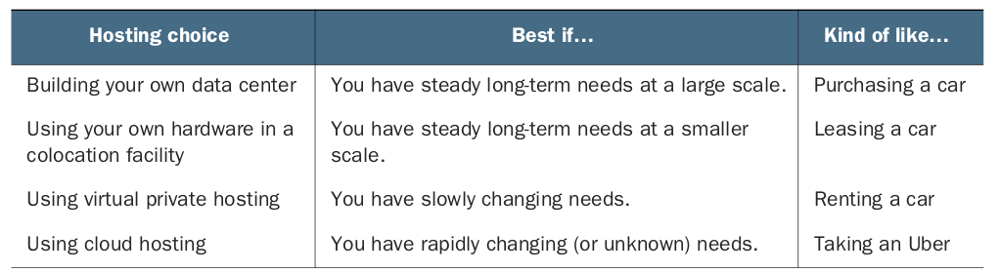
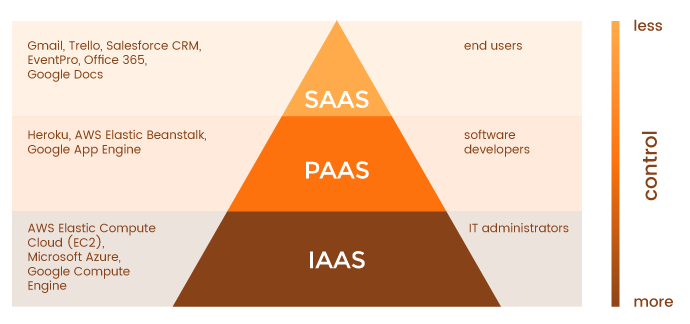
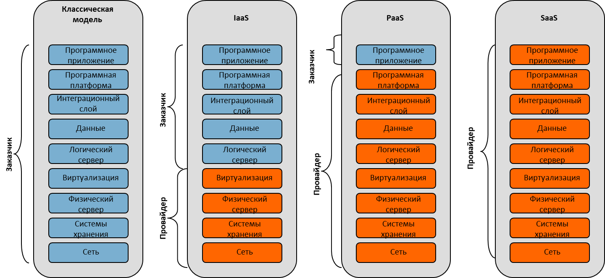
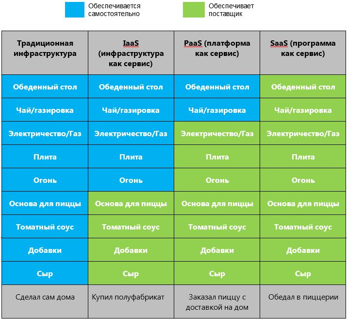
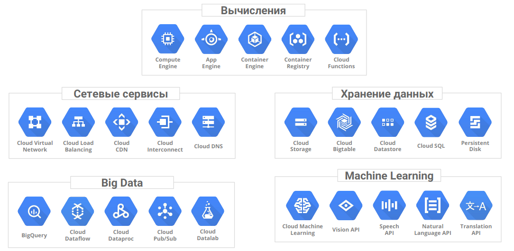

Облачные вычисления
=======================

Облачные вычисления (англ. cloud computing) — модель обеспечения удобного сетевого доступа по требованию к некоторому общему фонду конфигурируемых вычислительных ресурсов (например, сетям передачи данных, серверам, устройствам хранения данных, приложениям и сервисам — как вместе, так и по отдельности), которые могут быть оперативно предоставлены и освобождены с минимальными эксплуатационными затратами или обращениями к провайдеру.

Предоставление пользователю услуг как Интернет-сервис является ключевым. Однако под Интернет-сервисом не стоит понимать доступ к сервису только через Интернет, он может осуществляться также и через обычную локальную сеть с использованием веб-технологий.

Основой для создания и быстрого развития облачных вычислительных систем послужили крупные интернет сервисы, такие как Google, Amazon и др, а так же технический прогресс, что по сути говорит о том что появление облачных вычислений было всего лишь делом времени. Доступность облачных вычислений стало доступно по следующим причинам:

1. Развитие многоядерных процессоров привело к:

— увеличению производительности, при тех же размерах оборудования;

— снижение стоимости оборудования, как следствие эксплуатационных расходов;

— снижение энергопотребления облачной системы, для большинства ЦОД это действительно проблема при наращивании мощностей ЦОД.
2. Увеличение емкостей носителей информации, снижение стоимости хранения 1 Мб информации позволило:

— безгранично (по крайней мере так позиционируют себя большинство «облаков») увеличить объемы хранимой информации;

— снизить стоимость обслуживания хранилищ информации, значительно увеличив объемы хранимых данных.

3. Развитие технологии многопоточного программирования привело к:
— эффективному использованию вычислительных ресурсов многопроцессорных систем;
— гибкое распределение вычислительных мощностей облаков.

4. Развитие технологий виртуализации привело к:

— созданию программного обеспечения позволяющего создавать виртуальную инфраструктуру не зависимо от количества предоставленных аппаратных ресурсов;

— легкость масштабирования, наращивания систем;

— уменьшение расходов на администрирование облачных систем;

— доступность виртуальной инфраструктуры через сеть Интернет.

5. Увеличении пропускной способности привело к:
— увеличению скорости работы с облачными системами в частности виртуальный графический интерфейс и работа с виртуальными носителями информации;

— снижение стоимости Интернет трафика для работы с большими объемами информации;

— проникновению облачных вычислений в массы.

Все вышеперечисленные факторы привели к повышению конкурентоспособности облачных вычислений в ИТ сфере.

Достоинства:
~~~~~~~~~~~~~~

**доступность** – облака доступны всем, из любой точки, где есть Интернет, с любого компьютера, где есть браузер. Это позволяет пользователям (предприятиям) экономить на закупке высокопроизводительных, дорогостоящих компьютеров. Также сотрудники компаний становятся более мобильными так, как могут получить доступ к своему рабочему месту из любой точки земного шара, используя ноутбук, нетбук, планшетник или смартфон. Нет необходимости в покупки лицензионного ПО, его настройки и обновлении, вы просто заходите на сервис и пользуетесь его услугами заплатив за фактическое использование.

**низкая стоимость** – основные факторы снизившие стоимость использования облаков следующие:

— снижение расходов на обслуживания виртуальной инфраструктуры, вызванное развитием технологий виртуализации, за счет чего требуется меньший штат для обслуживания всей ИТ инфраструктуры предприятия;

— оплата фактического использования ресурсов, пользователь облака платит за фактическое использование вычислительных мощностей облака, что позволяет ему эффективно распределять свои денежные средства. Это позволяет пользователям (предприятиям) экономить на покупке лицензий к ПО;

— использование облака на правах аренды позволяет пользователям снизить расходы на закупку дорогостоящего оборудования, и сделать акцент на вложение денежных средств на наладку бизнес процессов предприятия, что в свою очередь позволяет легко начать бизнес;

— развитие аппаратной части вычислительных систем, в связи с чем снижение стоимости оборудования.

**гибкость** — неограниченность вычислительных ресурсов (память, процессор, диски), за счет использования систем виртуализации, процесс масштабирования и администрирования «облаков» становиться достаточно легкой задачей, так как «облако» самостоятельно может предоставить вам ресурсы, которые вам необходимы, а вы платите только за фактическое их использование.

**надежность** – надежность «облаков», особенно находящихся в специально оборудованных ЦОД, очень высокая так, как такие ЦОД имеют резервные источники питания, охрану, профессиональных работников, регулярное резервирование данных, высокую пропускную способность Интернет канала, высокая устойчивость к DDOS атакам.

**безопасность** – «облачные» сервисы имеют достаточно высокую безопасность при должном ее обеспечении, однако при халатном отношении эффект может быть полностью противоположным.
большие вычислительные мощности – вы как пользователь «облачной» системы можете использовать все ее вычислительные способности, заплатив только за фактическое время использования. Предприятия могут использовать данную возможность для анализа больших объемов данных.

При использовании облачных вычислений потребители информационных технологий могут существенно снизить капитальные расходы — на построение центров обработки данных, закупку серверного и сетевого оборудования, аппаратных и программных решений по обеспечению непрерывности и работоспособности — так как эти расходы поглощаются провайдером облачных услуг. Кроме того, длительное время построения и ввода в эксплуатацию крупных объектов инфраструктуры информационных технологий и высокая их начальная стоимость ограничивают способность потребителей гибко реагировать на требования рынка, тогда как облачные технологии обеспечивают возможность практически мгновенно реагировать на увеличение спроса на вычислительные мощности.

При использовании облачных вычислений затраты потребителя смещаются в сторону операционных — таким образом классифицируются расходы на оплату услуг облачных провайдеров.

Для объяснения экономической составляющей облачных подходов к вычислениям часто используется аналогия с услугами водо- или электроснабжения, предоставляемыми в развитых инфраструктурах по соответствующим коммунальным сетям, легкодоступными и оплачиваемыми по мере потребления, в сравнении с разработкой каждым потребителем собственного водозабора или монтированием собственной электроустановки

Недостатки
~~~~~~~~~~

* постоянное соединение с сетью – для получения доступа к услугам «облака» необходимо постоянное соединение с сетью Интернет. Однако в наше время это не такой и большой недостаток особенно с приходом технологий сотовой связи 3G и 4G.

* программное обеспечение и его кастомизация – есть ограничения по ПО которое можно разворачивать на «облаках» и предоставлять его пользователю. Пользователь ПО имеет ограничения в используемом ПО и иногда не имеет возможности настроить его под свои собственные цели.

* конфиденциальность – конфиденциальность данных хранимых на публичных «облаках» в настоящее вызывает много споров, но в большинстве случаев эксперты сходятся в том, что не рекомендуется хранить наиболее ценные для компании документы на публичном “облаке”, так как в настоящее время нет технологии которая бы гарантировала 100% конфиденциальность хранимых данных.

* надежность – что касается надежности хранимой информации, то с уверенностью можно сказать что если вы потеряли информацию хранимую в “облаке”, то вы ее потеряли навсегда.

* безопасность – “облако” само по себе является достаточно надежной системой, однако при проникновении на него злоумышленник получает доступ к огромному хранилищу данных. Еще один минус это использование систем виртуализации, в которых в качестве гипервизора используются ядра стандартные ОС такие, как Linux, Windows и др., что позволяет использовать вирусы.

* дороговизна оборудования – для построения собственного облака компании необходимо выделить значительные материальные ресурсы, что не выгодно только что созданным и малым компаниям.

Отличие облака от других вариантов размещения
~~~~~~~~~~~~~~~~~~~~~~~~~~~~~~~~~~~~~~~~~~~~~~~~

Вычисления
"""""""""""

Подготовка вашей машины будет быстрой.
По сравнению с размещенным или локальным хостингом подготовка выполняется значительно быстрее. В реальном выражении типичное ожидаемое время от нажатия кнопки до подключения через безопасную
оболочку к машине составит около минуты. Что еще интереснее, так это то, чего не хватает в процессе включения облачной виртуальной машины (ВМ). Если вы включите виртуальную машину прямо сейчас, вы можете заметить, что там нет упоминания об оплате. По сравнению с обычным виртуальным частным сервером (VPS), где цена установлена заранее и покупка  VPS осуществляется на полный год, производя ежемесячные платежи (с немедленным первым платежом и, возможно, скидкой на авансовый платеж) облачные провайдеры не взымают плату сразу так как они не знают, как долго вы будете поддерживать эту машину в рабочем состоянии. Поэтому невозможно узнать, какой счет выставить клиенту. Это можно определить, сколько вы должны только либо месяца или когда будет выключена виртуальна машина. 

       
Хранение (storage)
"""""""""""""""""""

Хранилище является необходимым для вычислений.
Что будет происходить с данными по окончании работы? Облачный подход к хранению данных следует той же схеме, которая  используется в области вычислений, абстрагируясь от управления физическими ресурсами. 

Хранение данных - сложная задача. Например, необходимо чтобы данные были кэшированы по краям, чтобы ускорить загрузку для пользователей в Интернете? Оптимизируется пропускная способность или задержка? Это нормально, если “время для первого байт” - это несколько секунд? Насколько доступными должны быть данные? Сколько клиентов нужно поддерживать? Ответы на эти вопросы существенно меняют то, что вы создаете , настолько, что в конечном итоге вы могли бы создавать совершенно другие продукты, если бы вы создавали службу хранения. В конечном счете, абстракция, предоставляемая службой хранения, предоставляет возможность настраивать механизмы хранения для различных уровней производительности, долговечности, доступности и стоимости. 

Но эти системы имеют несколько компромиссов. 

Во-первых, сбои при хранении данных обычно приводят к их исчезановению. Клиент не должны получать уведомлений с сообщением, что произошел сбой жесткого диска и данные были потеряны. Далее, при использовании опций с ограниченной доступностью можно время от времени пытаться загрузить данные и получать сообщение об ошибке с просьбой повторить попытку позже, но оплата будет гораздо меньше за хранилище этого класса , чем за любое другое. Наконец, для виртуальных дисков в облаке есть множество вариантов того, как хранить данные, как в емкости (измеряемой в ГБ), так и в производительность (обычно измеряется в операциях ввода-вывода в секунду [IOPS]). Опять же, как и вычисления в облаке, хранение данных на виртуальных дисках в облаке кажется знакомым. С другой стороны, некоторые пользовательские службы баз данных, такие как Облачное хранилище данных, могут показаться немного чуждыми. Эти системы во многих отношениях полностью уникальны для облачного хостинга. Они опираются на огромные, общие, масштабируемые системы. Например, Cloud Datastore представляет собой адаптированную внешнюю реализацию внутренней системы хранения данных под названием Megastore, которая до недавнего времени была базовой системой хранения для многих продуктов Google, включая Gmail. Эти размещенные системы хранения данных иногда требовали , чтобы выполнялась интеграция собственного кода с собственным API. Это означает, что очень важно поддерживать надлежащий уровень абстракции базой кода и уровнем хранилища. Все еще может иметь смысл полагаться на эти размещенные системы, особенно потому, что все масштабирование выполняется автоматически.

Аналитика (BigData)
""""""""""""""""""""""""

Большинство предприятия генерируют огромное количество информации и хранится практически все. Это необходимо анализировать и использовать, чтобы получать ноые и интересные выводы. Это также означает, что для того, чтобы сделать эти огромные объемы данных более управляемыми, появляются новые и интересные проекты с открытым исходным кодом, такие как Apache Spark, HBase и Hadoop. Многие крупные компании, предлагающие облачный хостинг, также используют эти системы. Облачные провайдеры не исключение.

Сети (Networking) 
""""""""""""""""""

Наличие множества различных элементов инфраструктуры без возможности взаимодействия этих элементов друг с другом означает, что система не является единой системой - это скорее куча изолированных систем. Традиционно сетевая работа подразумевается как нечто само собой разумеющееся, как то, что должно работать. Например, когда осуществляется регистрация на виртуальный частный хостинг и получеен доступ к серверу, ожидается, что у него есть подключение к Интернету и что оно будет достаточно быстрым. 

В мире облачных вычислений некоторые из этих допущений остаются неизменными. Но "облака" имеют более продвинутые особенности, такие как более быстрые, чем обычно, сетевые подключения, дополнительные свойства брандмауэров (где разрешены соединения определенных IP-адресов с определенными портами), балансировка нагрузки (где запросы поступают и могут обрабатываться одной из многих машин), и SSL сертификат управления (где запросы должны быть зашифрованы, но не управляется сертификатом для каждой виртуальной машины). 

Сеть на традиционном хостинге обычно скрыта, поэтому большинство людей не заметит никаких различий. Для тех, у кого есть глубокие знания в области сетевых технологий, большинство вещей, которые можно сделать с обычным вычислительным стеком (например, настроить VPN, настроить брандмауэры с iptables и сбалансировать запросы между серверами с помощью HAProxy), все еще возможны. Сетевые функции Google Cloud действуют только для упрощения распространенных случаев, когда вместо запуска отдельной виртуальной машины с помощью HAProxy необходимо полагаться на облачный балансировщик нагрузки Google для маршрутизации запросов.

Есть мнение, что в будущем каждая компания, независимо от размера или отрасли, будет дифференцировать себя от своих конкурентов через технологии во многом в виде программного обеспечения, большое программное обеспечение, ориентированное на данные. Таким образом, каждая компания станет компанией данных.

Форматы услуг облачных вычислений
~~~~~~~~~~~~~~~~~~~~~~~~~~~~~~~~~~~~~~

Мир облачных вычислений очень разнообразен. Облачные провайдеры предлагают множество услуг, адаптированных к различным требованиям клиентов. Существуют термины, как IaaS, PaaS, SaaS, FaaS, KaaS и т.д. со всеми буквами алфавита, за которыми следует «aaS». Они образуют набор сервисов облачных провайдеров. Есть 3 основных предложения **«как услуга»** (**as a Service**), которые облачные провайдеры почти всегда предоставляют.

Это IaaS, PaaS и SaaS, которые обозначают соответственно инфраструктуру как услугу (Infrastructure as a Service), платформу как услугу (Platform as a Service) и программное обеспечение как услугу (Software as a Service). Важно визуализировать облачные сервисы как уровни предоставляемых услуг. Это означает, что когда вы поднимаетесь или спускаетесь с уровня на уровень, вы, как клиент, пересекаете различные варианты обслуживания, которые либо добавляются, либо убираются из основного предложения. Лучше всего рассматривать это как пирамиду, как показано на рисунке:

       
IaaS 
"""""""""

IaaS включает в себя:

* Виртуальные серверы (VPS/VDS), на которые можно устанавливать различные программы. Иногда провайдер предлагает серверы сразу с операционными системами, чтобы на них можно было быстрее развернуть нужные приложения.
* Сетевые настройки, которые обеспечивают связь виртуальных серверов друг с другом, внешними серверами, принадлежащими компании-клиенту, и интернетом. К ним относят:
- доступность серверов друг для друга и для внешней сети, маршрутизацию сетевых соединений серверов;
- балансировщики нагрузки, которые предотвращают перегрузки серверов, распределяя между ними входящий трафик;
- VPN — технологию шифрования данных, передаваемых компанией между облаком и ее физическим дата-центром;
* Управление доступом пользователей. Например, можно ограничить доступ к отдельным виртуальным машинам или разрешить просмотр данных, но запретить вносить в них изменения.
* Облачные хранилища для хранения файлов, данных или бэкапов. От обычных облачных дисков, с которыми имеют дело отдельные пользователи, они отличаются почти неограниченным объемом хранения и быстрой скоростью доступа к данным.
* Сервисы резервного копирования и катастрофоустойчивости, которые страхуют вашу инфраструктуру от падений и потери данных при выходе из строя ее отдельных узлов.

При аренде инфраструктуры IaaS, приобретаются виртуальные серверы, сетевые настройки и облачные хранилища, за которые отвечает провайдер. При этом у клиента есть доступ к операционной системе виртуальных серверов и большая свобода в настройке и установке приложений.

Это самый низкий уровень, который может предложить поставщик облачных услуг, и он включает провайдера облачных вычислений, поставляющего «голую» инфраструктуру, включая промежуточное программное обеспечение, сетевые кабели, процессоры, графические процессоры, оперативную память, внешнее хранилище, серверы и образы базовых операционных систем, например, Debian Linux, CentOS, Windows и т. д.

За клиентом остается сборка этих частей для ведения вашего бизнеса. Степень того, с чем придется работать, может варьироваться от поставщика к поставщику, но, как правило, предоставляется аппаратное обеспечение и ОС. Примерами IaaS являются AWS Elastic Compute, Microsoft Azure и GCE.

Примеры IaaS
''''''''''''''

**Перенос IT-систем в облако**

Самое очевидное применение IaaS — отказ от физических серверов и перенос вашей IT-инфраструктуры в облако. С IaaS вы сможете делать все то же, что с физическим дата-центром — хранить данные, настроить CRM-систему, развернуть сайт или любые бизнес-серверы.
    
**Экономия на инфраструктуре**

Если вы сами обслуживаете серверы, вам нужно платить за помещение, оборудование, лицензионное ПО — это большие капитальные расходы. Кроме того, в облаке провайдер берет на себя предоставление виртуальной инфраструктуры с оговоренным в SLA временем простоя (аптаймом). Чтобы обеспечить такой же аптайм в собственном частном ЦОДе, а также управлять физической инфраструктурой и виртуализацией, нужен отдельный штат специалистов. Это дополнительные расходы сверх капитальных. Если собственный ЦОД для компании — не профильный бизнес, компания не умеет оценивать риски и дополнительные и скрытые расходы, у нее нет соответствующей экспертизы, тогда дешевле развернуть IT-инфраструктуру в облаке.

**Быстрый запуск бизнеса**

Облачная инфраструктура IaaS снижает расходы бизнеса на старте, так как помогает уменьшить капитальные вложения, обойтись без закупки оборудования и организации дата-центра.

**Расширение инфраструктуры**

Облачные технологии IaaS можно использовать и для расширения уже существующей инфраструктуры. К примеру, у вас есть физические серверы, но их мощности не хватает для нынешних задач. Вместо того чтобы покупать новые, можно подключиться к IaaS-платформе, и получить там нужные мощности.

**Инфраструктура для компаний со скачками спроса**

IaaS подходит, если у компании нелинейный спрос на ресурсы. Например, у вас есть физические серверы, на которых развернут интернет-магазин. В период праздников или распродаж сайт падает — покупателей приходит слишком много, и серверы не выдерживают. Если использовать облачную инфраструктуру, при увеличении нагрузки можно сразу получить дополнительные вычислительные мощности. А когда нагрузка упадет, вернуться к плановому потреблению мощностей. В случае обычной физической инфраструктуры нужно докупать дополнительные серверы — пользоваться ими вы будете только на пике нагрузки, а обслуживать постоянно. Это не говоря о том, что процедура закупки оборудования обычно занимает недели, а облачное масштабирование — минуты или даже секунды.

**Разработка и тестирование**

Как и в собственной локальной инфраструктуре, в облачной можно организовать раздельные среды разработки, тестирования и «боевой» нагрузки, в которой запущено уже готовое приложение. Но, в отличие от собственной инфраструктуры, в облаке тестовые среды можно разворачивать мгновенно. После завершения тестов лишние среды можно свернуть и не переплачивать за простаивающие ресурсы. Всё это упрощает и ускоряет процесс тестирования ПО и позволяет экономить на покупке тестовых серверов.

Если клиент не желает устанавливать образы ОС и заниматься сетью, балансировкой нагрузки или заботиться о том, какой тип процессора идеально подходит для их рабочей нагрузки, то ему необходимо рассматривать вариант PaaS.

PaaS
""""""""

Платформа как услуга (PaaS, англ. Platform-as-a-Service) — модель, когда потребителю предоставляется возможность использования облачной инфраструктуры для размещения базового программного обеспечения для последующего размещения на нём новых или существующих приложений (собственных, разработанных на заказ или приобретённых тиражируемых приложений). В состав таких платформ входят инструментальные средства создания, тестирования и выполнения прикладного программного обеспечения — системы управления базами данных, связующее программное обеспечение, среды исполнения языков программирования — предоставляемые облачным провайдером.

Контроль и управление основной физической и виртуальной инфраструктурой облака, в том числе сети, серверов, операционных систем, хранения осуществляется облачным провайдером, за исключением разработанных или установленных приложений, а также, по возможности, параметров конфигурации среды (платформы). 

Ключевое отличие PaaS от IaaS в том, что здесь есть определенные инструменты, например: система управления базами данных, среда машинного обучения или обработки big data, промышленный IoT. Их нужно настроить под потребности компании, но не надо строить с нуля. Это позволяет экономить время разработчиков — например, им не нужно возиться с разработкой базы данных, можно просто загрузить в нее информацию и работать.

При этом отсутствует доступ к операционной системе, настройкам виртуальных серверов, которые лежат в основе PaaS, а также к низкоуровневым настройкам самой платформы. Провайдер берет на себя их оптимальную конфигурацию и снимает с клиента необходимость следить за настройками, обновлениями, масштабированием и безопасностью. Клиент получает доступ только к интерфейсам самой платформы.

Примеры PaaS:
''''''''''''''

**Базы данных**

В облака можно перенести все или часть баз данных компании. В случае с IaaS пользователь получает только пространство на дисках, и должен сам выбрать систему управления базами данных, установить ее и настроить, обеспечить защиту данных и резервное копирование. В PaaS СУБД уже установлена, нужно лишь настроить ее для себя и загрузить данные. За работоспособность и резервное копирование отвечает провайдер.

**Разработка приложений в контейнерах. **

Это современный стандарт разработки приложений. Суть в том, что все компоненты, которые нужны для запуска приложения, упаковывают в отдельные виртуальные контейнеры. Их можно быстро вызывать, запускать приложения и при необходимости добавлять вычислительные мощности для быстрого масштабирования и устойчивости к высоким нагрузкам.

**Аналитика больших данных**

PaaS помогают обрабатывать как исторические большие данные, то есть массивы информации, собранные компанией за какое-то время, так и данные в режиме реального времени. Для этого используют такие инструменты как Apache Hadoop, Apache Spark, Apache Kafka и другие. Они уже установлены и настроены в облаке, остается только выбрать нужную конфигурацию.

**Машинное обучение**

Такая платформа как сервис позволяет быстро разрабатывать приложения на основе глубокого обучения под нужды компании: системы компьютерного зрения для распознавания лиц, номеров автомобилей и других объектов, системы аудиоаналитики. К примеру, имеется большая база данных с фотографиями сотрудников, и необходимо хотите настроить на объекте безбарьерный вход — пропускать сотрудников через турникеты, распознавая их лица. Для этого вы разрабатываете собственное приложение, а потом «обучается» нейросеть узнавать сотрудников с помощью PaaS, где уже установлены инструменты для распознавания лиц.

PaaS-сервисы экономят время на конфигурацию инфраструктуры, нужной компании. Можно подключить нужный набор сервисов, главное, убедиться, что у облачного провайдера есть нужные сейчас и в перспективе решения.

SaaS
"""""""""

Программное обеспечение как услуга (SaaS, англ. Software-as-a-Service) — модель, в которой потребителю предоставляется возможность использования прикладного программного обеспечения провайдера, работающего в облачной инфраструктуре и доступного из различных клиентских устройств или посредством тонкого клиента, например, из браузера (например, веб-почта) или посредством интерфейса программы. Контроль и управление основной физической и виртуальной инфраструктурой облака, в том числе сети, серверов, операционных систем, хранения, или даже индивидуальных возможностей приложения (за исключением ограниченного набора пользовательских настроек конфигурации приложения) осуществляется облачным провайдером. 

SaaS представляет собой наиболее распространенные сервисы, предоставляемые поставщиками облачных услуг. Они предназначены для конечных пользователей и доступны главным образом через веб-сайты, например Gmail, Google Docs, Dropbox и т. д. Что касается Google Cloud, есть несколько предложений вне их вычислительного стека, которые являются SaaS. К ним относятся Data Studio, Big Query и т. д.

       

Для совсем упрощенного понимания разницы это представимо в модели Pizza-as-a-Service:

       

Модели развёртывания
~~~~~~~~~~~~~~~~~~~~~~~

Частное облако
"""""""""""""""

Частное облако (англ. private cloud) — инфраструктура, предназначенная для использования одной организацией, включающей несколько потребителей (например, подразделений одной организации), возможно также клиентами и подрядчиками данной организации. Частное облако может находиться в собственности, управлении и эксплуатации как самой организации, так и третьей стороны (или какой-либо их комбинации), и оно может физически существовать как внутри, так и вне юрисдикции владельца.

Публичное облако
""""""""""""""""

Публичное облако (англ. public cloud) — инфраструктура, предназначенная для свободного использования широкой публикой. Публичное облако может находиться в собственности, управлении и эксплуатации коммерческих, научных и правительственных организаций (или какой-либо их комбинации). Публичное облако физически существует в юрисдикции владельца — поставщика услуг.

Общественное облако
""""""""""""""""""""

Общественное облако (англ. community cloud) — вид инфраструктуры, предназначенный для использования конкретным сообществом потребителей из организаций, имеющих общие задачи (например, миссии, требований безопасности, политики, и соответствия различным требованиям). Общественное облако может находиться в кооперативной (совместной) собственности, управлении и эксплуатации одной или более из организаций сообщества или третьей стороны (или какой-либо их комбинации), и оно может физически существовать как внутри, так и вне юрисдикции владельца.

Гибридное облако
"""""""""""""""""

Гибридное облако (англ. hybrid cloud) — это комбинация из двух или более различных облачных инфраструктур (частных, публичных или общественных), остающихся уникальными объектами, но связанных между собой стандартизованными или частными технологиями передачи данных и приложений (например, кратковременное использование ресурсов публичных облаков для балансировки нагрузки между облаками). 

NIST (Национальный институт стандартов и технологий) определяет следующие необходимые черты ИТ услуги, позволяющие считаться облачной:

1. ниверсальный сетевой доступ (broad network access) – услуга должна иметь универсальный сетевой интерфейс, дающий возможность подключения и использования услуги практически кому угодно с минимальными требованиями. Пример – чтобы использовать электрическую сеть 220В достаточно подключиться к любой розетке со стандартным универсальным интерфейсом (вилка), который не меняется от того, чайник это будет, пылесос или ноутбук.

2. Измеримость сервиса (measured service) – ключевой характеристикой облачной услуги является измеримость сервиса. Возвращаясь к аналогии с электричеством – вы оплатите ровно столько, сколько потребили с минимальной гранулярностью, вплоть до затрат на один раз вскипятить чайник, если за весь месяц вы были в доме один раз и выпили чашку чая.
    
3. Самостоятельное конфигурирование сервисов по требованию (on demand self service) – облачный провайдер предоставляет заказчику возможность разумного конфигурирования сервиса, без необходимости взаимодействия с сотрудниками провайдера. Для того, чтобы вскипятить чайник совершенно необязательно заранее связываться с Энергосбытом и заранее их предупреждать и получать разрешение. С момента как дом подключен (заключен договор) все потребители могут самостоятельно распоряжаться предоставленной мощностью.
    
4. Мгновенная эластичность (rapid elasticity) – облачный провайдер предоставляет ресурсы с возможностью мгновенного наращивания / снижения мощности (в определенных разумных рамках). Как только чайник включен – провайдер немедленно выдает в сеть 3 кВт мощности, и как только выключен – снижает выдачу до нуля.
    
5. Объединение ресурсов в пул (resource pooling) – внутренние механизмы провайдера услуг позволяют объединять отдельные генерирующие мощности в общий пул (бассейн) ресурсов с дальнейшим предоставлением ресурсов как услуги различным потребителям. Включая чайник, нас менее всего волнует с какой конкретно электростанции поступает мощность. И все остальные потребители потребляют эту мощность вместе с нами.

Архитектура GCP
=================

**Google Cloud Platform** (рус. «Облачная платформа Google», сокр.  GCP) — предоставляемый компанией Google набор облачных служб, которые выполняются на той же самой инфраструктуре, которую Google использует для своих продуктов, предназначенных для конечных потребителей, таких как Google Search и YouTube. Кроме инструментов для управления, также предоставляется ряд модульных облачных служб, таких как облачные вычисления, хранение данных, анализ данных и машинное обучение. Для регистрации нужно иметь банковскую карту или банковский счет

GCP - это набор коммерческих облачных сервисов, основанных на разработках и опыте Google в для 
собственных  продуктов:

* Google Search
* YouTube
* Google Maps
* и др.

Сервисы GCP:
~~~~~~~~~~~~~

**App Engine** — платформа как услуга для хостинга приложений.

**BigQuery** — инфраструктура как услуга, масштабируемая аналитика для баз данных.

**BigTable** — инфраструктура как услуга, масштабируемая NoSQL база данных.

**Cloud AutoML** — набор продуктов для машинного обучения, которые позволяет разработчикам с ограниченным опытом работы в области машинного обучения использовать технологии обучения и создания нейронных сетей.

**Cloud Datastore** — документоориентированная облачная база данных.

**Cloud Pub/Sub** — услуга для публикации и подписки на потоки данных и сообщения. Приложения могут обмениваться данными через публикацию / подписку, без прямого обмена сообщениями.

**Compute Engine** — инфраструктура как услуга, предоставляет виртуальные машины.

**Kubernetes Engine**— система автоматического развертывания, масштабирования и управления приложений в контейнерах для Kubernetes.

**Google Genomics** — анализ геномов в облаке

**Google Video Intelligence**

**Cloud Vision**

**Storage** — инфраструктура как услуга, предоставляет онлайн REST-доступ к файлам и содержанию хранилищ данных.

