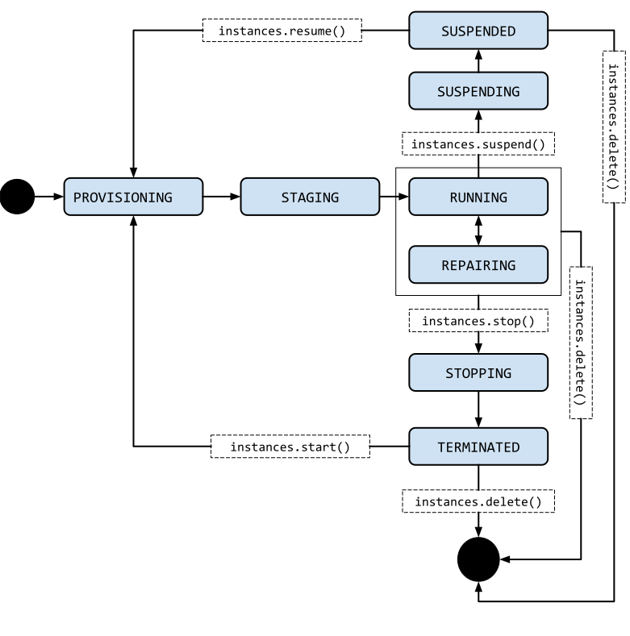

Compute Engine
=================

**Compute Engine** - это вычислительная и хостинговая служба, которая позволяет создавать и запускать виртуальные машины в инфраструктуре Google. Compute Engine предлагает масштабирование, производительность, которые позволяют легко запускать большие вычислительные кластеры в инфраструктуре Google. При отсутствии первоначальных инвестиций можно запускать тысячи виртуальных процессоров в системе, которая обеспечивает быструю и стабильную производительность. 

Экземпляры виртуальных машин (instances)
~~~~~~~~~~~~~~~~~~~~~~~~~~~~~

**Instance** - это виртуальная машина (ВМ), размещенная в инфраструктуре Google. Можно создать экземпляр с помощью облачной консоли Google, средства командной строки gcloud или API Compute Engine.

Экземпляры Compute Engine могут запускать общедоступные образы для Linux и Windows Server, предоставляемые Google, а также частные пользовательские образы, которые можно создавать или импортировать из существующих систем. Есть возможность развернуть контейнеры Docker, которые автоматически запускаются на экземплярах, на которых запущен общедоступный образ операционной системы, оптимизированный для контейнеров.

Вы можете выбрать свойства компьютера для своих экземпляров, такие как количество виртуальных процессоров и объем памяти, с помощью набора предопределенных типов компьютеров или путем создания собственных пользовательских типов компьютеров.

Каждый экземпляр принадлежит проекту Google Cloud Console, и в проекте может быть один или несколько экземпляров. При создании экземпляра в проекте вы указываете зону, операционную систему и тип компьютера этого экземпляра. Когда вы удаляете экземпляр, он удаляется из проекта.

По умолчанию каждый экземпляр вычислительного ядра имеет небольшой загрузочный постоянный диск, содержащий операционную систему. Если приложениям, запущенным на вашем экземпляре, требуется больше места для хранения, вы можете добавить дополнительные параметры хранения в свой экземпляр.

Каждый сетевой интерфейс экземпляра вычислительного ядра связан с подсетью уникальной сети VPC. 

Экземпляры вычислительного ядра поддерживают декларативный метод запуска приложений с использованием контейнеров. При создании виртуальной машины или шаблона экземпляра вы можете указать имя образа Docker и конфигурацию запуска. Compute Engine позаботится обо всем остальном, включая предоставление обновленного оптимизированного для контейнеров образа операционной системы с установленным Docker и запуск вашего контейнера при запуске виртуальной машины.

Для создания экземпляров и управления ими можно использовать различные инструменты, включая облачную консоль Google, средство командной строки gcloud и API REST. Чтобы настроить приложения на своих экземплярах, подключитесь к экземпляру с помощью Secure Shell (SSH) для экземпляров Linux или протокола удаленного рабочего стола (RDP) для экземпляров Windows Server.

Управление доступом
~~~~~~~~~~~~~~~~~~~~~

Вы можете управлять доступом к своим экземплярам одним из следующих способов:

**Linux:**

Управление доступом к экземпляру С помощью входа в ОС, который позволяет связать ключи SSH с вашей учетной записью Google или учетной записью Google Workspace и управлять доступом администратора или не администратора к экземпляру с помощью ролей IAM. Если вы подключаетесь к своим инстансам с помощью инструмента командной строки gcloud или SSH с консоли, Compute Engine может автоматически генерировать ключи SSH для вас и применять их к вашей учетной записи Google или учетной записи Google Workspace.

Управляйте своими SSH-ключами в метаданных проекта или экземпляра, что предоставляет доступ администратора к экземплярам с доступом к метаданным, которые не используют вход в ОС. Если вы подключаетесь к своим экземплярам с помощью средства командной строки gcloud или SSH с консоли, Compute Engine может автоматически генерировать ключи SSH для вас и применять их к метаданным проекта.

**Windows Server:**

Создайте пароль для экземпляра Windows Server
Подключитесь по RDP

Жизненный цикл экземпляра виртуальной машины
~~~~~~~~~~~~~~~~~~~~~~~~~~~~~~~~~~~~~~~~~~~~~~~~~~

Экземпляр виртуальной машины может переходить через множество состояний в рамках своего жизненного цикла. При создании виртуальной машины Compute Engine предоставляет ресурсы для запуска виртуальной машины. Затем виртуальная машина переходит в промежуточное состояние, где она готовится к первой загрузке. Во время и после запуска виртуальная машина считается запущенной. В течение срока службы работающую виртуальную машину можно неоднократно останавливать и перезапускать или приостанавливать и возобновлять.

Виртуальная машина может находиться в одном из следующих состояний:

* **PROVISIONING (ПОДГОТОВКА)**: выделение ресурсов для виртуальной машины. Виртуальная машина еще не запущена.

* **STAGING (ПРОМЕЖУТОЧНАЯ ПОДГОТОВКА)**: ресурсы получены, и виртуальная машина готовится к первой загрузке.

* **RUNNING (ЗАПУСК)**: виртуальная машина загружается или работает.

* **STOPPING (ОСТАНОВКА)**: виртуальная машина останавливается. Пользователь запросил остановку или произошел сбой. Это временное состояние, после которого виртуальная машина переходит в состояние "ЗАВЕРШЕНО".

* **REPAIRING (ВОССТАНОВЛЕНИЕ)**: Восстановление происходит, когда виртуальная машина обнаруживает внутреннюю ошибку или базовая машина недоступна из-за обслуживания. В течение этого времени виртуальная машина непригодна для использования. Если восстановление завершится успешно, виртуальная машина вернется в одно из указанных выше состояний.

* **TERMINATED (ЗАВЕРШЕНО)**: виртуальная машина остановлена. Клиент остановил виртуальную машину или на ней произошел сбой. Можно перезапустить или удалить виртуальную машину.

* **SUSPENDING (ПРИОСТАНОВКА)**: Виртуальная машина находится в процессе приостановки. 

* **SUSPENDED (ПРИОСТАНОВЛЕНО)**: Виртуальная машина находится в приостановленном состоянии. Можно  возобновить работу виртуальной машины или удалить ее.

На следующей диаграмме показан переход между каждым состоянием виртуальной машины:

       

