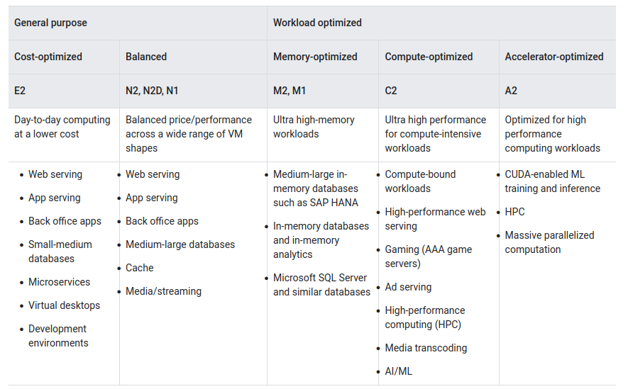

Compute Engine
=================

**Compute Engine** - это вычислительная и хостинговая служба, которая позволяет создавать и запускать виртуальные машины в инфраструктуре Google. Compute Engine предлагает масштабирование, производительность, которые позволяют легко запускать большие вычислительные кластеры в инфраструктуре Google. При отсутствии первоначальных инвестиций можно запускать тысячи виртуальных процессоров в системе, которая обеспечивает быструю и стабильную производительность. 

Экземпляры виртуальных машин (instances)
~~~~~~~~~~~~~~~~~~~~~~~~~~~~~

**Instance** - это виртуальная машина (ВМ), размещенная в инфраструктуре Google. Можно создать экземпляр с помощью облачной консоли Google, средства командной строки gcloud или API Compute Engine.

Экземпляры Compute Engine могут запускать общедоступные образы для Linux и Windows Server, предоставляемые Google, а также частные пользовательские образы, которые можно создавать или импортировать из существующих систем. Есть возможность развернуть контейнеры Docker, которые автоматически запускаются на экземплярах, на которых запущен общедоступный образ операционной системы, оптимизированный для контейнеров.

Вы можете выбрать свойства компьютера для своих экземпляров, такие как количество виртуальных процессоров и объем памяти, с помощью набора предопределенных типов компьютеров или путем создания собственных пользовательских типов компьютеров.

Каждый экземпляр принадлежит проекту Google Cloud Console, и в проекте может быть один или несколько экземпляров. При создании экземпляра в проекте вы указываете зону, операционную систему и тип компьютера этого экземпляра. Когда вы удаляете экземпляр, он удаляется из проекта.

По умолчанию каждый экземпляр вычислительного ядра имеет небольшой загрузочный постоянный диск, содержащий операционную систему. Если приложениям, запущенным на вашем экземпляре, требуется больше места для хранения, вы можете добавить дополнительные параметры хранения в свой экземпляр.

Каждый сетевой интерфейс экземпляра вычислительного ядра связан с подсетью уникальной сети VPC. 

Экземпляры вычислительного ядра поддерживают декларативный метод запуска приложений с использованием контейнеров. При создании виртуальной машины или шаблона экземпляра вы можете указать имя образа Docker и конфигурацию запуска. Compute Engine позаботится обо всем остальном, включая предоставление обновленного оптимизированного для контейнеров образа операционной системы с установленным Docker и запуск вашего контейнера при запуске виртуальной машины.

Для создания экземпляров и управления ими можно использовать различные инструменты, включая облачную консоль Google, средство командной строки gcloud и API REST. Чтобы настроить приложения на своих экземплярах, подключитесь к экземпляру с помощью Secure Shell (SSH) для экземпляров Linux или протокола удаленного рабочего стола (RDP) для экземпляров Windows Server.

Управление доступом
~~~~~~~~~~~~~~~~~~~~~

Вы можете управлять доступом к своим экземплярам одним из следующих способов:

**Linux:**

Управление доступом к экземпляру С помощью входа в ОС, который позволяет связать ключи SSH с вашей учетной записью Google или учетной записью Google Workspace и управлять доступом администратора или не администратора к экземпляру с помощью ролей IAM. Если вы подключаетесь к своим инстансам с помощью инструмента командной строки gcloud или SSH с консоли, Compute Engine может автоматически генерировать ключи SSH для вас и применять их к вашей учетной записи Google или учетной записи Google Workspace.

Управляйте своими SSH-ключами в метаданных проекта или экземпляра, что предоставляет доступ администратора к экземплярам с доступом к метаданным, которые не используют вход в ОС. Если вы подключаетесь к своим экземплярам с помощью средства командной строки gcloud или SSH с консоли, Compute Engine может автоматически генерировать ключи SSH для вас и применять их к метаданным проекта.

**Windows Server:**

Создайте пароль для экземпляра Windows Server
Подключитесь по RDP

Жизненный цикл экземпляра виртуальной машины
~~~~~~~~~~~~~~~~~~~~~~~~~~~~~~~~~~~~~~~~~~~~~~~~~~

Экземпляр виртуальной машины может переходить через множество состояний в рамках своего жизненного цикла. При создании виртуальной машины Compute Engine предоставляет ресурсы для запуска виртуальной машины. Затем виртуальная машина переходит в промежуточное состояние, где она готовится к первой загрузке. Во время и после запуска виртуальная машина считается запущенной. В течение срока службы работающую виртуальную машину можно неоднократно останавливать и перезапускать или приостанавливать и возобновлять.

Виртуальная машина может находиться в одном из следующих состояний:

* **PROVISIONING (ПОДГОТОВКА)**: выделение ресурсов для виртуальной машины. Виртуальная машина еще не запущена.

* **STAGING (ПРОМЕЖУТОЧНАЯ ПОДГОТОВКА)**: ресурсы получены, и виртуальная машина готовится к первой загрузке.

* **RUNNING (ЗАПУСК)**: виртуальная машина загружается или работает.

* **STOPPING (ОСТАНОВКА)**: виртуальная машина останавливается. Пользователь запросил остановку или произошел сбой. Это временное состояние, после которого виртуальная машина переходит в состояние "ЗАВЕРШЕНО".

* **REPAIRING (ВОССТАНОВЛЕНИЕ)**: Восстановление происходит, когда виртуальная машина обнаруживает внутреннюю ошибку или базовая машина недоступна из-за обслуживания. В течение этого времени виртуальная машина непригодна для использования. Если восстановление завершится успешно, виртуальная машина вернется в одно из указанных выше состояний.

* **TERMINATED (ЗАВЕРШЕНО)**: виртуальная машина остановлена. Клиент остановил виртуальную машину или на ней произошел сбой. Можно перезапустить или удалить виртуальную машину.

* **SUSPENDING (ПРИОСТАНОВКА)**: Виртуальная машина находится в процессе приостановки. 

* **SUSPENDED (ПРИОСТАНОВЛЕНО)**: Виртуальная машина находится в приостановленном состоянии. Можно  возобновить работу виртуальной машины или удалить ее.

На следующей диаграмме показан переход между каждым состоянием виртуальной машины:

.. figure:: instance-life-cycle.svg
       :scale: 100 %
       :align: center
       :alt: asda
       
Остановка, приостановка или сброс виртуальной машины
""""""""""""""""""""""""""""""""""""""""""""""""""""

Вы можете остановить или приостановить виртуальную машину, если она вам больше не нужна, но вы хотите сохранить ее для дальнейшего использования. Ваше решение остановить или приостановить виртуальную машину зависит от того, нужно ли сохранять память гостевой ОС и состояние приложения.

При приостановке или остановке виртуальной машины учитывайте следующее:

* Вы не несете расходов за приостановленную или остановленную виртуальную машину.
* Вы платите за ресурсы, которые все еще подключены к приостановленной или остановленной виртуальной машине, такие как статические IP-адреса и постоянные данные на диске.
* Эфемерные внешние IP-адреса освобождаются от виртуальной машины. При перезапуске или возобновлении работы виртуальной машины Google назначает новые временные внешние IP-адреса. Если вы зависите от эфемерного внешнего IP-адреса, который остается неизменным при перезапуске, повысьте эфемерный внешний IP-адрес.
* Статические внешние IP-адреса сохраняются.

Остановка виртуальной машины
""""""""""""""""""""""""""""""""

Остановка виртуальной машины приводит к тому, что вычислительный механизм отправляет на виртуальную машину сигнал выключения ACPI. Современные гостевые операционные системы настроены на выполнение чистого выключения перед выключением в ответ на сигнал отключения питания. Вычислительный механизм некоторое время ожидает завершения работы гостевой системы, а затем переводит виртуальную машину в завершенное состояние.

Остановка виртуальной машины может выполняться по нескольким причинам:

* Вам больше не нужна виртуальная машина, но вам нужны ресурсы, подключенные к виртуальной машине, такие как ее внутренний IP—адрес, MAC-адрес и постоянный диск.
* Вам не нужно сохранять память гостевой ОС, состояние устройства или состояние приложения.
* Вы хотите изменить определенные свойства виртуальной машины, которые требуют, чтобы вы сначала остановили виртуальную машину.

Завершенную виртуальную машину можно запустить когда потребуется

Приостановка виртуальной машины
"""""""""""""""""""""""""""""""""

Приостановка виртуальной машины отправляет сигнал приостановки ACPI S3 в операционную систему виртуальной машины. Приостановка виртуальной машины аналогична закрытию крышки ноутбука или переводу виртуальной машины в приостановленное состояние. Когда вы приостанавливаете виртуальную машину, она переходит в состояние SUSPENDED.

Вы можете приостановить виртуальную машину по следующим причинам:

* В настоящее время вам не нужна виртуальная машина, но вы хотите иметь возможность быстро восстановить ее с уже инициализированной операционной системой и состоянием приложения при этом сохранение состояния виртуальной машины оплачивается.

Возобновить работу приостановленной виртуальной машины можно в любой момент

Сброс виртуальной машины (RESETTING)
""""""""""""""""""""""""""""""""""""""""

Кроме того, вы можете сбросить виртуальную машину, чтобы стереть содержимое памяти виртуальной машины и вернуть ее в исходное состояние. Сброс виртуальной машины приводит к немедленному жесткому сбросу виртуальной машины; виртуальная машина не выполняет корректное завершение работы гостевой ОС. Однако виртуальная машина сохраняет все постоянные данные на диске, и ни одно из свойств виртуальной машины не изменяется. Виртуальная машина остается в рабочем состоянии после сброса.

**Comparing table**

Семейства машин
~~~~~~~~~~~~~~~~

Виртуальные машины - это базовое оборудование, которое используется для разработки приложений и выполнения рабочих нагрузок. Все виртуальные машины классифицируются по семейству машин. Второе поколение виртуальных машин общего назначения включает *E2*, *E2 с общим ядром*, *N2* и *N2D*. Виртуальные машины с общим ядром *N1* и *N1 shared-core*  относятся к первому поколению. Все семейства машин поддерживают виртуальные машины с возможностью вытеснения, за исключением виртуальных машин, оптимизированных для памяти M2.

Конфигурации машин определяются следующими характеристиками:

* **Семейство машин**: Набор процессоров и аппаратных конфигураций, оптимизированных для конкретных рабочих нагрузок. В процессе создания виртуальной машины вы выбираете предпочитаемое семейство компьютеров и настраиваете виртуальную машину.
* **Серия**: В консоли семейства машин дополнительно классифицируются по поколениям серий. Более новые виртуальные машины перечислены во втором поколении, а более старые - в первом поколении.
* **Тип машины**: Каждое семейство машин имеет предопределенные формы машин с определенным соотношением vCPU к памяти, которое соответствует различным потребностям рабочей нагрузки. Если предопределенный тип компьютера не соответствует вашим потребностям, вы можете создать пользовательский компьютер для любой виртуальной машины общего назначения.

Billing (Выставление счетов)
"""""""""""""""""""""""""""""""""

Счет выставляется за ресурсы, используемые виртуальной машиной. При создании виртуальной машины выбирается тип машины для экземпляра и выставляется счет, как описано на странице цены экземпляра виртуальной машины. В частности, выставляется счет за каждый vCPU и ГБ памяти отдельно, как описано в модели выставления счетов на основе ресурсов. Применяются применимые скидки, такие как скидки на длительное использование и скидки на обязательное использование.

https://cloud.google.com/compute/vm-instance-pricing#billingmodel

Machine family categories
""""""""""""""""""""""""""""""

Семейство **general-purpose machine** (общего назначения) предлагает различные типы машин с наилучшим соотношением цены и производительности для различных рабочих нагрузок.Виртуальные машины с общим ядром доступны для E2 и N1 в семействе общего назначения. Эти виртуальные машины совместно используют физическое ядро. Это может быть экономически эффективным методом для запуска небольших, не требующих больших ресурсов приложений.

E2: виртуальные машины с общим ядром e2-micro, e2-small и e2-medium имеют 2 VCPU, доступных для коротких периодов burst.
N1: Виртуальные машины с общим ядром f1-micro и g1-small имеют до 1 vCPU, доступного для коротких периодов burst.

CPU burst
'''''''''''

Виртуальные машины с общим ядром предлагают расширенные возможности, которые позволяют экземплярам использовать дополнительный физический процессор в течение коротких периодов времени. Burst происходит автоматически, когда вашему экземпляру требуется больше физического процессора, чем изначально выделено. Во время этих всплесков ваш экземпляр будет использовать преимущества доступного физического процессора в пакетах. Всплески не являются постоянными и возможны только периодически. За разрыв не взимается никаких дополнительных сборов. Взимается указанная цена по запросу для виртуальных машин **ishares-core, f1-micro и g1-small**.

Ограничения E2
'''''''''''''''

Виртуальные машины E2 не предлагают скидок на длительное использование; однако они обеспечивают стабильно низкие цены на использование по требованию и при обязательном использовании.
Виртуальные машины E2 не поддерживают графические процессоры, локальные твердотельные накопители, узлы с одним арендатором или вложенную виртуализацию.

Семейство машин, оптимизированных для вычислений, обеспечивает высочайшую производительность на ядро в вычислительном ядре и оптимизировано для интенсивных вычислительных нагрузок. Оптимизированные для вычислений виртуальные машины работают на масштабируемом процессоре Intel (Cascade Lake) и поддерживают турбонаддув до 3,8 ГГц.

https://cloud.google.com/compute/docs/general-purpose-machines#sharedcore

Семейство машин, оптимизированных для вычислений (compute-optimized machine), обеспечивает высочайшую производительность на ядро в вычислительном ядре и оптимизировано для интенсивных вычислительных нагрузок. Оптимизированные для вычислений виртуальные машины работают на масштабируемом процессоре Intel (Cascade Lake) и поддерживают турбонаддув до 3,8 ГГц.

Семейство машин с оптимизированной памятью (memory-optimized machine) предлагает виртуальные машины, которые идеально подходят для интенсивных рабочих нагрузок с памятью. Оптимизированные для памяти виртуальные машины предлагают больше памяти на ядро, чем любое другое семейство машин, с объемом памяти до 12 ТБ.

Семейство машин, оптимизированных для ускорителей (accelerator-optimized machine), идеально подходит для вычислительных нагрузок с массивным распараллеливанием вычислительной архитектуры унифицированных устройств (CUDA), таких как машинное обучение (ML) и высокопроизводительные вычисления (HPC). Виртуальные машины, оптимизированные для ускорителей, являются оптимальным выбором для рабочих нагрузок, требующих графических процессоров.

Рекомендации для семейств машин
""""""""""""""""""""""""""""""""""

     
  

