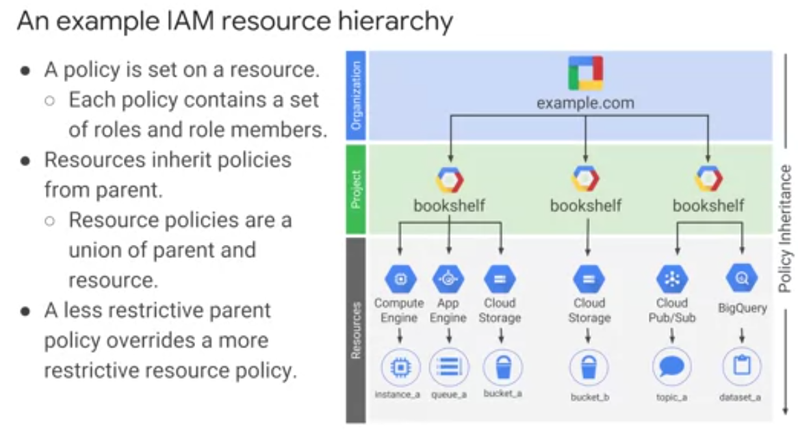

Работа с сервисами GCP. Проекты и ресурсы.
===========================================

Все ресурсы, которые используются в GCP, являются ли они виртуальными машинами, облачными хранилищами, таблицами и большим запросом или чем-то еще, организованы в **проекты (project)**. По желанию, эти проекты могут быть организованы в **папки (folder)**. Папки могут содержать другие папки. Все папки и проекты, используемые вашей организации, могут быть объединены в **узле организации (node)**. Проекты, папки и узлы организации — это места, где могут быть определены **политики**. Некоторые ресурсы GCP позволяют устанавливать политики на отдельные ресурсы, например, на корзины облачных хранилищ. Политики наследуются вниз в иерархии. Все ресурсы платформы Google Cloud принадлежат проекту. Проекты являются основой для включения и использования GCP-сервисов, таких как управление API, включение биллинга, добавление и удаление сотрудников и включение других сервисов Google. 

.. figure:: 00_prsheme.png
       :scale: 100 %
       :align: center
       :alt: asda
       

Каждый проект представляет собой отдельный отсек, и каждый ресурс принадлежит ровно одному. Проекты могут иметь разных владельцев и пользователей - они построены отдельно и управляются отдельно. Каждый проект GCP имеет имя и идентификатор проекта, которые ему назначаеся при создании. Идентификатор проекта является постоянным, неизменным идентификатором и должен быть уникальным в GCP. Идентификаторы проектов в используются в нескольких контекстах, чтобы сообщить GCP, с каким проектом необходимо работать. Для удобства можно присвоить названия проектов. GCP также присваивает каждому из проектов **уникальный номер** проекта, и он отображается в различных контекстах. В общем, идентификаторы проекта сделаны как строки, читаемые человеком, и вы будете использовать их часто для ссылки на проекты. 

       
Проекты можно разместить по папкам, хотя и не обязательно. Это инструмент для удобства администрирования. Например, папки можно использовать для представления различных отделов, команд, приложений или сред в организации. 

      
Папки позволяют командам делегировать административные права, чтобы они могли работать независимо. Ресурсы в папке наследуют политики IAM из папки. Итак, если проекты *project_3* и *project_4* управляются одной и той же командой по дизайну, то можно поместить политики IAM в папку B.

      
Размещение дубликатов этих политик в непосредственно  *project_3* и *project_4* излишне и подвержено ошибкам. 

Для того чтобы использовать папки, необходим **узел организации** в верхней части иерархии. Он предназначен для объединения всех проектов в компании в единую структуру централизованного мониторинга использования ресурсов и применения политик. 

      
Есть некоторые особые роли, связанные с этим узлом. Например, можно назначить пользователя администратором политики организации, чтобы только пользователи с данными привилегиями могли изменять политики. Можно назначить роль создателя проекта, что является отличным способом контролировать, кто может тратить деньги. После того, когда создан узел организации, можно создать в нем папки и размещать в них проекты. 

Вот пример того, как можете организовать свои ресурсы. 

      

Есть три проекта, каждый из которых использует ресурсы нескольких сервисов GCP. В этом примере мы не использовали никаких папок, хотя мы всегда могли перемещать проекты в папки. Ресурсы наследуют политики родительского ресурса. Например, если установить политику на уровне организации, она автоматически наследуется всеми дочерними проектами. И это наследство является транзитивным, что означает, что все ресурсы в этих проектах тоже наследуют политику. 

.. attention:: Политики, реализованные на более высоком уровне в иерархии, не могут отнять доступ, предоставляемый на более низком уровне. 

Например, предположим, что политика, применяемая на проекта книжной полки, дает пользователю Pat право изменять ведро облачного хранения, но политика на уровне организации говорит, что Pat может только просматривать ведра облачного хранения, не изменяя их. Более щедрая политика вступает в силу. Имейте это в виду при разработке политики. 
