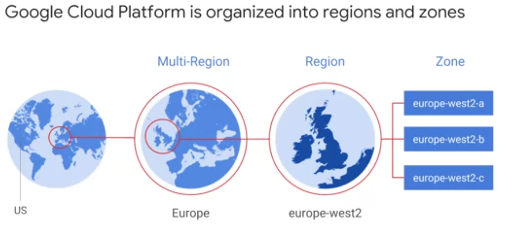
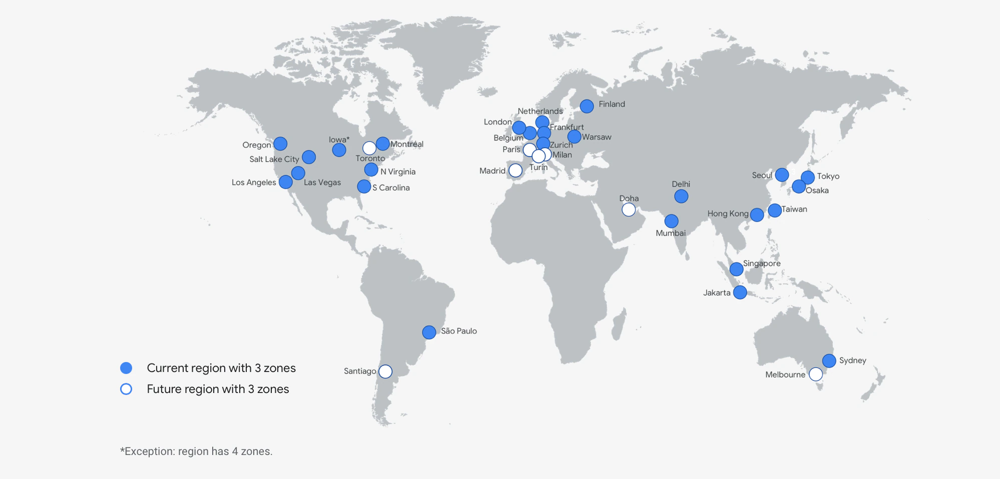

Регионы и зоны
~~~~~~~~~~~~~~~

Зона — это область развертывания ресурсов облачной платформы Google.
Например, при запуске виртуальной машины в GCP с помощью Compute Engine она запускается в указанной зоне.

       

Ресурсы Compute Engine размещены в нескольких местах по всему миру. Эти местоположения состоят из регионов и зон. Регион - это определенное географическое местоположение, в котором вы можете разместить свои ресурсы. Регионы имеют три или более зон. Например, регион us-west1 обозначает регион на западном побережье Соединенных Штатов, который имеет три зоны: us-west1-a, us-west1-b и us-west1-c.

Ресурсы, которые находятся в зоне, такие как экземпляры виртуальных машин или зональные постоянные диски, называются зональными ресурсами. Другие ресурсы, такие как статические внешние IP-адреса, являются региональными. Региональные ресурсы могут использоваться любым ресурсом в этом регионе, независимо от зоны, в то время как зональные ресурсы могут использоваться только другими ресурсами в той же зоне.

Например, чтобы подключить зональный постоянный диск к экземпляру, оба ресурса должны находиться в одной зоне. Аналогично, если вы хотите назначить экземпляру статический IP-адрес, экземпляр должен находиться в том же регионе, что и статический IP-адрес.

Размещение ресурсов в разных зонах региона снижает риск отключения инфраструктуры, влияющего на все ресурсы одновременно. Размещение ресурсов в разных регионах обеспечивает более высокую степень независимости от сбоев. Это позволяет создавать надежные системы с ресурсами, распределенными по различным областям сбоев.

Только определенные ресурсы зависят от региона или зоны. Другие ресурсы, такие как изображения, являются глобальными ресурсами, которые могут использоваться любыми другими ресурсами в любом месте. Для информирования

Зоны и кластеры
""""""""""""""""

Compute Engine реализует уровень абстракции между зонами и физическими кластерами, в которых размещены зоны. Кластер представляет собой отдельную физическую инфраструктуру, размещенную в центре обработки данных. Каждая зона размещается в одном или нескольких кластерах, и Compute Engine независимо сопоставляет зоны с кластерами для каждой организации. Например, зона us-central1-a для вашей организации может не соответствовать тому же кластеру, что и зона us-central1-a для другой организации.

Отделение зон от кластеров обеспечивает ряд преимуществ для вас и для Compute Engine :

Это позволяет вычислительному механизму обеспечивать сбалансированность ресурсов между кластерами в регионе.

Список зон, из которых вы можете выбрать, остается управляемым, поскольку Compute Engine продолжает расширять свои регионы с течением времени, добавляя больше кластеров.

Для большинства организаций Compute Engine гарантирует, что все проекты в организации имеют согласованное сопоставление зон с кластерами. Для организаций с проектами, в которых используется пиринг сети VPC или доступ к частным службам для совместного использования сетей или служб с другими организациями, Compute Engine пытается обеспечить, чтобы все пиринговые организации имели согласованную зону для сопоставления кластеров. Например, в случае крупных поставщиков SaaS, Compute Engine может не обеспечить согласованное сопоставление для всех одноранговых организаций. В этих случаях Вычислительный механизм гарантирует, что у одноранговых проектов есть согласованная зона для сопоставления кластеров.

Выбор региона и зоны
"""""""""""""""""""""""

Вы выбираете, в каком регионе или зоне размещаются ваши ресурсы, что определяет, где хранятся и используются ваши данные. Выбор региона и зоны важен по нескольким причинам:

* Обработка сбоев

Распределите свои ресурсы по нескольким зонам и регионам, чтобы избежать сбоев. Google разрабатывает зоны, чтобы свести к минимуму риск взаимосвязанных сбоев, вызванных отключениями физической инфраструктуры, такими как питание, охлаждение или подключение к сети. Таким образом, если зона становится недоступной, вы можете перенести трафик в другую зону в том же регионе, чтобы ваши сервисы продолжали работать. Аналогичным образом, вы можете смягчить влияние сбоя в работе региона на ваше приложение, запустив службы резервного копирования в другом регионе. Дополнительные сведения о распределении ресурсов и проектировании надежной системы см. в разделе Проектирование надежных систем.

* Уменьшена задержка в сети

Чтобы уменьшить задержку в сети, вы можете выбрать регион или зону, близкие к вашей точке обслуживания. Например, если у вас в основном клиенты на Восточном побережье США, то вы можете выбрать основной регион и зону, которые находятся рядом с этим регионом, и резервный регион и зону, которые также находятся поблизости.

Определение региона или зоны
"""""""""""""""""""""""""""""

Каждый регион в Compute Engine содержит несколько зон. Каждое имя зоны содержит две части, которые подробно описывают каждую зону. Первая часть названия зоны - это регион, а вторая часть названия описывает зону в регионе:

Регион
''''''''''

Регионы - это наборы зон. Зоны имеют высокую пропускную способность и сетевые подключения с низкой задержкой к другим зонам в том же регионе. Для развертывания отказоустойчивых приложений с высокой доступностью Google рекомендует развертывать приложения в нескольких зонах и нескольких регионах. Это помогает защитить от неожиданных отказов компонентов, вплоть до одной зоны или региона включительно.

Выберите регионы, которые подходят для вашего сценария. Например, если у вас есть клиенты только в США или если у вас есть особые потребности, требующие, чтобы ваши данные находились в США, имеет смысл хранить ваши ресурсы в зонах в регионе us-central1 или зонах в регионе us-west1.

Зона
'''''''''

Зона - это область развертывания в пределах региона. Полное имя зоны состоит из <регион>-<зона>. Например, полное имя зоны a в регионе us-central1 - us-central1-a.

В зависимости от того, насколько широко вы хотите распределить свои ресурсы, создайте экземпляры в нескольких зонах в нескольких регионах для избыточности.

Распределение ресурсов
~~~~~~~~~~~~~~~~~~~~~~~~~~

Облачные ресурсы Google размещены в нескольких местах по всему миру. Эти местоположения состоят из регионов с зонами внутри этих регионов. Размещение ресурсов в разных зонах региона обеспечивает изоляцию от многих типов сбоев инфраструктуры, оборудов*ания и программного обеспечения. Размещение ресурсов в разных регионах обеспечивает еще более высокую степень независимости от сбоев. Вы можете создавать надежные системы, распределяя ресурсы между различными областями сбоев.

Все ресурсы вычислительного ядра являются **глобальными, региональными или зональными**. Например, образы являются *глобальным* ресурсом, но постоянные диски являются *региональными* или *зональными* ресурсами. Область действия ресурса определяет, насколько ресурс доступен для других ресурсов. Например, глобальные ресурсы доступны ресурсам в любом регионе или зоне, поэтому экземпляры виртуальных машин (ВМ) из разных зон могут использовать один и тот же глобальный образ. Региональные ресурсы доступны только для ресурсов в пределах одного региона. Например, региональный статический внешний IP-адрес доступен только ресурсам в пределах одного региона. Чтобы экземпляр виртуальной машины использовал определенный статический внешний IP-адрес, экземпляр должен находиться в зоне, которая находится в том же регионе, что и адрес.

Объем ресурсов указывает, насколько они доступны для других ресурсов. Однако все ресурсы, будь то глобальные, зональные или региональные, должны быть уникальными в рамках проекта. Это означает, что каждый ресурс в Compute Engine должен иметь уникальное имя во всем проекте. Например, вы не можете назвать одинаково два экземпляра виртуальных машин в us-central1

Глобальные ресурсы
"""""""""""""""""""""

Глобальные ресурсы доступны любому ресурсу в любой зоне в рамках одного и того же проекта. При создании глобального ресурса вам не нужно указывать спецификацию области. Глобальные ресурсы включают:

* Адреса

Коллекция адресов содержит все глобальные статические внешние IP-адреса, которые вы зарезервировали для своего проекта. Глобальные статические внешние IP-адреса являются глобальным ресурсом и используются для глобальных балансировщиков нагрузки.

* Images

Образы используются любым экземпляром или дисковым ресурсом в том же проекте, что и образ. Google предоставляет предварительно настроенные изображения, которые вы можете использовать для загрузки своего экземпляра. Вы можете настроить одно из этих изображений или создать свое собственное изображение. При желании вы можете обмениваться изображениями между проектами.

* Snapshots

Постоянные моментальные снимки дисков доступны для всех дисков в рамках того же проекта, что и моментальный снимок. При необходимости вы можете обмениваться моментальными снимками между проектами.

* Сеть VPC

Сеть VPC является глобальным ресурсом, но отдельные подсети являются региональными ресурсами.

* Брандмауэры

Брандмауэры применяются к одной сети VPC и считаются глобальным ресурсом, поскольку пакеты могут достигать их из других сетей.

* Маршруты

Маршруты позволяют создавать сложные сетевые сценарии. Вы можете управлять маршрутизацией трафика для определенного диапазона IP-адресов. Маршруты аналогичны тому, как маршрутизатор направляет трафик в локальной сети. Маршруты применяются к сетям VPC в рамках облачного проекта Google и считаются глобальными ресурсами.

Региональные ресурсы
""""""""""""""""""""""""

Региональные ресурсы доступны для любых ресурсов в пределах одного региона. Например, если вы зарезервируете статический внешний IP-адрес в определенном регионе, этот статический внешний IP-адрес может быть назначен только экземплярам в этом регионе. В каждом регионе также есть одна или несколько зон.

Региональные ресурсы включают:

* Адреса

Коллекция адресов содержит все региональные статические внешние IP-адреса, которые вы зарезервировали для своего проекта. Статические внешние IP-адреса являются региональным ресурсом, который используется экземплярами, находящимися в том же регионе, что и адрес, в соответствии с региональными правилами пересылки для региональных балансировщиков нагрузки и для пересылки протоколов.

* Подсети

Подсети на региональном уровне сегментируют сетевое IP-пространство на префиксы (подсети) и определяют, из какого префикса выделяется внутренний IP-адрес экземпляра.

* Региональные группы управляемых экземпляров

Региональные группы управляемых экземпляров - это коллекции идентичных экземпляров, охватывающие несколько зон. Региональные группы управляемых экземпляров позволяют распределять нагрузку приложения по нескольким зонам, а не ограничивать приложение одной зоной или управлять несколькими группами экземпляров в разных зонах.

* Региональные постоянные диски

Региональные постоянные диски обеспечивают надежное хранение и репликацию данных между двумя зонами в пределах одного региона. В ситуации отработки отказа вы можете принудительно подключить региональный постоянный диск к другому экземпляру в том же регионе. Вы не можете принудительно подключить зональный постоянный диск к экземпляру. При необходимости вы можете совместно использовать дисковые ресурсы в разных проектах, что позволяет другим проектам создавать образы и моментальные снимки с этих дисков, но не позволяет экземплярам в других проектах подключать диски.

Зональные ресурсы
""""""""""""""""""""""

Ресурсы, размещенные в зоне, называются ресурсами для каждой зоны. Ресурсы, относящиеся к конкретной зоне, или ресурсы для каждой зоны, уникальны для этой зоны и могут использоваться только другими ресурсами в той же зоне. Например, экземпляр является ресурсом для каждой зоны. При создании экземпляра необходимо указать зону, в которой находится экземпляр. Экземпляр может получить доступ к другим ресурсам в той же зоне и может получить доступ к глобальным ресурсам, но он не может получить доступ к другим ресурсам для каждой зоны в другой зоне, таким как дисковый ресурс.

Примечание. Одним исключением является то, что экземпляры в одной зоне могут взаимодействовать с экземплярами в другой зоне, если оба экземпляра принадлежат к одной и той же сети VPC.

Ресурсы для каждой зоны включают:

* Экземпляры

Экземпляр виртуальной машины (ВМ) расположен в зоне и может получать доступ к глобальным ресурсам или ресурсам в пределах той же зоны.

* Постоянные диски

К постоянным дискам обращаются другие экземпляры в той же зоне. Вы можете прикрепить диск только к экземплярам в той же зоне, что и диск. Вы не можете подключить диск к экземпляру в другой зоне. При необходимости вы можете совместно использовать дисковые ресурсы в разных проектах, что позволяет другим проектам создавать образы и моментальные снимки с этих дисков, но не позволяет экземплярам в других проектах подключать диски.

* Типы машин

Типы машин - это ресурсы для каждой зоны. Экземпляры и диски могут использовать только те типы компьютеров, которые находятся в одной зоне.

* Зональные группы управляемых экземпляров

Группа управляемых экземпляров зоны использует шаблон экземпляра для создания группы идентичных экземпляров в пределах одной зоны. Вы управляете экземплярами виртуальных машин в группе управляемых экземпляров как единым целым, а не отдельными экземплярами.

