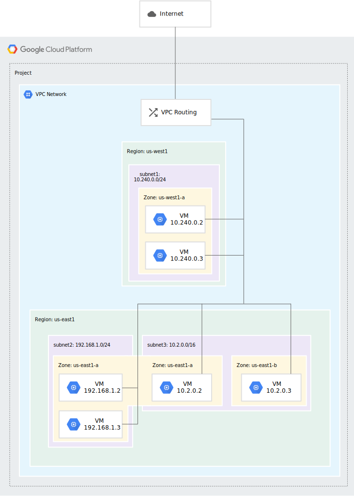

Virtual Private Cloud
==============================

Виртуальное частное облако (VPC) предоставляет сетевые функции для экземпляров виртуальных машин (ВМ) вычислительного ядра, кластеров Google Kubernetes Engine (GKE) и гибкой среды App Engine. VPC обеспечивает глобальную, масштабируемую и гибкую сеть для ваших облачных ресурсов и служб.

Сеть VPC - это глобальный ресурс, состоящий из региональных виртуальных подсетей (подсетей) в центрах обработки данных, соединенных глобальной глобальной сетью. Сети VPC логически изолированы друг от друга в облаке Google.

Сеть VPC обеспечивает следующее:

* Обеспечивает подключение для экземпляров виртуальных машин (ВМ) Compute Engine, включая кластеры Google Kubernetes Engine (GKE), экземпляры гибкой среды App Engine и другие облачные продукты Google, построенные на виртуальных машинах Compute Engine.
* Предлагает встроенную внутреннюю балансировку нагрузки TCP/UDP и прокси-системы для внутренних HTTP(S) балансировка нагрузки.
* Подключается к локальным сетям с помощью облачных VPN-туннелей и вложений Cloud Interconnect.
* Распределяет трафик от внешних балансировщиков нагрузки Google Cloud к бэкэндам.

Правила брандмауэра (firewalls)
""""""""""""""""""""""""""""""""""""

В каждой сети VPC реализован распределенный виртуальный брандмауэр, который можно настроить. Правила брандмауэра позволяют вам контролировать, каким пакетам разрешено отправляться в какие пункты назначения. В каждой сети VPC есть два подразумеваемых правила брандмауэра, которые блокируют все входящие подключения и разрешают все исходящие подключения.

В сети по умолчанию есть дополнительные правила брандмауэра, в том числе внутреннее правило по умолчанию "разрешить", которое разрешает обмен данными между экземплярами в сети.

Маршруты (routes)
"""""""""""""""""""""

Маршруты сообщают экземплярам виртуальных машин и сети VPC, как отправлять трафик от экземпляра к месту назначения либо внутри сети, либо за пределами Google Cloud. Каждая сеть VPC поставляется с некоторыми сгенерированными системой маршрутами для маршрутизации трафика между ее подсетями и отправки трафика из подходящих экземпляров в Интернет.

Вы можете создавать пользовательские статические маршруты для направления некоторых пакетов в определенные пункты назначения.

Правила пересылки (Forwarding rules)
"""""""""""""""""""""""""""""""""""""""

В то время как маршруты управляют трафиком, покидающим экземпляр, правила пересылки направляют трафик на облачный ресурс Google в сети VPC на основе IP-адреса, протокола и порта.

Некоторые правила пересылки направляют трафик из-за пределов Google Cloud в пункт назначения в сети; другие направляют трафик изнутри сети. Назначениями для правил пересылки являются целевые экземпляры, целевые объекты балансировщика нагрузки (целевые прокси-серверы, целевые пулы и серверные службы) и облачные VPN-шлюзы.

Узнайте больше о правилах пересылки.

Интерфейсы и IP-адреса
~~~~~~~~~~~~~~~~~~~~~~~~

IP-адреса
"""""""""""""

Облачные ресурсы Google, такие как экземпляры виртуальных машин Compute Engine, правила пересылки, контейнеры GKE и App Engine, для взаимодействия используют IP-адреса.

Несколько сетевых интерфейсов
"""""""""""""""""""""""""""""""

Вы можете добавить несколько сетевых интерфейсов к экземпляру виртуальной машины, где каждый интерфейс находится в уникальной сети VPC. Несколько сетевых интерфейсов позволяют виртуальной машине сетевого устройства выступать в качестве шлюза для защиты трафика между различными сетями VPC или в Интернет и из Интернета.

Совместное использование VPC и пиринг
~~~~~~~~~~~~~~~~~~~~~~~~~~~~~~~~~~~~~~~

Общий VPC

Вы можете предоставить общий доступ к сети VPC из одного проекта (называемого хост-проектом) другим проектам в вашей организации Google Cloud. Вы можете предоставить доступ ко всем общим сетям VPC или выбрать подсети в них, используя определенные разрешения IAM. Это позволяет обеспечить централизованный контроль над общей сетью при сохранении организационной гибкости. Общий VPC особенно полезен в крупных организациях.

Пиринг сети VPC
"""""""""""""""

Пиринг сетей VPC позволяет создавать экосистемы программного обеспечения как услуги (SaaS) в облаке Google, предоставляя частные услуги в разных сетях VPC, независимо от того, находятся ли сети в одном проекте, разных проектах или проектах в разных организациях.

При пиринге сети VPC вся связь осуществляется с использованием внутренних IP-адресов. В соответствии с правилами брандмауэра экземпляры виртуальных машин в каждой пиринговой сети могут взаимодействовать друг с другом без использования внешних IP-адресов.

Пиринговые сети автоматически обмениваются маршрутами подсети для диапазонов частных IP-адресов. Пиринг сети VPC позволяет настроить обмен следующими типами маршрутов:

Маршруты подсети для частных повторно используемых общедоступных диапазонов IP-адресов

Настраиваемые статические и динамические маршруты
""""""""""""""""""""""""""""""""""""""""""""""""""""""""

Сетевое администрирование для каждой пиринговой сети остается неизменным: политики IAM никогда не обмениваются пирингом сети VPC. Например, администраторы сети и безопасности для одной сети VPC не получают автоматически эти роли для пиринговой сети.

VPC network
===============

Сети VPC обладают следующими свойствами:

* Сети VPC, включая связанные с ними маршруты и правила брандмауэра, являются глобальными ресурсами. Они не связаны с каким-либо конкретным регионом или зоной.

* Подсети - это региональные ресурсы. Каждая подсеть определяет диапазон IP-адресов.

* Трафиком можно управлять с помощью правил сетевого брандмауэра. Правила реализованы на самих виртуальных машинах, поэтому трафик можно контролировать и регистрировать только по мере того, как он покидает или прибывает на виртуальную машину.

* Ресурсы в сети VPC могут взаимодействовать друг с другом с помощью внутренних адресов IPv4 в соответствии с применимыми правилами сетевого брандмауэра. Дополнительные сведения см. в разделе Связь внутри сети.

* Экземпляры с внутренними IP-адресами могут взаимодействовать с API и службами Google. 
* Сетевое администрирование может быть защищено с помощью ролей управления идентификацией и доступом (IAM).

* Организация может использовать общий VPC для сохранения сети VPC в общем проекте хоста. Авторизованные участники IAM из других проектов в той же организации могут создавать ресурсы, использующие подсети общей сети VPC.

* Сети VPC могут быть подключены к другим сетям VPC в разных проектах или организациях с помощью пиринга сети VPC.

* Сети VPC могут быть надежно подключены в гибридных средах с помощью облачной VPN или Cloud Interconnect.

* Сети VPC поддерживают трафик GRE, включая трафик через облачную VPN и облачное соединение. Сети VPC не поддерживают GRE для облачного NAT или для правил пересылки для балансировки нагрузки и пересылки протоколов. Поддержка GRE позволяет прерывать трафик GRE на виртуальной машине из Интернета (внешний IP-адрес) и облачного VPN или облачного соединения (внутренний IP-адрес). Декапсулированный трафик затем может быть перенаправлен в достижимое место назначения. GRE позволяет использовать такие службы, как служба безопасного доступа Edge (SASE) и SD-WAN.

Network and subnets
~~~~~~~~~~~~~~~~~~~~~~~

Терминология сети и подсети

Термины подсеть и подсеть являются синонимами. Они взаимозаменяемо используются в облачной консоли Google, командах gcloud и документации API.

Подсеть - это не то же самое, что сеть (VPC). Сети и подсети - это разные типы объектов в облаке Google.
Сети и подсети

Каждая сеть VPC состоит из одного или нескольких полезных разделов диапазона IP, называемых подсетями. Каждая подсеть связана с определенным регионом. Сети VPC не имеют связанных с ними диапазонов IP-адресов. Диапазоны IP-адресов определяются для подсетей.

Сеть должна иметь по крайней мере одну подсеть, прежде чем вы сможете ее использовать. Сети VPC в автоматическом режиме автоматически создают подсети в каждом регионе. Сети VPC в пользовательском режиме начинаются без подсетей, что дает вам полный контроль над созданием подсети. Вы можете создать более одной подсети для каждого региона. Дополнительные сведения о различиях между сетями VPC в автоматическом режиме и пользовательском режиме см. в разделе Типы сетей VPC.

При создании ресурса в Google Cloud выбирается сеть и подсеть. Для ресурсов, отличных от шаблонов экземпляров, также выбирается зона или регион. При выборе зоны неявно выбирается ее родительский регион. Поскольку подсети являются региональными объектами, регион, выбранный для ресурса, определяет подсети, которые он может использовать:

Процесс создания экземпляра включает в себя выбор зоны, сети и подсети. Доступные для выбора подсети ограничены подсетями в выбранном регионе. Google Cloud назначает экземпляру IP-адрес из диапазона доступных адресов в подсети.

Процесс создания группы управляемых экземпляров включает выбор зоны или региона в зависимости от типа группы и шаблона экземпляра. Шаблоны экземпляров, доступные для выбора, ограничены теми, чьи определенные подсети находятся в том же регионе, выбранном для группы управляемых экземпляров.
Шаблоны экземпляров являются глобальными ресурсами. Процесс создания шаблона экземпляра включает в себя выбор сети и подсети. Если вы выберете сеть VPC в автоматическом режиме, вы можете использовать автоматические подсети, чтобы отложить выбор подсети до той, которая доступна в выбранном регионе любой группы управляемых экземпляров, которая будет использовать шаблон. Сети VPC в автоматическом режиме по определению имеют подсеть в каждом регионе.

Google Cloud предлагает два типа сетей VPC, определяемых режимом создания их подсети:

* Когда создается сеть VPC в автоматическом режиме, в ней автоматически создается одна подсеть из каждого региона. Эти автоматически созданные подсети используют набор предопределенных диапазонов IP-адресов, которые соответствуют блоку CIDR 10.128.0.0/9. По мере появления новых облачных регионов Google новые подсети в этих регионах автоматически добавляются в сети VPC в автоматическом режиме с использованием диапазона IP-адресов из этого блока. В дополнение к автоматически созданным подсетям, вы можете вручную добавить дополнительные подсети в сети VPC в автоматическом режиме в регионах, которые вы выбираете, используя диапазоны IP-адресов за пределами 10.128.0.0/9.

* При создании сети VPC в пользовательском режиме подсети автоматически не создаются. Этот тип сети предоставляет вам полный контроль над своими подсетями и диапазонами IP-адресов. Вы сами решаете, какие подсети создавать в выбранных вами регионах, используя указанные вами диапазоны IP-адресов.

Можно переключить сеть VPC из автоматического режима в пользовательский режим. Это одностороннее преобразование; сети VPC в пользовательском режиме нельзя изменить на сети VPC в автоматическом режиме. Чтобы помочь вам решить, какой тип сети соответствует вашим потребностям, ознакомьтесь с рекомендациями по сетям VPC в автоматическом режиме.
