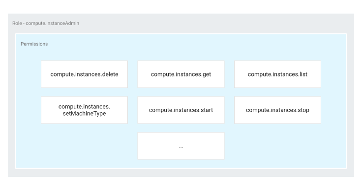

Роли IAM
~~~~~~~~~~~~

С помощью IAM вы управляете контролем доступа, определяя, **who** (identity) **имеет доступ** (role) к какому ресурсу. Например, экземпляры виртуальных машин Compute Engine, кластеры Google Kubernetes Engine (GKE) и корзины облачных хранилищ - все это облачные ресурсы Google. Организации, папки и проекты, которые вы используете для организации своих ресурсов, также являются ресурсами.

В IAM разрешение на доступ к ресурсу не предоставляется непосредственно конечному пользователю. Вместо этого разрешения группируются по ролям, а роли предоставляются участникам, прошедшим проверку подлинности.

Политика IAM определяет и применяет, какие роли предоставляются тем или иным участникам, и эта политика привязана к ресурсу. Когда аутентифицированный участник пытается получить доступ к ресурсу, IAM проверяет политику ресурса, чтобы определить, разрешено ли это действие.

На следующей диаграмме показано управление разрешениями в IAM.

	
Эта модель управления доступом состоит из трех основных частей:

Главный. Участником может быть учетная запись Google (для конечных пользователей), учетная запись службы (для приложений и виртуальных машин), группа Google или домен Google Workspace или Cloud Identity, который может получить доступ к ресурсу. Личность участника - это адрес электронной почты, связанный с пользователем, учетной записью службы или группой Google; или доменное имя, связанное с доменами Google Workspace или Cloud Identity.

Роль. Роль - это набор разрешений. Разрешения определяют, какие операции разрешены для ресурса. Когда вы предоставляете роль участнику, вы предоставляете все разрешения, которые содержит эта роль.

Политика. Политика IAM представляет собой набор привязок ролей, которые привязывают одного или нескольких участников к отдельным ролям. Если вы хотите определить, кто (участник) имеет какой тип доступа (роль) к ресурсу, вы создаете политику и прикрепляете ее к ресурсу.

На предыдущей диаграмме, например, политика IAM связывает участников, таких как user@example.com , к ролям, таким как роль администратора App Engine (роли/appengine.appadmin). Если политика прикреплена к проекту, участники получают указанные роли в рамках проекта.

Пользователи IAM
""""""""""""""""""

Google Account
'''''''''''''''''

Учетная запись Google представляет разработчика, администратора или любого другого лица, которое взаимодействует с Google Cloud. Любой адрес электронной почты, связанный с учетной записью Google, может быть удостоверением личности, включая gmail.com или в других доменах.
 
Service account
'''''''''''''''''

Учетная запись службы - это учетная запись приложения, а не отдельного конечного пользователя. Когда вы запускаете код, размещенный в облаке Google, код выполняется от имени указанной вами учетной записи. Вы можете создать столько учетных записей служб, сколько необходимо для представления различных логических компонентов вашего приложения. 

Приложения используют учетные записи служб для выполнения авторизованных вызовов API, авторизованные либо как сама учетная запись службы, либо как пользователи Google Workspace или Cloud Identity посредством делегирования домена.

Например, виртуальная машина Compute Engine может запускаться от имени учетной записи службы, и этой учетной записи могут быть предоставлены разрешения на доступ к необходимым ресурсам. Таким образом, учетная запись службы является удостоверением службы, а разрешения учетной записи службы определяют, к каким ресурсам может получить доступ служба.

Учетная запись службы идентифицируется по ее адресу электронной почты, который является уникальным для учетной записи.

Различия между учетной записью службы и учетной записью пользователя
++++++++++++++++++++++++++++++++++++++++++++++++++++++++++++++++++++++++

* Учетные записи служб не имеют паролей и не могут входить в систему с помощью браузеров или файлов cookie.
* Учетные записи служб связаны с частными/открытыми парами ключей RSA, которые используются для аутентификации в Google.
* Вы можете разрешить другим пользователям или учетным записям служб выдавать себя за учетную запись службы.

* Учетные записи служб не принадлежат вашему домену Google Workspace, в отличие от учетных записей пользователей. Если вы предоставляете общий доступ к ресурсам Google Workspace, таким как документы или события, всему домену Google Workspace, они не будут доступны для учетных записей служб. Аналогичным образом, ресурсы Google Workspace, созданные учетной записью службы, не создаются в вашем домене Google Workspace. В результате администраторы Google Workspace и Cloud Identity не могут владеть этими активами или управлять ими.

Google group
'''''''''''''''

Группа Google - это именованная коллекция учетных записей Google и учетных записей служб. У каждой группы Google есть уникальный адрес электронной почты, связанный с этой группой. Вы можете найти адрес электронной почты, связанный с группой Google, нажав "О программе" на главной странице любой группы Google. 

Группы Google - это удобный способ применить политику доступа к группе пользователей. Вы можете предоставлять и изменять элементы управления доступом для всей группы одновременно вместо предоставления или изменения элементов управления доступом по одному для отдельных пользователей или учетных записей служб. Вы также можете легко добавлять участников в группу Google и удалять их из нее вместо обновления политики IAM для добавления или удаления пользователей.

У групп Google нет учетных данных для входа, и вы не можете использовать группы Google для установления личности, чтобы сделать запрос на доступ к ресурсу.

Google Workspace domain
'''''''''''''''''''''''''''''

Домен Google Workspace представляет собой виртуальную группу всех учетных записей Google, созданных в учетной записи Google Workspace организации. Домены Google Workspace представляют собой доменное имя вашей организации в Интернете (например example.com ), и когда вы добавляете пользователя в свой домен Google Workspace, для пользователя внутри этой виртуальной группы создается новая учетная запись Google (например username@example.com ).

Как и группы Google, домены Google Workspace нельзя использовать для установления личности, но они обеспечивают удобное управление разрешениями.

Cloud Identity domain
''''''''''''''''''''''''''

Домен Cloud Identity похож на домен Google Workspace, поскольку он представляет виртуальную группу всех учетных записей Google в организации. Однако пользователи домена Cloud Identity не имеют доступа к приложениям и функциям Google Workspace.

All authenticated users
''''''''''''''''''''''''''''

Значение **allAuthenticatedUsers** - это специальный идентификатор, который представляет все учетные записи служб и всех пользователей в Интернете, прошедших проверку подлинности с помощью учетной записи Google. Этот идентификатор включает учетные записи, которые не подключены к домену Google Workspace или Cloud Identity, например личные учетные записи Gmail. Пользователи, которые не прошли проверку подлинности, такие как анонимные посетители, не включаются.

Некоторые типы ресурсов не поддерживают этот основной тип.

Some resource types do not support this principal type.

All users
'''''''''''''''

Значение **allUsers** - это специальный идентификатор, который представляет всех, кто находится в Интернете, включая аутентифицированных и не прошедших проверку подлинности пользователей.

Некоторые типы ресурсов не поддерживают этот основной тип.

Ресурс
"""""""""""""

Если пользователю необходим доступ к определенному облачному ресурсу Google, вы можете предоставить пользователю **роль** для этого ресурса. Некоторыми примерами ресурсов являются проекты, экземпляры вычислительных ядер и корзины облачных хранилищ.

Некоторые службы поддерживают предоставление разрешений IAM с более высокой степенью детализации, чем на уровне проекта. Например, вы можете предоставить роль администратора хранилища (roles/storage.admin) пользователю для определенного облачного хранилища или предоставить роль администратора экземпляра Compute Instance (roles/compute.instanceadmin) пользователю для определенного экземпляра Compute Engine.

В других случаях вы можете предоставить разрешения IAM на уровне проекта. Затем разрешения наследуются всеми ресурсами в рамках этого проекта. Например, чтобы предоставить доступ ко всем сегментам облачного хранилища в проекте, предоставьте доступ к проекту, а не к каждому отдельному сегменту. Или чтобы предоставить доступ ко всем экземплярам вычислительного ядра в проекте, предоставьте доступ к проекту, а не к каждому отдельному экземпляру.

Для получения информации о том, какие роли могут быть предоставлены для каких ресурсов, см. раздел Общие сведения о ролях и обратитесь к столбцу Наименьших ресурсов для данной роли.

Разрешения
"""""""""""

Разрешения определяют, какие операции разрешены для ресурса. В мире IAM разрешения представлены в форме **service.resource.verb**, например, **pubsub.subscriptions.consume**.

Разрешения часто соответствуют один к одному методам REST API. То есть каждая облачная служба Google имеет соответствующий набор разрешений для каждого метода REST API, который она предоставляет. Вызывающему этот метод требуются эти разрешения для вызова этого метода. Например, если вы используете Pub/sub и вам нужно вызвать метод **topics.publish()**, у вас должно быть разрешение **pubsub.topics.publish** для этой темы.

Вы не предоставляете разрешения пользователям напрямую. Вместо этого вы определяете роли, которые содержат соответствующие разрешения, а затем предоставляете эти роли пользователю.

Роли
""""""""

Роль - это набор разрешений. Вы не можете предоставить разрешение пользователю напрямую. Вместо этого вы предоставляете им определенную роль. Когда вы предоставляете роль пользователю, вы предоставляете ему все разрешения, которые содержит роль.

	
В IAM есть несколько видов ролей:

**Basic roles (Основные роли)**: Роли, исторически доступные в облачной консоли Google. Эти роли - Owner, Editor, and Viewer (Владелец, Редактор и Просмотрщик).

.. warning:: Базовые роли включают тысячи разрешений для всех облачных сервисов Google. В производственных средах не предоставляйте базовые роли, если нет альтернативы. Вместо этого предоставьте наиболее ограниченные предопределенные роли или пользовательские роли, соответствующие вашим потребностям.

**Predefined roles (Предопределенные роли)**: Роли, которые обеспечивают более детальный контроль доступа, чем базовые роли. Например, предопределенная роль Pub/Sub Publisher  (роли/pubsub.publisher) предоставляет доступ только к публикации сообщений в Pub/Sub topic.

**Custom roles (Пользовательские роли)**: Роли, которые вы создаете, чтобы адаптировать разрешения к потребностям вашей организации, когда предопределенные роли не соответствуют вашим потребностям.

Политика IAM
~~~~~~~~~~~~~

Вы можете предоставить роли пользователям, создав политику IAM, которая представляет собой набор инструкций, определяющих, у кого какой тип доступа. Политика прикрепляется к ресурсу и используется для обеспечения контроля доступа при каждом обращении к этому ресурсу.

Политика IAM представлена объектом политики IAM. Объект политики IAM состоит из списка привязок ролей. Привязка роли привязывает список участников к роли.

Role: Роль, которую вы хотите предоставить руководителю. роль указывается в виде ролей/service.RoleName. Например, Облачное хранилище предоставляет роли роли/storage.objectadmin, роли/storage.objectcreator и роли/storage.objectviewer, среди прочих.

members: Список одного или нескольких участников, как описано в разделе "Концепции, связанные с идентификацией" в этом документе. Каждый основной тип идентифицируется с помощью префикса, такого как учетная запись Google (пользователь:), учетная запись службы (учетная запись службы:), группа Google (группа:) или домен Google Workspace или Cloud Identity (домен:). В следующем примере фрагмента кода роль storage.objectadmin предоставляется следующим участникам с использованием соответствующего префикса: user:ali@example.com , serviceAccount:my-other-app@appspot.gserviceaccount.com , group:admins@example.com , и domain:google.com . Роль objectViewer предоставляется user:maria@example.com .

Следующий фрагмент кода показывает структуру политики IAM.

	
IAM и политики API
""""""""""""""""""""""""""""""""

IAM предоставляет набор методов, которые вы можете использовать для создания политик контроля доступа к облачным ресурсам Google и управления ими. Эти методы предоставляются службами, поддерживающими IAM. Например, методы IAM предоставляются API-интерфейсами Resource Manager, Pub / SUB и Cloud Life Sciences, и это лишь некоторые из них.

Методы IAM заключаются в следующем:

setIamPolicy(): Устанавливает политики для ваших ресурсов.
getIamPolicy(): Возвращает политику, которая была установлена ранее.
testIamPermissions(): Проверяет, имеет ли вызывающий объект указанные разрешения для ресурса.

Иерархия ресурсов
"""""""""""""""""""

Облачные ресурсы Google организованы иерархически:

Организация является корневым узлом в иерархии.
Папки являются дочерними элементами организации.
Проекты являются дочерними элементами организации или папки.
Ресурсы для каждой службы являются потомками проектов.

У каждого ресурса есть ровно один родитель.

На следующей диаграмме приведен пример иерархии облачных ресурсов Google.

.. figure:: policy-inheritance.svg
	:align:center
	

