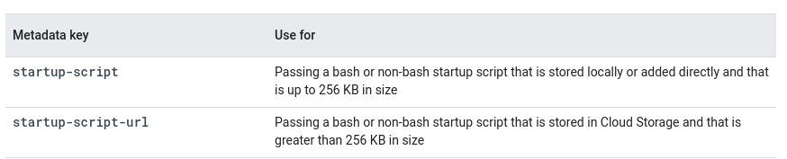
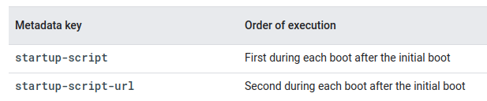

Metadata
============
:Метаданные: Информация о другой информации, или данные, относящиеся к дополнительной информации о содержимом или объекте. Метаданные раскрывают сведения о признаках и свойствах, характеризующих какие-либо сущности, позволяющие автоматически искать и управлять ими в больших информационных потоках. 

Каждый экземпляр виртуальной машины (ВМ) хранит свои метаданные на сервере метаданных. Каждая виртуальная машина автоматически получает доступ к API сервера метаданных без какой-либо дополнительной авторизации. Метаданные хранятся в виде пар **ключ:значение**.

Существует набор ключей метаданных по умолчанию, доступных для виртуальных машин, работающих Compute Engine. Список этих ключей https://cloud.google.com/compute/docs/metadata/default-metadata-values. Можно использовать собственные пользовательские ключи метаданных для отдельной виртуальной машины или проекта. 

После настройки записи метаданных по умолчанию или пользовательских метаданных вы можете просмотреть информацию о метаданных для этой виртуальной машины или проекта. Для просмотра метаданных см. раздел Запрос метаданных виртуальной машины.
Использование метаданных виртуальной машины

В следующих разделах описано несколько сценариев, в которых вы можете использовать записи метаданных для управления виртуальными машинами.

Сценарии запуска и завершения работы
"""""""""""""""""""""""""""""""""""""""""

Сервер метаданных особенно полезен при использовании в сочетании со сценариями запуска и завершения работы, поскольку вы можете использовать сервер метаданных для программного получения уникальной информации о виртуальной машине без дополнительной авторизации.

Например, можно написать сценарий запуска, который получает пару метаданных ключ:значение для внешнего IP-адреса виртуальной машины, и использовать этот IP-адрес в своем сценарии для настройки базы данных. Поскольку ключи метаданных по умолчанию одинаковы на каждой виртуальной машине, вы можете повторно использовать свой сценарий без необходимости обновлять его для каждой виртуальной машины. Это поможет вам создавать менее хрупкий код для ваших приложений.

Дополнительные сведения о сценариях запуска см. в разделе Обзор сценариев запуска.
Дополнительные сведения о сценариях завершения работы см. в разделе Выполнение сценариев завершения работы.

Обслуживание хоста
"""""""""""""""""""""

Сервер метаданных предоставляет информацию о опции планирования виртуальных машин с помощью записи каталога планирование/ метаданные и атрибута событие обслуживания. Вы можете использовать эти значения метаданных для уведомления о предстоящем событии обслуживания, чтобы подготовить среду к этому событию. Дополнительные сведения см. в разделе Получение уведомлений о миграции в реальном времени.
Атрибуты гостя

Гостевые атрибуты - это определенный тип пользовательских метаданных, в которые ваши приложения могут записывать данные во время работы на виртуальных машинах. Используйте гостевые атрибуты только в тех случаях, когда требуются небольшие объемы данных, которые не часто меняются. Дополнительные сведения об атрибутах гостя см. в разделе Настройка и запрос атрибутов гостя.

Соображения безопасности метаданных
"""""""""""""""""""""""""""""""""""""""""

Когда вы делаете запрос на получение информации с сервера метаданных, ваш запрос и последующий ответ на метаданные никогда не покидают физического хоста, на котором запущена виртуальная машина.

Однако любой процесс, который может запрашивать URL-адрес метаданных, имеет доступ ко всем значениям на сервере метаданных. Сюда входят любые пользовательские значения метаданных, которые вы записываете на сервер. Google рекомендует проявлять осторожность при записи конфиденциальных значений на сервер метаданных или при запуске сторонних процессов.

Сценарий запуска - это файл, который выполняет задачи в процессе запуска экземпляра виртуальной машины (ВМ). Сценарии запуска могут применяться ко всем виртуальным машинам в проекте или к одной виртуальной машине. Сценарии запуска, заданные метаданными уровня виртуальной машины, переопределяют сценарии запуска, заданные метаданными уровня проекта, и сценарии запуска выполняются только при наличии сети. В этом документе описывается, как использовать сценарии запуска на экземплярах виртуальных машин Linux. Дополнительные сведения о том, как добавить сценарий запуска на уровне проекта, см. в разделе Добавление метаданных gcloud compute project-info.

Для сценариев запуска Linux вы можете использовать файл
* bash или не-bash. 
* Чтобы использовать файл, отличный от bash, укажите интерпретатор, добавив **#!** в начало файла. Например, чтобы использовать сценарий запуска Python 3, добавьте 

::

	#! /usr/bin/python3 в начало файла.

Если вы укажете сценарий запуска с помощью одной из процедур в этом документе, Compute Engine выполнит следующее:

* Копирует сценарий запуска на виртуальную машину
* Устанавливает разрешения на запуск для сценария запуска
* Запускает сценарий запуска от имени пользователя **root** при загрузке виртуальной машины

Ключи метаданных для сценариев запуска Linux
""""""""""""""""""""""""""""""""""""""""""""""

https://cloud.google.com/compute/docs/instances/startup-scripts/linux#passing-directly

Сценарий запуска передается виртуальной машине из расположения, указанного ключом метаданных. Ключ метаданных указывает, хранится ли сценарий запуска локально, в облачном хранилище или передается непосредственно виртуальной машине. Используемый вами ключ метаданных также может зависеть от размера сценария запуска.

В следующей таблице показаны ключи метаданных, которые можно использовать для сценариев запуска Linux, и представлена информация о том, какой ключ использовать, в зависимости от места хранения и размера сценария запуска.

	
Порядок выполнения сценариев запуска Linux
""""""""""""""""""""""""""""""""""""""""""""

Вы можете использовать несколько сценариев запуска. Сценарии запуска, сохраненные локально или добавленные непосредственно, выполняются перед сценариями запуска, хранящимися в облачном хранилище. В следующей таблице на основе ключа метаданных показан порядок выполнения сценариев запуска Linux.

	

