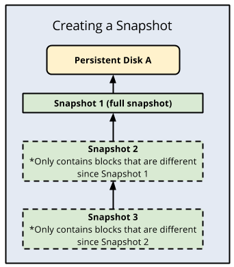
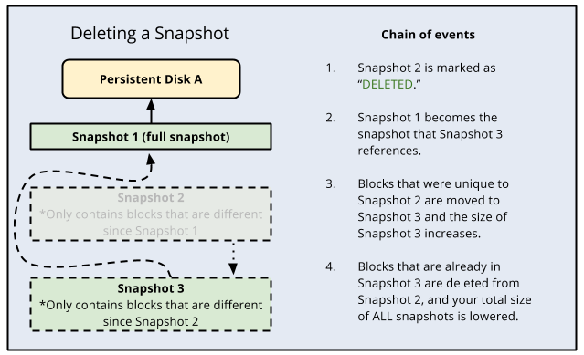

Снимки постоянного диска
=========================

Моментальные снимки постепенно создают резервные копии данных с ваших постоянных дисков. После создания моментального снимка текущего состояния диска его можно использовать для восстановления этих данных на новый диск. Compute Engine хранит несколько копий каждого моментального снимка в нескольких местах с автоматическими контрольными суммами для обеспечения целостности ваших данных.

Вы можете создавать моментальные снимки с дисков, даже если они подключены к запущенным экземплярам виртуальных машин (ВМ). Жизненный цикл моментального снимка, созданного с диска, подключенного к работающим экземплярам виртуальной машины, не зависит от жизненного цикла экземпляра виртуальной машины.

Обратите внимание, что моментальные снимки отличаются от пользовательских образов и образов компьютеров, которые полезны для создания загрузочных дисков экземпляра.

Работа со снимками
~~~~~~~~~~~~~~~~~~~~~

Вы можете создать моментальный снимок своего диска перед выполнением потенциально опасной операции, чтобы можно было отменить изменение в случае неожиданных результатов.

Чтобы узнать, как восстановить содержимое моментального снимка на новый диск, см. раздел Восстановление моментальных снимков.

Если вам больше не нужен конкретный снимок, вы можете снизить затраты на хранение, удалив снимок.

Чтобы снизить риск непредвиденной потери данных, рассмотрите наилучшую практику настройки расписания моментальных снимков, чтобы обеспечить регулярное резервное копирование ваших данных.

Доступ к моментальным снимкам
~~~~~~~~~~~~~~~~~~~~~~~~~~~~~~~~

Моментальные снимки являются глобальными ресурсами, поэтому любой моментальный снимок доступен любому ресурсу в рамках одного проекта.

Вы также можете обмениваться моментальными снимками между проектами.

Ограничения
""""""""""""""""

Нельзя изменить расположение хранилища существующего моментального снимка. См. раздел Выбор места хранения для моментального снимка.

Вы можете делать снимки своих дисков не чаще одного раза в 10 минут. Если вы хотите отправить пакет запросов на создание моментальных снимков ваших дисков, вы можете отправить не более 6 запросов за 60 минут. Дополнительные сведения см. в разделе Ограничения частоты моментальных снимков.

Как работают инкрементные моментальные снимки
~~~~~~~~~~~~~~~~~~~~~~~~~~~~~~~~~~~~~~~~~~~~~~~~~~~~

Моментальные снимки являются инкрементными и автоматически сжимаются, поэтому вы можете создавать обычные моментальные снимки на постоянном диске быстрее и с меньшими затратами, чем если бы вы регулярно создавали полный образ диска.

.. attention::  Моментальные снимки по умолчанию являются инкрементными, чтобы избежать выставления счетов за избыточные данные и свести к минимуму использование места для хранения. Однако для обеспечения надежности истории моментальных снимков моментальный снимок может иногда захватывать полный образ диска. Это происходит автоматически, чтобы максимально оптимизировать пространство для хранения и затраты, и вам не нужно выбирать между созданием добавочных или полных моментальных снимков. Когда это происходит, предыдущие инкрементные моментальные снимки этого диска остаются неизменными.

Инкрементные моментальные снимки работают следующим образом:

* Первый успешный снимок постоянного диска - это полный снимок, содержащий все данные на постоянном диске.
* Второй снимок содержит только любые новые или измененные данные с момента первого снимка. Данные, которые не изменились с момента создания снимка 1, не включаются. Вместо этого снимок 2 содержит ссылки на снимок 1 для любых неизмененных данных.
* Снимок 3 содержит любые новые или измененные данные со снимка 2, но не будет содержать никаких неизмененных данных со снимка 1 или 2. Вместо этого снимок 3 содержит ссылки на блоки в снимке 1 и снимке 2 для любых неизмененных данных.

Это повторяется для всех последующих снимков постоянного диска. Моментальные снимки всегда создаются на основе последнего успешного снимка.

	
Удаление моментального снимка
~~~~~~~~~~~~~~~~~~~~~~~~~~~~~~~

Compute Engine использует инкрементные моментальные снимки, так что каждый снимок содержит только те данные, которые изменились с момента предыдущего снимка. Для неизмененных данных моментальные снимки ссылаются на данные в предыдущих моментальных снимках. Стоимость хранения для постоянных моментальных снимков диска взимается только за общий размер моментального снимка.

Когда вы удаляете снимок, Compute Engine немедленно помечает снимок как УДАЛЕННЫЙ в системе. Если у моментального снимка нет зависимых моментальных снимков, он сразу удаляется. Однако, если у моментального снимка есть зависимые моментальные снимки:

* Любые данные, необходимые для восстановления других снимков, перемещаются в следующий снимок, увеличивая его размер.
* Все данные, которые не требуются для восстановления других моментальных снимков, удаляются. Это уменьшает общий размер всех ваших снимков.
* Следующий снимок больше не ссылается на снимок, помеченный для удаления, а вместо этого ссылается на снимок перед ним.

* Поскольку для последующих снимков может потребоваться информация, сохраненная в предыдущем снимке, имейте в виду, что удаление снимка не обязательно удаляет все данные на снимке. Чтобы окончательно удалить данные из ваших снимков, вы должны удалить все снимки.

* Если на вашем диске есть расписание моментальных снимков, вы должны отсоединить расписание моментальных снимков от диска, прежде чем сможете удалить расписание. Удаление расписания моментальных снимков с диска предотвращает дальнейшую активность с моментальными снимками. Вы не можете удалить расписание, прикрепленное к диску. У вас есть возможность вручную удалить снимки в любое время.

На следующей диаграмме показан этот процесс:

	
Размер снимка и удаленные блоки
~~~~~~~~~~~~~~~~~~~~~~~~~~~~~~~~

Моментальные снимки захватывают части диска, которые были записаны и не удалены. В зависимости от конфигурации файловой системы диска иногда удаленные файлы не удаляются. Если это произойдет, вы можете увидеть, что размер вашего снимка больше, чем используемое пространство на диске, о котором сообщает файловая система. Чтобы избежать этого, рекомендуется включить опцию удаления или запустить fstrim на вашем диске.

Цепочки моментальных снимков
"""""""""""""""""""""""""""""""

Используя инструмент gcloud или API Compute Engine, вы можете создавать моментальные снимки в отдельных цепочках моментальных снимков, указав имя цепочки моментальных снимков. При создании нескольких снимков постоянного диска с использованием имени цепочки каждый снимок постепенно основывается на последнем успешном снимке, созданном с этим именем цепочки. Это доступно в бета-версии. Используйте это поле только в том случае, если вы являетесь владельцем расширенной службы, которому необходимо создавать отдельные цепочки моментальных снимков, например, для отслеживания возврата платежей.

Место хранения моментальных снимков
~~~~~~~~~~~~~~~~~~~~~~~~~~~~~~~~~~~~~

При создании моментального снимка можно указать место хранения. Расположение моментального снимка влияет на его доступность и может привести к сетевым затратам при создании моментального снимка или его восстановлении на новый диск.

Моментальные снимки могут храниться либо в одном многорегиональном облачном хранилище, например в asia, либо в одном региональном облачном хранилище, например в **asia-south1**.

Многорегиональное хранилище обеспечивает более высокую доступность и может снизить сетевые затраты при создании или восстановлении моментального снимка. Например, создание диска из snapshot, хранящегося в межрегиональном расположении, не требует затрат на сеть, если новый постоянный диск создается в одном из регионов межрегиональной группы. Региональное хранилище дает вам больше контроля над физическим расположением ваших данных, поскольку вы указываете один регион.

Моментальный снимок можно использовать для создания нового диска в любом регионе и зоне, независимо от места хранения моментального снимка.

Если у вас есть политика организации, которая включает ограничение расположения ресурсов, любое указанное вами место хранения моментальных снимков должно находиться в наборе местоположений, определенных ограничением. Дополнительные сведения см. в разделе Расположение ресурсов вычислительного ядра.

Если вы не укажете место хранения для моментального снимка, Google Cloud использует расположение по умолчанию, в котором ваш моментальный снимок хранится в многорегиональном облачном хранилище, ближайшем к региону исходного диска. Если вам нужно выбрать региональное хранилище или указать другое межрегиональное расположение, сохраните снимок в пользовательском расположении.

Расположение по умолчанию
"""""""""""""""""""""""""""""

Если вы не укажете место хранения, ваш снимок будет сохранен в мультирегионе, географически ближайшем к местоположению вашего постоянного диска.

Например, если ваш постоянный диск хранится в us-central1, ваш снимок по умолчанию хранится в мультирегионе США.

Однако местоположение по умолчанию, такое как  australia-southeast1, находится за пределами мультирегиона. Ближайшим мультирегионом является asia. Создание или восстановление моментального снимка приводит к затратам на сеть.

Некоторые примеры использования для выбора расположения по умолчанию для хранения снимков включают следующее:

* Расположение по умолчанию в нескольких регионах соответствует корпоративным или государственным политикам размещения данных.
* Ваш постоянный диск хранится в региональном расположении, которое является частью многорегионального расположения по умолчанию. Например, ваш постоянный диск находится в регионе us-central1, поэтому по умолчанию используется мультирегион США. В этом случае более высокая доступность моментальных снимков имеет приоритет при риске снижения производительности восстановления моментальных снимков.
* Вы не ожидаете, что ваши моментальные снимки будут часто восстанавливаться на дисках, расположенных за пределами хранилища моментальных снимков по умолчанию.

Пользовательское местоположение
"""""""""""""""""""""""""""""""""""

Выберите пользовательское расположение для хранения снимка в региональном расположении или, если вам нужно указать другое межрегиональное расположение.

Ниже приведены некоторые примеры выбора пользовательского места хранения для ваших снимков:

* Пользовательское расположение в нескольких регионах соответствует корпоративной или государственной политике размещения данных.
* Ваше приложение развернуто в регионе, который не входит в одно из многорегиональных расположений облачного хранилища, и вы хотите установить приоритет производительности восстановления моментальных снимков над доступностью моментальных снимков.
* Моментальные снимки восстанавливаются несколько раз с диска, расположенного за пределами хранилища моментальных снимков по умолчанию.

Если вам необходимо соблюдать корпоративные или государственные политики размещения данных, сохраните свой снимок в ближайшем региональном местоположении, которое соответствует этим политикам.

Если ваше приложение развернуто не в нескольких регионах и вы хотите установить приоритет между низкими сетевыми затратами и высокой доступностью моментальных снимков, сохраните снимок в регионе, где находится исходный диск. Хранение моментального снимка в регионе, где расположен исходный диск, сводит к минимуму сетевые затраты на восстановление и создание моментальных снимков с этого исходного диска.

Однако, в отличие от многорегионального хранилища, региональное хранилище не хранит ваши данные избыточно в нескольких центрах обработки данных, поэтому ваши данные могут быть недоступны в случае крупномасштабного сбоя. Чтобы обеспечить доступность ваших данных, вам также может потребоваться сохранить резервный снимок во втором расположении.

Затраты на сеть
""""""""""""""""

Выбор места хранения моментальных снимков имеет жизненно важное значение для минимизации затрат на сеть. Если вы храните снимок в том же регионе, что и исходный диск, плата за подключение к сети при доступе к этому снимку из того же региона не взимается. Если вы получаете доступ к снимку из другого региона, это будет стоить сети.

Если географическое расположение хранилища исходного диска совпадает с его мультирегиональным, плата за подключение к сети не взимается.

Например, если ваш исходный диск находится в регионе asia-east1-a, вы можете сохранить свой снимок в регионе asia-east1-a или в мультирегионе asia. Вы не понесете затрат на сеть при доступе к своим моментальным снимкам.

За межрегиональный доступ к сети взимается плата. Например, если ваш исходный диск находится в asia-east1, а вы храните свои снимки в asia-east12, вы понесете расходы на сеть при доступе к снимку между этими двумя регионами.

В двух регионах, australia-southeast1 и southamerica-east1, по умолчанию установлено хранилище моментальных снимков для нескольких регионов, что потребует затрат на сеть, если вы не переопределите значение по умолчанию при создании моментального снимка:

* Если ваш исходный диск находится в australia-southeast1, место хранения моментальных снимков по умолчанию находится в мультирегионе asia. Чтобы снизить затраты, переопределите это расположение по умолчанию и храните свои снимки в регионе australia-southeast1.

* Если ваш исходный диск находится в southamerica-east1, место хранения моментальных снимков по умолчанию находится в мультирегионе us. Чтобы снизить затраты, переопределите это расположение по умолчанию и храните свои снимки в регионе southamerica-east1.

Если вы восстановите моментальный снимок на диск в регионе, который не включен в расположение хранилища моментального снимка, вы понесете расходы на сеть. Например, если вы создадите новый региональный постоянный диск в australia-southeast1 из моментального снимка, хранящегося в asia, в многорегиональном расположении, вы понесете расходы на сеть.

Creating snapshots
~~~~~~~~~~~~~~~~~~~~~

https://cloud.google.com/compute/docs/disks/create-snapshots#creating_snapshots
