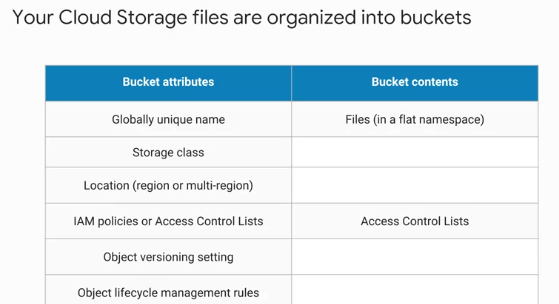
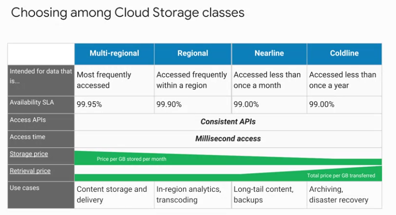
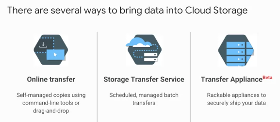

Cloud Storage 
==================   

Хранилище Google это не то же самое, что файловое хранилище, в котором вы управляете своими данными как иерархией папок и это не то же самое, что блочное хранилище, в котором ваша операционная система управляет вашими данными как куски диска. Вместо этого хранение объектов означает, что все хранится в виде произвольной кучи байтов и хранилище позволяет вам обращаться к нему с помощью уникального ключа. Часто эти уникальные ключи находятся в виде URL-адресов , что означает, что хранилище объектов хорошо взаимодействует с веб-технологиями. Это полностью управляемый масштабируемый сервис. Это означает, что не нужно выделять ресурсы раньше времени. Просто  сохраняются объекты и сервис хранит их с высокой прочностью и высокой доступностью. Можно использовать облачное хранилище для множества вещей: для обслуживания содержимого веб-сайта, хранения данных для архивирования и аварийного восстановления, или для распространения больших объектов данных конечным пользователям через Direct Download. 

Облачное хранилище не является файловой системой , так как каждый объект в облачном хранилище имеет URL-адрес. Каждый объект является "файлом" но все же это не файловая система. 

Вместо этого облачное хранилище состоит из корзин (backets) , которые создаются, настраиваются и используются для хранения объектов хранения. Объекты хранения неизменны, что означает, что они не редактируются их на месте, а создаются новые версии. 

Cloud Storage всегда шифрует данные на стороне сервера до того, как они будут записаны на диск (бесплатно). Также по умолчанию транзитные данные шифруются с помощью HTTPS. Говоря о передаче данных, есть сервисы, которые можно использовать для удобного получения больших объемов данных в облачное хранилище. После того, как они находятся в облачном хранилище, можно переместить их в другие службы хранения GCP. Файлы облачного хранилища организованы в **backets**. Когда вы создаете **backets**, ему присваивается глобальное уникальное имя, указывается географическое местоположение и выбирается класс хранения по умолчанию. необходимо выбрать местоположение, которое минимизирует задержку для пользователей. Другими словами, если большинство ваших пользователей в Европе, то лучше выбрать европейское местоположение. 

Контроль доступа
~~~~~~~~~~~~~~~~~~~~~

	

Есть несколько способов контролировать доступ к вашим объектам и backets. Для большинства целей достаточно облачного IAM. Роли наследуются от проекта к объекту. Если нужен более тонкий контроль, можете создать списки управления доступом (ACL), которые обеспечивают более тонкий контроль. ACL определяют, кто имеет доступ к вашим ведрам и объектам , а также какой уровень доступа у них. Каждый ACL состоит из двух частей информации, области, которая определяет, кто может выполнять указанные действия, например конкретного пользователя или группы пользователей и разрешение , определяющее, какие действия могут быть выполнены. Например, читать или писать. 

Версии
~~~~~~~~~~

Объекты облачного хранилища неизменны. Можете включить управление версиями объектов на backets. При этом облачное хранилище будет хранить историю изменений. То есть он переопределять или удалять все объекты в backets. Можно перечислить архивные версии объекта, восстановить объект в старое состояние или безвозвратно удалить версию по мере необходимости. Если не включать управление версиями объектов, new всегда переопределяет старые. 

Cloud Storage также предлагает политики управления жизненным циклом. Например, можно указать облачному хранилищу удалять объекты старше 365 дней. Если необходимо удалить объекты, созданные до 1 января 2013 или сохранить только три самые последние версии каждого объекта в ведре с включенным контролем версий.   

Cloud Storage interactions 
~~~~~~~~~~~~~~~~~~~~~~~~~~~~~~  

	

Облачное хранилище позволяет выбрать один из четырех типов классов хранения:
* Региональный
* Multi-региональный
* Nearline 
* Coldline. 

Многорегиональные и региональные являются высокопроизводительными объектными хранилищами, в то время как Nearline и Coldline являются резервными и архивными хранилищами. 

Доступ ко всем классам хранения осуществляется сопоставимыми способами с помощью API облачного хранилища, и все они поддерживают доступ в течение миллисекунды. 

**Региональное хранилище** позволяет хранить данные в определенном регионе GCP: Центральная, Западная Европа или Восточная Азия. Это дешевле, чем многорегиональные хранилища, но обеспечивает меньшую избыточность. 

**Многорегиональное хранилище**, с другой стороны, стоит немного дороже, но оно геоизбыточно. Это означает, что вы выбираете широкое географическое положение, как США, Европейский Союз, или Азия и облачное хранилище хранит ваши данные в по крайней мере два географических местоположения, разделенных по крайней мере 160 километров. Многорегиональное хранилище подходит для хранения часто используемых данных. Например, контент сайта , интерактивные рабочие нагрузки, или данные, являющиеся частью мобильных и игровых приложений. Люди используют региональное хранилище для хранения данных рядом с экземлярами Compute Engine, виртуальными машинами или кластерами ядра Kubernetes. Это дает лучшую производительность для вычислений, требующих больших объемов данных. 

**Nearline Storage** — это недорогая, очень долговечная служба для хранения редко используемых данных. Класс хранения лучше, чем многорегиональное хранилище или региональное хранилище в сценариях , где вы планируете читать или изменять данные раз в месяц или меньше в среднем. Например, если вы хотите постоянно добавлять файлы в облачное хранилище и планируете получать доступ к этим файлам один раз в месяц для анализа, хранилище Nearline — отличный выбор.

**Хранилище Coldline** — это очень низкая стоимость, очень долговечная служба для архивирования данных, оперативного резервного копирования и аварийного восстановления. Хранилище Coldline - лучший выбор для данных, к которым вы планируете получать доступ не более одного раза в год. Это связано с несколько меньшей доступностью, минимальной продолжительностью хранения 90 дней, стоимостью на доступ к данным, и более высокими затратами на операцию. Например, если вы хотите архивировать данные или иметь к ним доступ в случае аварийного восстановления. Доступность этих классов хранения варьируется в зависимости от того, что самый высокий уровень доступности составляет 99,95%, за которым следуют региональные ( 99,9%) и Nearline и Coldline (99%). 

Что касается цен, то все классы хранения несут стоимость за гигабайт данных, хранящихся в месяц, при этом многорегиональные ресурсы имеют самую высокую цену хранения, а Coldline — самую низкую цену хранения. Также может взиматься плата за извлечение и передачу данных. В дополнение к этим сборам, в хранилище Nearline также взимается плата за доступ за гигабайт данных чтения, а в хранилище Coldline взимается более высокая плата за считывание данных за гигабайт.

Независимо от того, какой класс хранения вы выбрали, есть несколько способов перенести данные в облачное хранилище. Многие клиенты просто используют gsutil, который является командой облачного хранилища из этого облачного SDK. Вы также можете перемещать данные с помощью перетаскивания в консоль GCP, если вы используете браузер Google Chrome. 

	
Но что делать, если вам придется загружать терабайты или даже петабайты данных? Google Cloud платформа предлагает услугу передачи данных онлайн хранения и автономное устройство передачи, чтобы помочь. Служба передачи хранилища позволяет планировать и управлять пакетной передачей в облачное хранилище от другого поставщика облака из другого региона облачного хранилища или с конечной точки HTTPS. 

Устройство передачи данных — это стоечный сервер хранения, большой емкости, который вы арендуете у Google Cloud. Вы просто подключаете его к сети, загружаете его с данными, а затем отправляете его в объект загрузки, где данные загружаются в облачное хранилище. Эта услуга позволяет безопасно передавать до петабайт данных на одном устройстве. Есть и другие способы получения данных в облачное хранилище, поскольку этот вариант хранения тесно интегрирован со многими продуктами и услугами облачной платформы Google 

Например, можно импортировать и экспортировать таблицы из BigQuery, а также Cloud SQL. Также можете хранить журналы App Engine, резервные копии облачного хранилища данных , и объекты, используемые приложениями App Engine, такие как изображения. Облачное хранилище также может хранить сценарии мгновенного запуска, образы Compute Engine и объекты, используемые приложениями Compute Engine. Короче говоря, облачное хранилище часто является точкой приема данных , перемещаемых в облако, и часто является долговременным хранилищем данных. 
