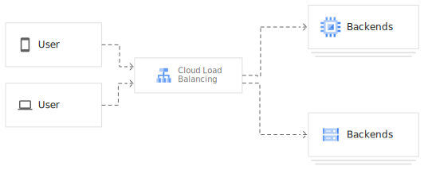

Обзор балансировки облачной нагрузки
=========================================

Балансировщик нагрузки распределяет пользовательский трафик между несколькими экземплярами ваших приложений

	
Балансировка нагрузки в Облаке
~~~~~~~~~~~~~~~~~~~~~~~~~~~~~~~~~~
Балансировка облачной нагрузки - это полностью распределенная программно-определяемая управляемая служба. Она не основана на оборудовании, поэтому вам не нужно управлять инфраструктурой балансировки физической нагрузки.

Балансировка облачной нагрузки построена на той же интерфейсной инфраструктуре, которая поддерживает Google. Он поддерживает более 1 миллиона запросов в секунду с неизменно высокой производительностью и низкой задержкой. Трафик поступает в облачную систему балансировки нагрузки через более чем 80 различных мест глобальной балансировки нагрузки, максимально увеличивая расстояние, пройденное по магистральной сети быстрой частной сети Google. Используя балансировку нагрузки в облаке, вы можете предоставлять контент как можно ближе к своим пользователям.

Google Cloud предлагает следующие функции балансировки нагрузки:

* **Один IP-адрес любой рассылки.** Благодаря балансировке нагрузки в облаке один IP-адрес anycast является интерфейсом для всех ваших внутренних инстансов в регионах по всему миру. Он обеспечивает межрегиональную балансировку нагрузки, включая автоматическую отработку отказа в нескольких регионах, которая перемещает трафик на серверы для отработки отказа, если ваши основные серверные ресурсы становятся неработоспособными. Балансировка облачной нагрузки мгновенно реагирует на изменения пользователей, трафика, сети, работоспособности серверной части и других связанных с этим условий.

* **Программно-определяемая балансировка нагрузки**. Балансировка облачной нагрузки - это полностью распределенная, программно определяемая, управляемая служба для всего вашего трафика. Это решение не основано на экземплярах или устройствах, поэтому вы не будете привязаны к инфраструктуре балансировки физической нагрузки или не столкнетесь с проблемами высокой производительности, масштабирования и управления, присущими балансировщикам нагрузки на основе экземпляров.

* **Плавное автоматическое масштабирование**. Балансировка облачной нагрузки может масштабироваться по мере роста ваших пользователей и трафика, в том числе легко справляться с огромными, неожиданными и мгновенными скачками, перенаправляя трафик в другие регионы мира, которые могут принимать трафик. Автоматическое масштабирование не требует предварительного прогрева: вы можете масштабировать трафик от нуля до полного за считанные секунды.

* **Балансировка нагрузки уровня 4 и уровня 7**. Используйте балансировку нагрузки на основе уровня 4 для направления трафика на основе данных из протоколов сетевого и транспортного уровней, таких как TCP, UDP, ESP или ICMP. Используйте балансировку нагрузки на основе уровня 7 для добавления решений о маршрутизации запросов на основе атрибутов, таких как заголовок HTTP и единый идентификатор ресурса.

* **Балансировка внешней и внутренней нагрузки**. Вы можете использовать внешнюю балансировку нагрузки, когда ваши пользователи получают доступ к вашим приложениям из Интернета, и внутреннюю балансировку нагрузки, когда ваши клиенты находятся внутри Google Cloud.

* **Глобальная и региональная балансировка нагрузки**. Распределите свои ресурсы с балансировкой нагрузки в одном или нескольких регионах, чтобы прервать соединения рядом с вашими пользователями и удовлетворить ваши требования к высокой доступности.

* **Расширенная поддержка функций**. Балансировка нагрузки в облаке поддерживает такие функции, как глобальная балансировка нагрузки IPv6, веб-сайты, определяемые пользователем заголовки запросов и перенаправление протоколов для частных VIP-персон.

Он также включает в себя следующие интеграции для внешних HTTP(ОВ) балансировка нагрузки:
	* Интеграция с облачной CDN для доставки кэшированного контента

	* Интеграция с Google Cloud Armor для защиты вашей инфраструктуры от распределенных атак типа "отказ в обслуживании" (DDoS) и других целевых атак на приложения
	
Краткое описание балансировщиков нагрузки Google Cloud
""""""""""""""""""""""""""""""""""""""""""""""""""""""""

На следующей диаграмме представлены доступные продукты для балансировки облачной нагрузки

.. figure:: cloud-load-balancing.svg
	:scale: 100%
	:align: center
	
Выбор балансировщика нагрузки
~~~~~~~~~~~~~~~~~~~~~~~~~~~~~~~~

Чтобы определить, какой продукт для балансировки нагрузки в облаке следует использовать, сначала необходимо определить, какой тип трафика должны обрабатывать ваши балансировщики нагрузки, и нужна ли вам глобальная или региональная балансировка нагрузки, внешняя или внутренняя балансировка нагрузки, а также балансировка нагрузки через прокси или сквозная. 

Затем использовать это дерево решений, чтобы определить, какие балансировщики нагрузки доступны для вашего клиента, протокола и конфигурации сети. 

.. figure:: choose-lb.svg
	:scale: 100%
	:align: center
	
Технология, лежащая в основе облачных балансировщиков нагрузки Google
"""""""""""""""""""""""""""""""""""""""""""""""""""""""""""""""""""""""""

В этом разделе содержится дополнительная информация о каждом типе балансировщика нагрузки Google Cloud, включая ссылки на обзорную документацию для более глубокого понимания.

Интерфейсы Google (DFE) - это программно-определяемые распределенные системы, расположенные в точках присутствия Google (POPS) и выполняющие глобальную балансировку нагрузки совместно с другими системами и плоскостями управления.
Andromeda - это программно-определяемый стек сетевой виртуализации Google Cloud.
Maglev - это распределенная система для балансировки сетевой нагрузки.
Прокси-сервер Envoy - это пограничный и сервисный прокси-сервер с открытым исходным кодом, предназначенный для облачных приложений.

Internal HTTP(S) Load Balancing
'''''''''''''''''''''''''''''''''

Балансировка нагрузки построена на стеке сетевой виртуализации Andromeda и представляет собой управляемую службу, основанную на прокси-сервере Envoy с открытым исходным кодом. Этот балансировщик нагрузки обеспечивает внутреннюю балансировку нагрузки на основе прокси-сервера для данных приложений уровня 7. Вы указываете, как трафик маршрутизируется с помощью карт URL. Балансировщик нагрузки использует внутренний IP-адрес, который действует как интерфейс для ваших бэкэндов.

External HTTP(S) Load Balancing
'''''''''''''''''''''''''''''''''

Балансировка нагрузки реализована на GFEs. GFE распространяются по всему миру и работают совместно с использованием глобальной сети Google и плоскости управления. На уровне премиум-класса GFES предлагают балансировку нагрузки в нескольких регионах, направляя трафик на ближайший работоспособный сервер, обладающий пропускной способностью, и завершая HTTP-трафик как можно ближе к вашим пользователям.

Regional external HTTP(S) 
'''''''''''''''''''''''''''''

это управляемая служба, основанная на прокси-сервере Envoy с открытым исходным кодом, которая обеспечивает расширенные возможности управления трафиком. Это региональный балансировщик нагрузки HTTP(S), который поддерживается только на стандартном уровне.

Internal TCP/UDP Load Balancing
'''''''''''''''''''''''''''''''''''

Построена на стеке сетевой виртуализации Andromeda. Внутренняя балансировка нагрузки TCP/UDP позволяет балансировать трафик TCP/UDP за IP-адресом внутренней балансировки нагрузки, доступным только для экземпляров внутренней виртуальной машины (ВМ). Используя внутреннюю балансировку нагрузки TCP/UDP, IP-адрес внутренней балансировки нагрузки настраивается для работы в качестве внешнего интерфейса для ваших внутренних серверных экземпляров. Вы используете только внутренние IP-адреса для своей службы балансировки нагрузки. В целом, ваша конфигурация становится проще.

Внутренняя балансировка нагрузки TCP/UDP поддерживает региональные группы управляемых экземпляров, чтобы вы могли автоматически масштабироваться по региону, защищая свою службу от зональных сбоев.

External TCP/UDP Network Load Balancing
''''''''''''''''''''''''''''''''''''''''''

Балансировка сетевой нагрузки построена на магнитной подвеске. Этот балансировщик нагрузки позволяет балансировать трафик в ваших системах на основе входящих данных протокола IP, включая адрес, протокол и порт (необязательно). Это региональная, не проксируемая система балансировки нагрузки. То есть балансировщик сетевой нагрузки - это сквозной балансировщик нагрузки, который не использует прокси-соединения от клиентов.

Балансировщики сетевой нагрузки на основе серверных служб поддерживают трафик TCP, UDP, ESP и ICMP.

Балансировщики сетевой нагрузки на основе целевого пула поддерживают только трафик TCP или UDP.

SSL Proxy Load Balancing
'''''''''''''''''''''''''''

Балансировка нагрузки SSL-прокси реализована на GFE, которые распределены по всему миру. Если вы выберете уровень сетевых услуг Премиум-класса, балансировщик нагрузки SSL-прокси будет глобальным. На уровне Премиум вы можете развертывать серверные части в нескольких регионах, а балансировщик нагрузки автоматически направляет трафик пользователей в ближайший регион с достаточной пропускной способностью. Если вы выберете Стандартный уровень, балансировщик нагрузки прокси-сервера SSL сможет направлять трафик только между серверными системами в одном регионе.

TCP Proxy Load Balancing
'''''''''''''''''''''''''''

Балансировка нагрузки прокси-сервера TCP реализована на GFE, которые распределены по всему миру. Если вы выбираете уровень сетевых услуг Премиум-класса, балансировщик нагрузки прокси-сервера TCP является глобальным. На уровне Премиум вы можете развертывать серверные части в нескольких регионах, а балансировщик нагрузки автоматически направляет трафик пользователей в ближайший регион с достаточной пропускной способностью. Если вы выберете Стандартный уровень, балансировщик нагрузки прокси-сервера TCP может направлять трафик только между серверными системами в одном регионе.

