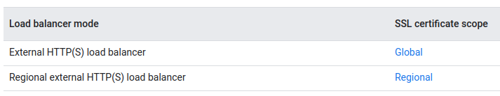

Обзор балансировки облачной нагрузки
=========================================

Балансировщик нагрузки распределяет пользовательский трафик между несколькими экземплярами ваших приложений

.. figure:: lb-simple-overview.svg
	:scale: 100%
	:align: center
	
Балансировка нагрузки в Облаке
~~~~~~~~~~~~~~~~~~~~~~~~~~~~~~~~~~
Балансировка облачной нагрузки - это полностью распределенная программно-определяемая управляемая служба. Она не основана на оборудовании, поэтому вам не нужно управлять инфраструктурой балансировки физической нагрузки.

Балансировка облачной нагрузки построена на той же интерфейсной инфраструктуре, которая поддерживает Google. Он поддерживает более 1 миллиона запросов в секунду с неизменно высокой производительностью и низкой задержкой. Трафик поступает в облачную систему балансировки нагрузки через более чем 80 различных мест глобальной балансировки нагрузки, максимально увеличивая расстояние, пройденное по магистральной сети быстрой частной сети Google. Используя балансировку нагрузки в облаке, вы можете предоставлять контент как можно ближе к своим пользователям.

Google Cloud предлагает следующие функции балансировки нагрузки:

* **Один IP-адрес любой рассылки.** Благодаря балансировке нагрузки в облаке один IP-адрес anycast является интерфейсом для всех ваших внутренних инстансов в регионах по всему миру. Он обеспечивает межрегиональную балансировку нагрузки, включая автоматическую отработку отказа в нескольких регионах, которая перемещает трафик на серверы для отработки отказа, если ваши основные серверные ресурсы становятся неработоспособными. Балансировка облачной нагрузки мгновенно реагирует на изменения пользователей, трафика, сети, работоспособности серверной части и других связанных с этим условий.

* **Программно-определяемая балансировка нагрузки**. Балансировка облачной нагрузки - это полностью распределенная, программно определяемая, управляемая служба для всего вашего трафика. Это решение не основано на экземплярах или устройствах, поэтому вы не будете привязаны к инфраструктуре балансировки физической нагрузки или не столкнетесь с проблемами высокой производительности, масштабирования и управления, присущими балансировщикам нагрузки на основе экземпляров.

* **Плавное автоматическое масштабирование**. Балансировка облачной нагрузки может масштабироваться по мере роста ваших пользователей и трафика, в том числе легко справляться с огромными, неожиданными и мгновенными скачками, перенаправляя трафик в другие регионы мира, которые могут принимать трафик. Автоматическое масштабирование не требует предварительного прогрева: вы можете масштабировать трафик от нуля до полного за считанные секунды.

* **Балансировка нагрузки уровня 4 и уровня 7**. Используйте балансировку нагрузки на основе уровня 4 для направления трафика на основе данных из протоколов сетевого и транспортного уровней, таких как TCP, UDP, ESP или ICMP. Используйте балансировку нагрузки на основе уровня 7 для добавления решений о маршрутизации запросов на основе атрибутов, таких как заголовок HTTP и единый идентификатор ресурса.

* **Балансировка внешней и внутренней нагрузки**. Вы можете использовать внешнюю балансировку нагрузки, когда ваши пользователи получают доступ к вашим приложениям из Интернета, и внутреннюю балансировку нагрузки, когда ваши клиенты находятся внутри Google Cloud.

* **Глобальная и региональная балансировка нагрузки**. Распределите свои ресурсы с балансировкой нагрузки в одном или нескольких регионах, чтобы прервать соединения рядом с вашими пользователями и удовлетворить ваши требования к высокой доступности.

* **Расширенная поддержка функций**. Балансировка нагрузки в облаке поддерживает такие функции, как глобальная балансировка нагрузки IPv6, веб-сайты, определяемые пользователем заголовки запросов и перенаправление протоколов для частных VIP-персон.

Он также включает в себя следующие интеграции для внешних HTTP(ОВ) балансировка нагрузки:
	* Интеграция с облачной CDN для доставки кэшированного контента

	* Интеграция с Google Cloud Armor для защиты вашей инфраструктуры от распределенных атак типа "отказ в обслуживании" (DDoS) и других целевых атак на приложения
	
Краткое описание балансировщиков нагрузки Google Cloud
""""""""""""""""""""""""""""""""""""""""""""""""""""""""

На следующей диаграмме представлены доступные продукты для балансировки облачной нагрузки

	
Выбор балансировщика нагрузки
~~~~~~~~~~~~~~~~~~~~~~~~~~~~~~~~

Чтобы определить, какой продукт для балансировки нагрузки в облаке следует использовать, сначала необходимо определить, какой тип трафика должны обрабатывать ваши балансировщики нагрузки, и нужна ли вам глобальная или региональная балансировка нагрузки, внешняя или внутренняя балансировка нагрузки, а также балансировка нагрузки через прокси или сквозная. 

Затем использовать это дерево решений, чтобы определить, какие балансировщики нагрузки доступны для вашего клиента, протокола и конфигурации сети. 

	
Технология, лежащая в основе облачных балансировщиков нагрузки Google
"""""""""""""""""""""""""""""""""""""""""""""""""""""""""""""""""""""""""

В этом разделе содержится дополнительная информация о каждом типе балансировщика нагрузки Google Cloud, включая ссылки на обзорную документацию для более глубокого понимания.

Интерфейсы Google (DFE) - это программно-определяемые распределенные системы, расположенные в точках присутствия Google (POPS) и выполняющие глобальную балансировку нагрузки совместно с другими системами и плоскостями управления.
Andromeda - это программно-определяемый стек сетевой виртуализации Google Cloud.
Maglev - это распределенная система для балансировки сетевой нагрузки.
Прокси-сервер Envoy - это пограничный и сервисный прокси-сервер с открытым исходным кодом, предназначенный для облачных приложений.

Internal HTTP(S) Load Balancing
'''''''''''''''''''''''''''''''''

Балансировка нагрузки построена на стеке сетевой виртуализации Andromeda и представляет собой управляемую службу, основанную на прокси-сервере Envoy с открытым исходным кодом. Этот балансировщик нагрузки обеспечивает внутреннюю балансировку нагрузки на основе прокси-сервера для данных приложений уровня 7. Вы указываете, как трафик маршрутизируется с помощью карт URL. Балансировщик нагрузки использует внутренний IP-адрес, который действует как интерфейс для ваших бэкэндов.

External HTTP(S) Load Balancing
'''''''''''''''''''''''''''''''''

Балансировка нагрузки реализована на GFEs. GFE распространяются по всему миру и работают совместно с использованием глобальной сети Google и плоскости управления. На уровне премиум-класса GFES предлагают балансировку нагрузки в нескольких регионах, направляя трафик на ближайший работоспособный сервер, обладающий пропускной способностью, и завершая HTTP-трафик как можно ближе к вашим пользователям.

Regional external HTTP(S) 
'''''''''''''''''''''''''''''

это управляемая служба, основанная на прокси-сервере Envoy с открытым исходным кодом, которая обеспечивает расширенные возможности управления трафиком. Это региональный балансировщик нагрузки HTTP(S), который поддерживается только на стандартном уровне.

Internal TCP/UDP Load Balancing
'''''''''''''''''''''''''''''''''''

Построена на стеке сетевой виртуализации Andromeda. Внутренняя балансировка нагрузки TCP/UDP позволяет балансировать трафик TCP/UDP за IP-адресом внутренней балансировки нагрузки, доступным только для экземпляров внутренней виртуальной машины (ВМ). Используя внутреннюю балансировку нагрузки TCP/UDP, IP-адрес внутренней балансировки нагрузки настраивается для работы в качестве внешнего интерфейса для ваших внутренних серверных экземпляров. Вы используете только внутренние IP-адреса для своей службы балансировки нагрузки. В целом, ваша конфигурация становится проще.

Внутренняя балансировка нагрузки TCP/UDP поддерживает региональные группы управляемых экземпляров, чтобы вы могли автоматически масштабироваться по региону, защищая свою службу от зональных сбоев.

External TCP/UDP Network Load Balancing
''''''''''''''''''''''''''''''''''''''''''

Балансировка сетевой нагрузки построена на магнитной подвеске. Этот балансировщик нагрузки позволяет балансировать трафик в ваших системах на основе входящих данных протокола IP, включая адрес, протокол и порт (необязательно). Это региональная, не проксируемая система балансировки нагрузки. То есть балансировщик сетевой нагрузки - это сквозной балансировщик нагрузки, который не использует прокси-соединения от клиентов.

Балансировщики сетевой нагрузки на основе серверных служб поддерживают трафик TCP, UDP, ESP и ICMP.

Балансировщики сетевой нагрузки на основе целевого пула поддерживают только трафик TCP или UDP.

SSL Proxy Load Balancing
'''''''''''''''''''''''''''

Балансировка нагрузки SSL-прокси реализована на GFE, которые распределены по всему миру. Если вы выберете уровень сетевых услуг Премиум-класса, балансировщик нагрузки SSL-прокси будет глобальным. На уровне Премиум вы можете развертывать серверные части в нескольких регионах, а балансировщик нагрузки автоматически направляет трафик пользователей в ближайший регион с достаточной пропускной способностью. Если вы выберете Стандартный уровень, балансировщик нагрузки прокси-сервера SSL сможет направлять трафик только между серверными системами в одном регионе.

TCP Proxy Load Balancing
'''''''''''''''''''''''''''

Балансировка нагрузки прокси-сервера TCP реализована на GFE, которые распределены по всему миру. Если вы выбираете уровень сетевых услуг Премиум-класса, балансировщик нагрузки прокси-сервера TCP является глобальным. На уровне Премиум вы можете развертывать серверные части в нескольких регионах, а балансировщик нагрузки автоматически направляет трафик пользователей в ближайший регион с достаточной пропускной способностью. Если вы выберете Стандартный уровень, балансировщик нагрузки прокси-сервера TCP может направлять трафик только между серверными системами в одном регионе.

External HTTP(S) Load Balancing 
~~~~~~~~~~~~~~~~~~~~~~~~~~~~~~~~~~~~~~~~~

https://cloud.google.com/load-balancing/docs

HTTP(S) балансировка нагрузки - это балансировщик нагрузки 7 уровня OSI на основе прокси-сервера, который позволяет запускать и масштабировать ваши службы с помощью одного внешнего IP-адреса. Внешние HTTP(S) Балансировка нагрузки распределяет трафик HTTP и HTTPS между бэкэндами, размещенными на различных облачных платформах Google (таких как Compute Engine, Google Kubernetes Engine (GKE), Облачное хранилище и т. Д.), А также внешними бэкэндами, подключенными через Интернет или с помощью гибридного подключения.

Режимы внешних балансировщиков нагрузки HTTP(S)
""""""""""""""""""""""""""""""""""""""""""""""""""

Вы можете настроить внешние HTTP(Ы) Балансировка нагрузки в следующих режимах:

* Внешний балансировщик нагрузки HTTP(S). Это внешний балансировщик нагрузки HTTP(S), который является региональным на уровне стандарта и глобальным на уровне Премиум. Внешний балансировщик нагрузки HTTP(S) реализован на интерфейсах Google (DfES). GFE распространяются по всему миру и работают совместно с использованием глобальной сети Google и плоскости управления.
* Региональный внешний балансировщик нагрузки HTTP(S) (предварительный просмотр). Это региональный балансировщик нагрузки, реализованный как управляемая служба на прокси-сервере Envoy с открытым исходным кодом. Он включает в себя расширенные возможности управления трафиком, такие как зеркальное отображение трафика, разделение трафика на основе веса, преобразования заголовков на основе запроса /ответа и многое другое.

Архитектура
""""""""""""""

Для развертывания внешнего балансировщика нагрузки HTTP(S) требуются следующие ресурсы:

* Только для региональных внешних балансировщиков нагрузки HTTP(S) подсеть только для прокси-сервера используется для отправки подключений из балансировщика нагрузки на серверные части.

* Правило внешней пересылки определяет внешний IP-адрес, порт и целевой HTTP-прокси. Клиенты используют IP-адрес и порт для подключения к балансировщику нагрузки.

* Целевой прокси-сервер HTTP(S) получает запрос от клиента. Прокси-сервер HTTP(S) оценивает запрос, используя сопоставление URL-адресов для принятия решений о маршрутизации трафика. Прокси-сервер также может проверять подлинность сообщений с помощью SSL-сертификатов.
- Для балансировки нагрузки HTTPS целевой прокси-сервер HTTPS использует SSL-сертификаты для подтверждения своей личности клиентам. Целевой прокси-сервер HTTPS поддерживает задокументированное количество SSL-сертификатов.

* Прокси-сервер HTTP(S) использует сопоставление URL-адресов (URL-map) для определения маршрута на основе атрибутов HTTP (таких как путь запроса, файлы cookie или заголовки). На основе решения о маршрутизации прокси-сервер перенаправляет запросы клиентов в определенные серверные службы или серверные сегменты. Карта URL-адресов может указывать дополнительные действия, такие как отправка перенаправлений клиентам.

* Серверная служба распределяет запросы по исправным бэкэндам. Внешний балансировщик нагрузки HTTP(S) также поддерживает внутренние сегменты.
 - Один или несколько бэкендов должны быть подключены к бэкенд-службе или бэкенд-корзине.

* Проверка работоспособности периодически проверяет готовность ваших бэкендов. Это снижает риск того, что запросы могут быть отправлены бэкендам, которые не могут обслуживать запрос.

* Правила брандмауэра для ваших бэкэндов, позволяющие принимать запросы на проверку работоспособности. Региональным внешним балансировщикам нагрузки HTTP(S) требуется дополнительное правило брандмауэра, позволяющее трафику из подсети только для прокси-серверов достигать внутренних серверов.

.. figure:: exthttpbalance01.png
	:scale: 100%
	:align: center
	
Подсеть только для прокси-сервера (Proxy-only subnet)
""""""""""""""""""""""""""""""""""""""""""""""""""""""

Подсети только для прокси-серверов требуются только для **региональных** внешних балансировщиков нагрузки HTTP(S).

Подсеть только для прокси-серверов предоставляет набор IP-адресов, которые Google использует для запуска прокси-серверов Envoy от вашего имени. Необходимо создать одну подсеть только для прокси-сервера в каждом регионе сети VPC, где используются региональные внешние балансировщики нагрузки HTTP(S). Флаг --purpose для этой подсети только для прокси-сервера установлен в REGIONAL_MANAGED_PROXY. Все региональные внешние балансировщики нагрузки HTTP(S) в одном регионе и сети VPC совместно используют пул прокси-серверов Envoy из одной подсети только для прокси-серверов. В дальнейшем:

* Подсети только для прокси-серверов используются только для прокси-серверов Envoy, а не для ваших бэкендов.
* Серверные виртуальные машины или конечные точки всех региональных внешних балансировщиков нагрузки HTTP(S) в регионе и сети VPC получают подключения из подсети только для прокси-серверов.
* IP-адрес регионального внешнего балансировщика нагрузки HTTP(S) не находится в подсети только для прокси-сервера. IP-адрес балансировщика нагрузки определяется его правилом внешней управляемой пересылки, которое описано ниже.

.. note:: Внутренние балансировщики нагрузки HTTP(S) также используют подсети только для прокси-серверов (с --целью, установленной в INTERNAL_HTTPS_LOAD_BALANCER). В настоящее время в регионе сети VPC может существовать только одна подсеть только для прокси-сервера. Это означает, что вы не можете создавать как внутренние балансировщики нагрузки HTTP(S), так и региональные внешние балансировщики нагрузки HTTP(S) в одном и том же регионе сети.

Правила и адреса пересылки
"""""""""""""""""""""""""""

Правила пересылки маршрутизируют трафик по IP-адресу, порту и протоколу в конфигурацию балансировки нагрузки, состоящую из целевого прокси-сервера, сопоставления URL-адресов и одной или нескольких внутренних служб.

Каждое правило пересылки предоставляет один IP-адрес, который можно использовать в записях DNS для вашего приложения. Балансировка нагрузки на основе DNS не требуется. Вы можете либо указать используемый IP-адрес, либо позволить распределению нагрузки в облаке назначить его для вас.

* Правило пересылки для балансировщика нагрузки HTTP может ссылаться только на TCP-порты 80 и 8080.
* Правило пересылки для балансировщика нагрузки HTTPS может ссылаться только на TCP-порт 443.

Тип правила пересылки, IP-адрес и схема балансировки нагрузки, используемые внешними балансировщиками нагрузки HTTP(S), зависят от режима балансировщика нагрузки и уровня сетевых служб, на котором находится балансировщик нагрузки.

	
Целевые прокси-серверы
""""""""""""""""""""""""

Целевые прокси-серверы завершают HTTP-соединения от клиентов. Одно или несколько правил пересылки направляют трафик на целевой прокси-сервер, и целевой прокси-сервер сверяется с картой URL-адресов, чтобы определить, как направлять трафик на серверные серверы.

Не полагайтесь на прокси-сервер для сохранения регистра имен заголовков запросов или ответов. Например, заголовок ответа Server: Apache/1.0 может отображаться на клиенте как сервер: Apache/1.0.

Карты URL-адресов
""""""""""""""""""""

Карты URL-адресов определяют шаблоны сопоставления для маршрутизации запросов на основе URL-адресов к соответствующим внутренним службам. Служба по умолчанию определена для обработки любых запросов, которые не соответствуют указанному правилу хоста или правилу сопоставления путей. В некоторых ситуациях, таких как пример балансировки нагрузки для нескольких регионов, вы можете не определять никаких правил URL-адресов и полагаться только на службу по умолчанию. Для маршрутизации запросов карта URL-адресов позволяет разделить трафик путем изучения компонентов URL-адресов для отправки запросов различным наборам серверных.

В следующей таблице указан тип сопоставления URL-адресов, требуемый внешними балансировщиками нагрузки HTTP(S) в каждом режиме.

	
SSL-сертификаты
"""""""""""""""""""""

Безопасность транспортного уровня (TLS) - это протокол шифрования, используемый в сертификатах SSL для защиты сетевых коммуникаций.

Google Cloud использует SSL-сертификаты для обеспечения конфиденциальности и безопасности от клиента до балансировщика нагрузки. Если вы используете балансировку нагрузки на основе HTTPS, вам необходимо установить один или несколько SSL-сертификатов на targetHTTPSproxy.
В следующей таблице указана область действия SSL-сертификата, требуемого внешними балансировщиками нагрузки HTTP(S) в каждом режиме:

	
Политики SSL
"""""""""""""""
Примечание: Региональный внешний балансировщик нагрузки HTTP(S) не поддерживает политики SSL.

Политики SSL дают возможность управлять функциями SSL, которые балансировщик нагрузки HTTPS согласовывает с клиентами HTTPS.

По умолчанию балансировка нагрузки HTTPS использует набор функций SSL, которые обеспечивают хорошую безопасность и широкую совместимость. Некоторые приложения требуют большего контроля над тем, какие версии SSL и шифры используются для их соединений HTTPS или SSL. Вы можете определить политики SSL, которые управляют функциями SSL, согласовываемыми вашим балансировщиком нагрузки, и связать политику SSL с вашим целевым прокси-сервером HTTPS.

Серверные службы и пакеты
""""""""""""""""""""""""""

Внешний балансировщик нагрузки HTTP(S) может иметь серверные службы и серверные сегменты. Региональный внешний балансировщик нагрузки HTTP(S) не поддерживает серверные сегменты.

Backend  cерверные службы предоставляют информацию о конфигурации подсистеме балансировки нагрузки. Балансировщики нагрузки используют информацию в  backend  серверной службе для направления входящего трафика на один или несколько подключенных серверных серверов. Пример, показывающий, как настроить балансировщик нагрузки с серверной службой и серверной частью вычислительного механизма, см. в разделе Настройка внешнего балансировщика нагрузки HTTP(S) с серверной частью вычислительного механизма (https://cloud.google.com/load-balancing/docs/https/ext-https-lb-simple)

Backend buckets направляют входящий трафик в сегменты облачного хранилища. Пример, показывающий, как добавить сегмент во внешний балансировщик нагрузки HTTP(S) (https://cloud.google.com/load-balancing/docs/https/ext-load-balancer-backend-buckets)

Если вы хотите настроить внешний балансировщик нагрузки HTTP(S) с помощью HTTP/2 с помощью Google Kubernetes Engine Ingress или с помощью gRPC и HTTP/2 с помощью Ingress, см. раздел HTTP/2 для балансировки нагрузки с помощью Ingress.

В следующей таблице указаны внутренние функции, поддерживаемые HTTP(-АМИ) балансировка нагрузки.

	
Протокол для бэкэндов
"""""""""""""""""""""

Когда вы настраиваете серверную службу для внешнего балансировщика нагрузки HTTP(S), вы устанавливаете протокол, который серверная служба использует для связи с серверными системами. Вы можете выбрать HTTP, HTTPS или HTTP/2. Балансировщик нагрузки использует только указанный вами протокол. Балансировщик нагрузки не возвращается к одному из других протоколов, если ему не удается согласовать подключение к серверной части с указанным протоколом.

Если вы используете HTTP/2, вы должны использовать TLS. HTTP/2 без шифрования не поддерживается.

Проверки работоспособности
""""""""""""""""""""""""""""

Каждая серверная служба определяет проверку работоспособности для серверных экземпляров.

Для зондов проверки работоспособности необходимо создать правило брандмауэра "Разрешить вход", которое позволяет трафику достигать ваших внутренних экземпляров. Правило брандмауэра должно разрешать следующие диапазоны источников:

130.211.0.0/22
35.191.0.0/16

Хотя это и не требуется, рекомендуется использовать проверку работоспособности, протокол которой соответствует протоколу серверной службы. Например, проверка работоспособности HTTP/2 наиболее точно проверяет подключение HTTP/2 к бэкэндам. Список поддерживаемых протоколов проверки работоспособности см. в разделе Функции балансировки нагрузки.

В следующей таблице указана область проверки работоспособности, поддерживаемая внешними балансировщиками нагрузки HTTP(S) в каждом режиме.

Load balancer mode 	                         Health check type
External HTTP(S) load balancer 	          Global
Regional external HTTP(S) load balancer 	  Regional

Правила брандмауэра
"""""""""""""""""""""

Для внешнего балансировщика нагрузки HTTP(S) требуются следующие правила брандмауэра:

* Для внешнего балансировщика нагрузки HTTP(S) правило разрешения входа разрешает трафик с интерфейсов Google (GFES) для доступа к вашим бэкэндам.
Для регионального внешнего балансировщика нагрузки HTTP(S) входное правило разрешения разрешает трафик из подсети только для прокси-сервера.
* Правило разрешения входа разрешает трафик из диапазонов датчиков проверки работоспособности. Дополнительные сведения о пробниках проверки работоспособности и о том, почему необходимо разрешать трафик с них, см. в разделе Диапазоны IP-адресов для проверки и правила брандмауэра.

Порты для этих правил брандмауэра должны быть настроены следующим образом:

* Разрешите трафик к порту назначения для проверки работоспособности каждой серверной службы.

* Например, серверные части группы: Определите порты, которые будут настроены, путем сопоставления именованного порта серверной службы и номеров портов, связанных с этим именованным портом в каждой группе экземпляров. Номера портов могут различаться в разных группах экземпляров, назначенных одной и той же серверной службе.

* Для внутренних интерфейсов GCE_VM_IP_PORT: Разрешить трафик на номера портов конечных точек.

Правила брандмауэра реализуются на уровне экземпляра виртуальной машины, а не на прокси-серверах GFE. Вы не можете использовать правила брандмауэра Google Cloud, чтобы предотвратить попадание трафика в балансировщик нагрузки. Для внешнего балансировщика нагрузки HTTP (S) вы можете использовать облачную броню Google для достижения этой цели.

Для внешних балансировщиков нагрузки HTTP(S) в следующей таблице приведены необходимые диапазоны IP-адресов для правил брандмауэра:

