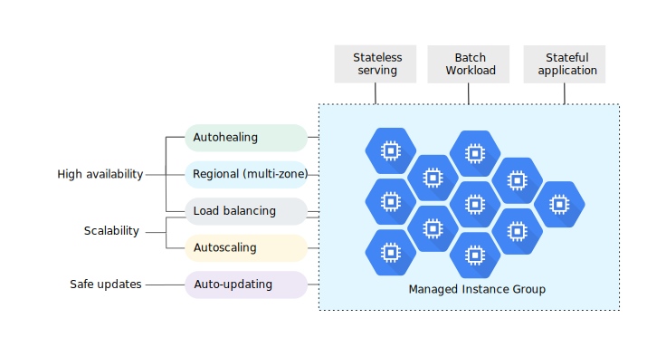
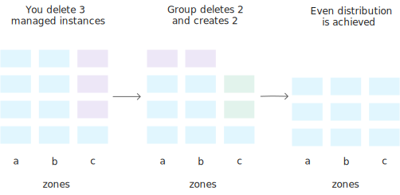
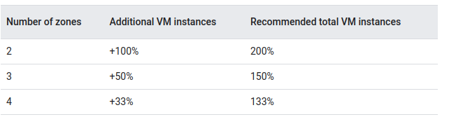

Группы экземпляров
===================

Группа экземпляров - это коллекция экземпляров виртуальных машин (ВМ), которыми можно управлять как единым целым.

Compute Engine предлагает два вида групп экземпляров виртуальных машин: управляемые и неуправляемые:

* Группы управляемых экземпляров (MIG) позволяют управлять приложениями на нескольких идентичных виртуальных машинах. Вы можете сделать свои рабочие нагрузки масштабируемыми и высокодоступными, воспользовавшись преимуществами автоматизированных служб MIG, включая автоматическое масштабирование, автоматическое лечение, региональное (многозональное) развертывание и автоматическое обновление.
* Неуправляемые группы экземпляров позволяют распределять нагрузку между парком виртуальных машин, которыми вы управляете самостоятельно.

Группы управляемых экземпляров (MIGS)
~~~~~~~~~~~~~~~~~~~~~~~~~~~~~~~~~~~~~~~~

Используйте группу управляемых экземпляров (MIG) для подобных сценариев:

* Рабочие нагрузки без сохранения состояния, такие как интерфейс веб-сайта
* Пакетные, высокопроизводительные или высокопроизводительные вычислительные нагрузки без сохранения состояния, такие как обработка изображений из очереди
* Приложения с отслеживанием состояния, такие как базы данных, устаревшие приложения и длительные пакетные вычисления с контрольными точками

Compute Engine поддерживает каждый из управляемых экземпляров MIG на основе конфигурации, указанной в шаблоне экземпляра, и дополнительной конфигурации с отслеживанием состояния.

Преимущества
""""""""""""""""

* **Высокая доступность**.

**Поддержание запущенных экземпляров виртуальных машин**. Если виртуальная машина в группе останавливается, выходит из строя или удаляется действием, отличным от команды управления группой экземпляров (например, преднамеренное масштабирование), MIG автоматически воссоздает эту виртуальную машину в соответствии со спецификацией исходного экземпляра (то же имя виртуальной машины, тот же шаблон), чтобы виртуальная машина могла возобновить свою работу.

**Автоматическое лечение на основе приложений.** Вы также можете настроить проверку работоспособности приложения, которая периодически проверяет, что ваше приложение отвечает должным образом на каждом из экземпляров MIG. Если приложение не отвечает на виртуальной машине, средство автоматического оповещения автоматически воссоздает эту виртуальную машину для вас. Проверка того, что приложение отвечает, является более точной, чем просто проверка того, что виртуальная машина запущена и запущена.

**Региональный (многозонный) охват**. Региональные MIGs позволяют распределять нагрузку на приложения по нескольким зонам. Эта репликация защищает от зональных сбоев. Если это произойдет, ваше приложение сможет продолжать обслуживать трафик из экземпляров, запущенных в оставшихся доступных зонах в том же регионе.

* Балансировка нагрузки. 
MIGs работают со службами балансировки нагрузки для распределения трафика между всеми экземплярами в группе.

* **Масштабируемость**. Когда вашим приложениям требуются дополнительные вычислительные ресурсы, автоматически масштабируемые MIGs могут автоматически увеличивать количество экземпляров в группе для удовлетворения спроса. Если спрос упадет, автоматически масштабируемые MIGsмогут автоматически уменьшиться, чтобы снизить ваши затраты.

* **Автоматические обновления**. Средство автоматического обновления MIG позволяет безопасно развертывать новые версии программного обеспечения на экземплярах в вашем MIG и поддерживает гибкий диапазон сценариев развертывания, таких как текущие обновления и обновления canary. Вы можете контролировать скорость и объем развертывания, а также уровень сбоев в работе вашего сервиса.

* **Поддержка рабочих нагрузок с отслеживанием состояния**. Вы можете использовать MIGs для создания высокодоступных развертываний и автоматизации работы приложений с данными о состоянии или конфигурацией, таких как базы данных, DNS-серверы, устаревшие монолитные приложения или длительные пакетные вычисления с контрольными точками. MIGsс отслеживанием состояния сохраняют уникальное состояние каждого экземпляра (имя экземпляра, подключенные постоянные диски и метаданные) при перезапуске компьютера, восстановлении, автоматическом восстановлении и событиях обновления.

	
Autohealing (Автоматическое лечение)
""""""""""""""""""""""""""""""""""""""""

Группы управляемых экземпляров поддерживают высокую доступность ваших приложений, активно сохраняя ваши экземпляры доступными, что означает, что они находятся в состоянии RUNNING. MIG автоматически воссоздает экземпляр, который не RUNNING. Однако полагаться только на состояние виртуальной машины может быть недостаточно. Возможно, вам захочется воссоздать экземпляры, когда приложение зависает, выходит из строя или заканчивается память.

Автоматическое лечение на основе приложений повышает доступность приложений, полагаясь на сигнал проверки работоспособности, который обнаруживает проблемы, связанные с конкретным приложением, такие как зависание, сбой или перегрузка. Если проверка работоспособности определяет, что на виртуальной машине произошел сбой приложения, группа автоматически воссоздает этот экземпляр виртуальной машины.

Проверка работоспособности
"""""""""""""""""""""""""""""

Проверки работоспособности, используемые для мониторинга MIGs, аналогичны проверкам работоспособности, используемым для балансировки нагрузки, с некоторыми различиями в поведении. Проверки работоспособности балансировки нагрузки помогают перенаправить трафик от не реагирующих экземпляров к исправным экземплярам; эти проверки работоспособности не заставляют Compute Engine воссоздавать экземпляры. С другой стороны, проверки работоспособности группы управляемых экземпляров проактивно сигнализируют об удалении и повторном создании экземпляров, которые становятся UNHEALTHY (НЕРАБОТОСПОСОБНЫМИ).

В большинстве сценариев используйте отдельные проверки работоспособности для балансировки нагрузки и автоматического лечения. Проверка работоспособности для балансировки нагрузки может и должна быть более агрессивной, поскольку эти проверки работоспособности определяют, получает ли экземпляр пользовательский трафик. Поскольку клиенты могут полагаться на ваши услуги, вы хотите быстро перехватывать экземпляры, не отвечающие на запросы, чтобы при необходимости перенаправлять трафик. Напротив, проверка работоспособности для автоматического восстановления заставляет MIGs активно заменять отказавшие экземпляры, поэтому эта проверка работоспособности должна быть более консервативной, чем проверка работоспособности балансировки нагрузки.

Региональные или зональные группы
"""""""""""""""""""""""""""""""""""""

Вы можете создать два типа MIGs:

* Зональный MIG, который развертывает экземпляры в одной зоне.
* Региональный MIG, который развертывает экземпляры в нескольких зонах в одном регионе.

Оба типа обладают всеми преимуществами MIGs. Региональные MIG повышают доступность за счет распределения нагрузки приложений по нескольким зонам, что защищает вашу рабочую нагрузку от зональных сбоев, а региональные MIG обеспечивают большую пропускную способность - максимум 2000 экземпляров на региональную группу.

Балансировка нагрузки
"""""""""""""""""""""

Для балансировки нагрузки в облаке Google можно использовать группы экземпляров для обслуживания трафика. В зависимости от выбранного типа балансировщика нагрузки вы можете добавлять группы экземпляров в целевой пул или в серверную службу.

Автоматическое масштабирование
""""""""""""""""""""""""""""""""

MIGs поддерживают автоматическое масштабирование, которое динамически добавляет или удаляет экземпляры виртуальных машин из группы в ответ на увеличение или уменьшение нагрузки. Вы можете настроить политику автоматического масштабирования, чтобы указать, как вы хотите масштабировать группу. В политике автоматического масштабирования вы можете задать один или несколько сигналов для масштабирования группы на основе загрузки ЦП, емкости балансировки нагрузки, показателей облачного мониторинга, расписаний или, для зональных MIG, с помощью рабочей нагрузки на основе очереди, такой как Pub/SUB.

Автоматическое обновление
"""""""""""""""""""""""""""

Вы можете легко и безопасно развертывать новые версии программного обеспечения на экземплярах в MIG. Развертывание обновления происходит автоматически в соответствии с вашими спецификациями: вы можете контролировать скорость и объем развертывания обновления, чтобы свести к минимуму сбои в работе вашего приложения. При необходимости вы можете выполнить частичное развертывание, что позволяет проводить "тестирование на канарейках".

Поддержка рабочих нагрузок с отслеживанием состояния
""""""""""""""""""""""""""""""""""""""""""""""""""""""

Вы можете создавать высокодоступные развертывания рабочих нагрузок с отслеживанием состояния на виртуальных машинах, используя группы управляемых экземпляров с отслеживанием состояния (MIG с отслеживанием состояния). Рабочие нагрузки с отслеживанием состояния включают приложения с данными или конфигурацией с отслеживанием состояния, такие как базы данных, устаревшие монолитные приложения и длительные пакетные вычисления с контрольными точками.

Вы можете повысить время безотказной работы и отказоустойчивость таких приложений с помощью автоматического восстановления, управляемых обновлений и многозонных развертываний, сохраняя при этом уникальное состояние каждого экземпляра, включая настраиваемое имя экземпляра, постоянные диски и метаданные.

Группы вытесняемых экземпляров
""""""""""""""""""""""""""""""""

Для рабочих нагрузок, в которых минимальные затраты важнее скорости выполнения, вы можете снизить стоимость рабочей нагрузки, используя в своей группе экземпляров виртуальные машины с возможностью вытеснения. Вытесняемые экземпляры длятся до 24 часов и  вытесняются — у вашего приложения есть 30 секунд для правильного выхода. Вытесняемые экземпляры могут быть удалены в любое время, но автоматическое восстановление вернет экземпляры, когда вытесняемая емкость снова станет доступной.

Контейнеры
"""""""""""""""

Вы можете упростить развертывание приложений, развернув контейнеры в экземплярах в группах управляемых экземпляров. Когда вы указываете образ контейнера в шаблоне экземпляра, а затем используете этот шаблон для создания группы управляемых экземпляров, каждая виртуальная машина создается с оптимизированной для контейнеров операционной системой, включающей Docker, и ваш контейнер автоматически запускается на каждой виртуальной машине в группе. См. раздел Развертывание контейнеров на виртуальных машинах и MIG.

Сеть и подсеть
""""""""""""""

При создании группы управляемых экземпляров необходимо ссылаться на существующий шаблон экземпляра. Шаблон экземпляра определяет сеть VPC и подсеть, которые используют экземпляры участников. Для сетей VPC в автоматическом режиме вы можете опустить подсеть; это указывает Google Cloud выбрать автоматически созданную подсеть в регионе, указанном в шаблоне. Если вы опустите сеть VPC, Google Cloud попытается использовать сеть VPC с именем по умолчанию.

Неуправляемые группы экземпляров
~~~~~~~~~~~~~~~~~~~~~~~~~~~~~~~~~~~

Неуправляемые группы экземпляров могут содержать разнородные экземпляры, которые можно произвольно добавлять и удалять из группы. Неуправляемые группы экземпляров не обеспечивают автоматическое масштабирование, автоматическое восстановление, поддержку последовательного обновления, поддержку нескольких зон или использование шаблонов экземпляров и не подходят для развертывания высокодоступных и масштабируемых рабочих нагрузок. Используйте неуправляемые группы экземпляров, если вам нужно применить балансировку нагрузки к группам разнородных экземпляров или если вам нужно управлять экземплярами самостоятельно.

Ценообразование
"""""""""""""""""

Дополнительная плата за использование управляемых или неуправляемых групп экземпляров не взимается. Плата взимается в зависимости от ресурсов, используемых вашей группой. 

Шаблоны экземпляров
~~~~~~~~~~~~~~~~~~~~~~~~~~~

Шаблон экземпляра - это ресурс, который можно использовать для создания экземпляров виртуальных машин (ВМ) и управляемых групп экземпляров (MIG).

Шаблоны экземпляров определяют тип машины, образ загрузочного диска или образ контейнера, метки и другие свойства экземпляра. Затем вы можете использовать шаблон экземпляра для создания MIG или для создания отдельных виртуальных машин. Шаблоны экземпляров - это удобный способ сохранить конфигурацию экземпляра виртуальной машины, чтобы вы могли использовать ее позже для создания виртуальных машин или групп виртуальных машин.

Шаблон экземпляра - это глобальный ресурс, который не привязан к зоне или региону. Однако вы укажете некоторые зональные ресурсы в шаблоне экземпляра, что ограничит шаблон зоной, в которой находится этот ресурс. Например, если вы включите постоянный диск только для чтения из **us-central1-b** в свой шаблон экземпляра, вы не сможете использовать этот шаблон в любой другой зоне, поскольку этот конкретный диск существует только в зоне **us-central1-b**. 

Обратите внимание, что метки, определенные в шаблоне экземпляра, применяются ко всем экземплярам, созданным на основе этого шаблона экземпляра. Метки не применяются к самому шаблону экземпляра.

Когда следует использовать шаблоны экземпляров
"""""""""""""""""""""""""""""""""""""""""""""""""

Используйте шаблоны экземпляров всегда, когда вы хотите быстро создать экземпляры виртуальных машин на основе уже существующей конфигурации. Если вы хотите создать группу идентичных экземпляров, вы должны использовать шаблон экземпляра для создания MIG.

Как обновить шаблоны экземпляров
""""""""""""""""""""""""""""""""""

Шаблоны экземпляров предназначены для создания экземпляров с идентичными конфигурациями. Таким образом, вы не можете обновить существующий шаблон экземпляра или изменить шаблон экземпляра после его создания.

Если вам нужно внести изменения в конфигурацию, создайте новый шаблон экземпляра. Вы можете создать шаблон на основе существующего шаблона экземпляра или на основе существующего экземпляра. Вы также можете переопределить поля шаблона экземпляра при создании экземпляра виртуальной машины из шаблона экземпляра.

Creating instance templates
~~~~~~~~~~~~~~~~~~~~~~~~~~~~~~

https://cloud.google.com/compute/docs/instance-templates/create-instance-templates

Создание групп управляемых экземпляров
~~~~~~~~~~~~~~~~~~~~~~~~~~~~~~~~~~~~~~~~~~~~~~

MIG - это группа экземпляров виртуальных машин (ВМ), которыми вы управляете как единым целым. MIGs поддерживают такие функции, как автоматическое восстановление, балансировка нагрузки, автоматическое масштабирование, автоматическое обновление и рабочие нагрузки с отслеживанием состояния.

Вы можете создавать региональные MIGsили зональные MIGs  Региональные MIGs  обеспечивают более высокую доступность по сравнению с зональными МиГами, поскольку экземпляры в региональном MIG распределены по нескольким зонам в одном регионе. В этом документе содержится информация о создании либо зональных, либо региональных МиГов. Однако у региональных MIGs есть дополнительные возможности и соображения. Для получения дополнительной информации о региональных МиГах см. Обзор региональных МиГов.

Создайте шаблон экземпляра, который является строительным блоком для группы управляемых экземпляров.

Ограничения
"""""""""""""""

С помощью регионального MIG вы можете создать до 2000 виртуальных машин в регионе, максимум 1000 виртуальных машин на зону. С помощью зонального MIG вы можете создать до 1000 виртуальных машин. Если вам нужно больше, обратитесь в службу поддержки.

При обновлении MIG вы можете указать до 1000 виртуальных машин в одном запросе.

Вы не можете создать MIG с несколькими подсетями. После создания вы не сможете изменить сеть или подсеть в MIG.

Если вам нужен MIG с отслеживанием состояния, ознакомьтесь с ограничениями MIG с отслеживанием состояния.

https://cloud.google.com/compute/docs/instance-groups/configuring-stateful-migs#limitations

Если вам нужен региональный MIG, ознакомьтесь с региональными ограничениями MIG.
https://cloud.google.com/compute/docs/instance-groups/distributing-instances-with-regional-instance-groups#limitations

Общий VPC на интерфейсах, отличных от nic0, для групп управляемых экземпляров поддерживается в инструменте gcloud и API, но не в облачной консоли.

Stateless or stateful MIGs
""""""""""""""""""""""""""""""""

Вы можете использовать MIGs stateless  для обслуживания или пакетных рабочих нагрузок, таких как интерфейс веб-сайта или обработка изображений из очереди, или для приложений с отслеживанием состояния, таких как базы данных или устаревшие приложения.

Использование MIGs для приложений без сохранения состояния
''''''''''''''''''''''''''''''''''''''''''''''''''''''''''''

Приложения без сохранения состояния не зависят от конкретного состояния запускаемого экземпляра базовой виртуальной машины (ВМ). Если вы используете MIG без сохранения состояния, ваше приложение не должно зависеть от свойств виртуальной машины, которые не сохраняются, таких как содержимое подключенных дисков или данные в памяти. 

Поведение по умолчанию для всех постоянных дисков в MIG заключается в их удалении или повторном создании при удалении или повторном создании соответствующей виртуальной машины, поэтому не следует полагаться на подключенные диски в качестве постоянных данных. Чтобы сохранить ваши данные в MIG без сохранения состояния, рекомендуется регулярно обновлять пользовательские образы с обновленным программным обеспечением и конфигурациями или использовать сценарии запуска и настраивать приложения для резервного копирования необходимых данных в другом централизованном расположении, например в облачном хранилище.

В шаблонах экземпляров вы можете указать образ контейнера или пользовательский образ с соответствующими сценариями запуска, чтобы при повторном создании виртуальной машины на ней были установлены необходимые приложения и был доступ к необходимым данным. Дополнительные сведения о создании шаблонов экземпляров см. в разделе Детерминированные шаблоны экземпляров.

Использование MIGs для приложений с отслеживанием состояния
''''''''''''''''''''''''''''''''''''''''''''''''''''''''''''

Группы управляемых экземпляров также поддерживают приложения с отслеживанием состояния. Функция MIG с отслеживанием состояния сохраняет уникальное состояние каждой виртуальной машины (имя экземпляра виртуальной машины, подключенные постоянные диски и/или метаданные) при перезапуске, восстановлении, автоматическом восстановлении или обновлении машины.

Используйте MIGS с отслеживанием состояния для приложений с данными или конфигурацией с отслеживанием состояния, таких как базы данных, приложения для обработки данных, устаревшие приложения и длительные пакетные рабочие нагрузки с контрольными точками.

Рассмотрите возможность использования MIGS с отслеживанием состояния всякий раз, когда вы развертываете приложение или кластер с отслеживанием состояния для вычислительного ядра и хотите повысить его доступность с помощью автоматического восстановления и развертывания в нескольких зонах или хотите упростить и ускорить обновления с помощью автоматических последовательных обновлений.

Дополнительные сведения о том, как создать MIG с отслеживанием состояния или добавить конфигурацию с отслеживанием состояния к существующему MIG, см. в разделе Настройка MIG с отслеживанием состояния.

Creating a managed instance group
~~~~~~~~~~~~~~~~~~~~~~~~~~~~~~~~~~~

MIG создает каждый из своих управляемых экземпляров на основе заданных вами шаблонов экземпляров и дополнительной конфигурации с отслеживанием состояния (statefull). Каждый управляемый экземпляр является объектом данных в MIG, который содержит текущее состояние и предполагаемое состояние для фактического экземпляра виртуальной машины. MIGs поддерживают высокую доступность ваших приложений, активно поддерживая фактические виртуальные машины доступными, то есть в рабочем состоянии.

https://cloud.google.com/compute/docs/instance-templates/deterministic-instance-templates

Regional managed instance groups 
~~~~~~~~~~~~~~~~~~~~~~~~~~~~~~~~~

Вы можете использовать региональную группу управляемых экземпляров (MIG) для повышения устойчивости рабочей нагрузки на основе MIG. Региональный MIG распределяет экземпляры вашей виртуальной машины (ВМ) по нескольким зонам в регионе, что защищает вас от крайних случаев, когда все экземпляры в одной зоне выходят из строя.

Почему следует выбирать региональные группы управляемых экземпляров?
"""""""""""""""""""""""""""""""""""""""""""""""""""""""""""""""""""""""

Google рекомендует региональные MIGs по сравнению с зональными MIGs по следующим причинам:

Вы можете использовать региональные MIGs для управления до 2000 экземплярами, что в два раза больше, чем зональные MIGs.

Вы можете использовать региональные MIGs для распределения нагрузки приложения по нескольким зонам, вместо того чтобы ограничивать приложение одной зоной или управлять несколькими зональными МиГами в разных зонах.

Использование нескольких зон защищает от зональных сбоев и непредвиденных сценариев, когда вся группа экземпляров в одной зоне выходит из строя. Если это произойдет, ваше приложение сможет продолжать обслуживать трафик из экземпляров, запущенных в другой зоне в том же регионе.

В случае зонального сбоя или если группа экземпляров в зоне перестает отвечать на запросы, региональный MIG продолжает поддерживать ваши экземпляры следующим образом:

Количество экземпляров, входящих в состав регионального MIG, в остальных зонах продолжает обслуживать трафик. Новые экземпляры не добавляются и не распространяются (если только вы не настроили автоматическое масштабирование).

После восстановления отказавшей зоны MIG снова начинает обслуживать трафик из этой зоны.

При проектировании для надежных и масштабируемых приложений используйте региональные MIGs.

Ограничения
""""""""""""""

* С помощью регионального MIG вы можете создать до 2000 виртуальных машин в регионе, максимум 1000 виртуальных машин на зону. С помощью зонального MIG вы можете создать до 1000 виртуальных машин. Если вам нужно больше, обратитесь в службу поддержки.
* При обновлении MIG вы можете указать до 1000 виртуальных машин в одном запросе.

* Вы не можете создать MIG с несколькими подсетями. После создания вы не сможете изменить сеть или подсеть в MIG.

* При создании регионального MIG необходимо выбрать, какие зоны связаны с региональным MIG. После выбора определенных зон во время создания вы не сможете изменить или обновить зоны позже. Но вы можете задать форму целевого распределения MIG, чтобы указать, как группа распределяет свои управляемые экземпляры по выбранным вами зонам.

* Если вы установили для целевой формы распределения группы значение  ANY или BALANCED, просмотрите ограничения.

* Если вы хотите использовать балансировку нагрузки с региональным MIG, применяются следующие ограничения:

	* Вы не можете использовать режим балансировки максимальной скорости.
	* Если вы используете схему балансировки нагрузки HTTP(S) с региональным MIG, необходимо выбрать режим балансировки maxRatePerInstance или maxUtilization.
* Если вы хотите автоматически масштабировать региональный MIG, применяются следующие ограничения:

* Вы должны установить для целевой формы распределения группы ЧЕТНОЕ значение.
* Для увеличения и уменьшения масштаба необходимо включить упреждающее перераспределение экземпляров. Если вы настроили режим автоматического масштабирования только на масштабирование, то вам не нужно включать упреждающее распространение экземпляров.

Параметры региональной конфигурации
""""""""""""""""""""""""""""""""""""""

Создание регионального MIG аналогично созданию зонального MIG, за исключением того, что у вас есть дополнительные опции:

* Вы можете выбрать, в каких зонах региона создавать экземпляры.
* Вы можете выбрать способ распределения экземпляров по выбранным зонам.

Выбор зоны
''''''''''' 

По умолчанию региональный MIG распределяет свои управляемые экземпляры равномерно по трем зонам. По разным причинам вам может потребоваться выбрать определенные зоны для вашего приложения. Например, если вам требуются графические процессоры для ваших экземпляров, вы можете выбрать только зоны, поддерживающие графические процессоры, или у вас могут быть существующие постоянные диски или резервирования, доступные только в определенных зонах.

Если вы хотите выбрать количество зон или выбрать конкретные зоны, в которых работает группа, вы должны сделать это при первом создании группы. После выбора определенных зон во время создания вы не сможете изменить или обновить их позже.

Если вы хотите, чтобы ваш MIG автоматически использовал зоны, поддерживающие оборудование, указанное в шаблоне экземпляра MIG, вы можете установить для целевой формы распределения MIG значение BALANCED или ANY и выбрать все зоны в регионе. MIG автоматически проверяет доступность ресурсов и планирует экземпляры только в зонах, где есть ресурсы. Если вы хотите определить приоритетность использования зональных резервирований, установите для формы значение ANY. Дополнительные сведения см. в разделе Форма целевого распределения.

* Чтобы выбрать более трех зон в пределах региона, необходимо явно указать отдельные зоны. Например, чтобы выбрать все четыре зоны в пределах региона, вы должны явно указать все четыре зоны в своем запросе. Если вы этого не сделаете, Compute Engine по умолчанию выберет три зоны.

* Чтобы выбрать две или менее зон в регионе, необходимо явно указать отдельные зоны. Даже если регион содержит только две зоны, вы все равно должны явно указать зоны в своем запросе.

Google регулярно расширяет свою инфраструктуру, делая специализированное оборудование доступным в большем количестве зон. Региональный MIG периодически проверяет доступность оборудования и автоматически запускает планирование экземпляров в зонах, которые поддерживают необходимые машины. Если по какой-либо причине вы не хотите запускать свои экземпляры в некоторых зонах, не выбирайте эти зоны при создании своей группы.

Форма целевого распределения
"""""""""""""""""""""""""""""""

По умолчанию региональный MIG распределяет свои управляемые экземпляры равномерно по выбранным зонам. Но если вам нужно оборудование, которое доступно не во всех зонах, или если вам необходимо определить приоритетность использования зонального резервирования, вы можете предпочесть другое распределение.

Чтобы настроить, как ваш региональный MIG распределяет свои экземпляры по выбранным зонам в регионе, задайте целевую форму распределения MIG. Доступны следующие опции:

* **EVEN** ЧЕТНЫЙ (по умолчанию): группа планирует создание и удаление экземпляра виртуальной машины, чтобы обеспечить и поддерживать четное количество управляемых экземпляров в выбранных зонах. Распределение происходит даже в том случае, если количество управляемых экземпляров не отличается более чем на 1 между любыми двумя зонами. *Рекомендуется для рабочих нагрузок с высокой доступностью обслуживания*.

* **BALANCED** СБАЛАНСИРОВАННОСТЬ: группа уделяет приоритетное внимание приобретению ресурсов, планируя виртуальные машины в зонах, где доступны ресурсы, распределяя виртуальные машины как можно более равномерно по выбранным зонам, чтобы минимизировать влияние зонального сбоя. *Рекомендуется для высокодоступных обслуживающих или пакетных рабочих нагрузок, которые не требуют автоматического масштабирования*.

* **ANY**: группа выбирает зоны для создания экземпляров виртуальных машин, чтобы выполнить требуемое количество виртуальных машин в рамках существующих ограничений ресурсов и максимально использовать неиспользуемые зональные резервирования. *Рекомендуется для пакетных рабочих нагрузок, не требующих высокой доступности*.

Упреждающее перераспределение экземпляров
~~~~~~~~~~~~~~~~~~~~~~~~~~~~~~~~~~~~~~~~~~~~~

По умолчанию региональный MIG пытается поддерживать равномерное распределение экземпляров по зонам в регионе, чтобы максимально повысить доступность вашего приложения в случае сбоя на уровне зоны.

Если вы удаляете или удаляете экземпляры из своей группы, что приводит к неравномерному распределению по зонам, группа активно перераспределяет экземпляры, чтобы восстановить равномерное распределение.

Чтобы восстановить равномерное распределение по зонам, группа удаляет экземпляры в зонах с большим количеством экземпляров и добавляет экземпляры в зоны с меньшим количеством экземпляров. Группа автоматически выбирает, какие экземпляры следует удалить.

	
Например, предположим, что у вас есть региональный MIG с 12 экземплярами, распределенными по 3 зонам: a, b и c. Если вы удалите 3 управляемых экземпляра в c, группа попытается восстановить баланс, чтобы экземпляры снова были равномерно распределены по зонам. В этом случае группа удаляет 2 экземпляра (один из a и один из b) и создает 2 экземпляра в зоне c, чтобы в каждой зоне было по 3 экземпляра и было достигнуто равномерное распределение. Нет способа выборочно определить, какие экземпляры удаляются. Группа временно теряет пропускную способность, пока запускаются новые экземпляры.

Чтобы предотвратить автоматическое перераспределение ваших экземпляров, вы можете отключить упреждающее перераспределение экземпляров.

Отключение упреждающего распространения экземпляров полезно, когда вам нужно:

* Удалите или удалите экземпляры из группы, не затрагивая другие запущенные экземпляры. Например, вы можете удалить экземпляр пакетного работника после завершения задания, не затрагивая других работников.
* Защитите экземпляры с рабочими нагрузками с отслеживанием состояния от нежелательного автоматического удаления из-за упреждающего перераспределения.
* Установите форму целевого распределения MIG на СБАЛАНСИРОВАННУЮ.

Отличия в поведении в сравнении с зональными MIGs
~~~~~~~~~~~~~~~~~~~~~~~~~~~~~~~~~~~~~~~~~~~~~~~~~~~

**Основное различие между зональным MIG и региональным** MIG заключается в том, что **региональный MIG может использовать более одной зоны**.

Поскольку управляемые экземпляры регионального MIG распределены по зонам внутри региона, следующие функции MIG ведут себя несколько иначе.

* Автоматическое масштабирование
* Автоматическое обновление

Автоматическое масштабирование регионального MIG
"""""""""""""""""""""""""""""""""""""""""""""""""

Compute Engine предлагает автоматическое масштабирование для MIGs, которое позволяет вашим группам автоматически добавлять экземпляры (масштабировать) или удалять экземпляры (масштабировать) в зависимости от увеличения или уменьшения нагрузки.

* Если вы включите автоматическое масштабирование для регионального MIG, функция будет работать следующим образом:

* Политика автоматического масштабирования применяется к группе в целом. Например, если вы включите функцию автоматического масштабирования для достижения 66% загрузки ЦП, программа автоматического масштабирования отслеживает все экземпляры в группе, чтобы поддерживать среднюю загрузку 66% во всех экземплярах во всех зонах.

* Автоматическое масштабирование пытается равномерно распределить виртуальные машины по доступным зонам. Как правило, автоматическое масштабирование сохраняет зоны сбалансированными по размеру, добавляя виртуальные машины в зоны с меньшим количеством виртуальных машин. Затем нагрузка перенаправляется из зон с большим количеством виртуальных машин, например, через балансировщик нагрузки. Мы не рекомендуем настраивать пользовательский балансировщик нагрузки, который предпочитает одну зону, поскольку это может привести к неожиданному поведению, такому как неравномерное распределение экземпляров по зонам или неиспользуемые экземпляры в других зонах.

* Если ваш рабочий процесс равномерно использует экземпляры в 3 зонах, и в зоне происходит сбой, или группа экземпляров в пределах зоны выходит из строя, 1/3 емкости может быть потеряна, но 2/3 емкости остается в других зонах. Рекомендуется увеличить свой автоматически масштабируемый региональный MIG, чтобы избежать перегрузки уцелевших серверов во время потери зоны.

* Если ресурсы (например, вытесняемые экземпляры) временно недоступны в зоне, группа продолжает пытаться создать эти экземпляры в этой зоне. После того, как ресурсы снова станут доступными, группа получит желаемое количество запущенных экземпляров.

* Если включена балансировка нагрузки и если ресурсы недоступны в зоне, что приводит к более высокому использованию существующих ресурсов в этой зоне, новые экземпляры могут создаваться в зонах с более низкими коэффициентами использования, что может привести к временному неравномерному распределению.

Средство автоматического масштабирования добавляет экземпляры только в зону до 1/n от указанного максимального значения для группы, где n - количество подготовленных зон. Например, если вы используете по умолчанию 3 зоны, и если 15 - это максимальное количество копий, настроенных для автоматического масштабирования, средство автоматического масштабирования может добавить только до 1/3 * 15 = 5 экземпляров на зону для группы. Если одна зона выходит из строя, авто масштабирование масштабируется только до 2/3 от максимального количества копий в оставшихся двух зонах вместе взятых.

Подготовка конфигурации автоматического масштабирования
""""""""""""""""""""""""""""""""""""""""""""""""""""""""""

Аналогично рекомендациям по чрезмерному расширению регионального MIG, вам следует расширить конфигурацию автоматического масштабирования вашего регионального MIG. Предполагая, что ваша группа использует 3 зоны, настройте автоматическое масштабирование следующим образом:

Целевой показатель использования при автоматическом масштабировании составляет 2/3 от желаемого целевого показателя использования.

Чтобы соответствовать целевому показателю с пониженным уровнем использования, autoscaler добавляет больше экземпляров, поэтому вам следует увеличить максимальное количество копий на 50% больше, чем было бы задано без учета избыточного предоставления.

Например, если вы ожидаете, что 20 экземпляров смогут обрабатывать ваши пиковые нагрузки, а целевое использование составляет 80%, установите для автоматического масштабирования значение:

2/3 * 0,8 = 0,53 или 53% для целевого использования вместо 80%
3/2 * 20 = 30 для максимального количества экземпляров вместо 20

Эта настройка помогает гарантировать, что в случае сбоя в одной зоне у вашего MIG не закончится емкость, потому что оставшиеся 2/3 экземпляров могут обрабатывать увеличенную нагрузку из автономной зоны (поскольку вы снизили целевую загрузку значительно ниже ее емкости). Средство автоматического масштабирования также добавляет новые экземпляры до максимального количества экземпляров, указанного вами для поддержания целевого показателя использования 2/3.

Тем не менее, вы не долж0ны полагаться исключительно на чрезмерное увеличение вашего MIG для обработки увеличенной нагрузки. В качестве наилучшей практики Google рекомендует регулярно тестировать приложения на загрузку, чтобы убедиться, что они справятся с увеличением загрузки, которое может быть вызвано зональным отключением, удаляющим 1/3 экземпляров.

Обновление регионального МИГ
"""""""""""""""""""""""""""""""
Вы не можете изменить политику распространения для группы после того, как группа была создана. Это включает в себя изменение или обновление зон для группы.

Если вы хотите развернуть новый шаблон для регионального MIG, см. раздел Обновление регионального MIG.

Если вы хотите добавить или удалить экземпляры в MIG, процесс аналогичен для региональных и зональных MIG. См. раздел Работа с управляемыми экземплярами.

Если вас интересует настройка дисков с отслеживанием состояния или метаданных с отслеживанием состояния в MIG, см. раздел Настройка MIG с отслеживанием состояния.

Как повысить доступность за счет чрезмерного предоставления
""""""""""""""""""""""""""""""""""""""""""""""""""""""""""""""

Различные события могут привести к тому, что один или несколько экземпляров станут недоступными, и вы можете помочь устранить эту проблему, используя несколько облачных сервисов Google:

* Используйте региональный MIG с РАВНОМЕРНОЙ или СБАЛАНСИРОВАННОЙ формой целевого распределения, чтобы распределить приложение по нескольким зонам.
* Используйте автоматическое восстановление на основе приложений для повторного создания экземпляров с отказавшими приложениями.
* Используйте балансировку нагрузки, чтобы автоматически перенаправлять трафик пользователей из недоступных экземпляров.

Однако, даже если вы используете эти службы, у ваших пользователей все равно могут возникнуть проблемы, если слишком много ваших экземпляров одновременно недоступны.

Чтобы быть готовым к крайнему случаю, когда одна зона выходит из строя или целая группа инстансов перестает отвечать на запросы, Google настоятельно рекомендует перепрофилировать ваш MIG. В зависимости от потребностей вашего приложения, чрезмерное расширение вашей группы предотвращает полный сбой системы, если зона или группа экземпляров перестают отвечать на запросы.

Google дает рекомендации по чрезмерному расширению с приоритетом сохранения вашего приложения доступным для ваших пользователей. Эти рекомендации включают подготовку и оплату большего количества экземпляров, чем может потребоваться вашему приложению на ежедневной основе. Основывайте свои решения о перенапряжении на потребностях приложений и ограничениях затрат.

Вы можете задать размер своего MIG при его создании, а также добавлять или удалять экземпляры после его создания.

Кроме того, вы можете настроить автоматическое масштабирование для автоматического увеличения производительности при добавлении и удалении экземпляров из группы в зависимости от нагрузки.

Оценка рекомендуемого размера группы
"""""""""""""""""""""""""""""""""""""""""

Мы рекомендуем вам предоставить достаточное количество экземпляров, чтобы, если все экземпляры в какой-либо одной зоне станут недоступны, оставшиеся экземпляры все равно соответствовали бы минимальному количеству экземпляров, которое вам требуется.

Используйте следующую таблицу, чтобы определить минимальный рекомендуемый размер для вашей группы:

	
Creating and managing regional MIGs
~~~~~~~~~~~~~~~~~~~~~~~~~~~~~~~~~~~~~~~~

https://cloud.google.com/compute/docs/instance-groups/distributing-instances-with-regional-instance-groups

Создание регионального MIG:

Используйте облачную консоль, инструмент gcloud или API Compute Engine.

Если в каждой зоне недостаточно емкости для поддержки виртуальных машин для группы, Compute Engine создает как можно больше виртуальных машин и продолжает попытки создать оставшиеся виртуальные машины, когда становится доступной дополнительная емкость.

Если вы явно не укажете отдельные зоны в своем запросе, Compute Engine автоматически выберет три зоны для создания виртуальных машин. Если вам нужно создать виртуальные машины в более или менее трех зонах или вы хотите выбрать, какие зоны используются, вы можете указать список зон в своем запросе. Дополнительные сведения см. в разделе Выбор зоны.

По умолчанию MIGs равномерно распределяет виртуальные машины по выбранным зонам. Поскольку вы создаете региональный MIG, имейте в виду, что некоторые ресурсы являются зональными, например графические процессоры и существующие постоянные диски. Если в шаблоне экземпляра вашего MIG указаны зональные ресурсы, вы должны убедиться, что все эти ресурсы присутствуют во всех выбранных зонах, чтобы их можно было подключить к виртуальным машинам, созданным региональным MIG. В качестве альтернативы, если вы хотите, чтобы группа проверяла наличие зональных ресурсов для вас, вы можете настроить форму распределения MIG для создания экземпляров только в зонах, содержащих эти ресурсы.

Упреждающее перераспределение экземпляров включено по умолчанию. Если вам необходимо вручную управлять количеством виртуальных машин в каждой зоне или установить для целевой формы распределения MIG значение СБАЛАНСИРОВАННЫЙ, необходимо отключить упреждающее перераспределение экземпляров. Если вы отключите упреждающее перераспределение экземпляров и хотите использовать автоматическое масштабирование, вы также должны установить равномерную форму распределения и ограничить автоматическое масштабирование только масштабированием.

