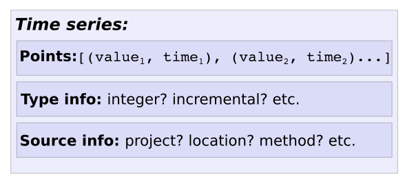

Monitoring
==============

Введение в облачный мониторинг

На этой странице представлен обзор инструментов и модели данных облачного мониторинга. Используя облачный мониторинг, вы можете ответить на такие важные вопросы, как следующие:

Какова нагрузка на мой сервис?
Доступен ли мой веб-сайт и правильно ли он реагирует?
Хорошо ли работает моя служба?

Эта страница предназначена для разработчиков и системных администраторов, которым необходимо отслеживать производительность службы или системы.

Обзор облачного мониторинга
~~~~~~~~~~~~~~~~~~~~~~~~~~~~~~~

Облачный мониторинг собирает данные о вашем сервисе и используемых вами облачных ресурсах Google. В этом разделе представлен обзор инструментов облачного мониторинга, которые можно использовать для визуализации и мониторинга этих измерений.

Политики оповещения и проверки работоспособности
"""""""""""""""""""""""""""""""""""""""""""""""""" 

Если вы заинтересованы в получении уведомлений, когда производительность службы не соответствует определенным вами критериям, создайте политику оповещения. Например, вы можете создать политику оповещения, которая уведомляет вашу команду если 90% задержки ответов HTTP 200 от вашей службы превышает 100 мс.

Если вы заинтересованы в том, чтобы получать уведомления о недоступности развернутой службы или о ее неправильном ответе, настройте проверку времени безотказной работы и прикрепите политику предупреждений:

Проверка безотказной работы периодически проверяет вашу службу и сохраняет успешность и задержку этой проверки в виде метрических данных.
Политика оповещения отслеживает состояние успешной проверки работоспособности и уведомляет вас о сбое проверки.

Диаграммы и информационные панели
~~~~~~~~~~~~~~~~~~~~~~~~~~~~~~~~~~~~

Чтобы понять текущую нагрузку на службу или просмотреть данные о производительности вашей службы за последний месяц, используйте инструменты диаграмм и панелей мониторинга. Облачный мониторинг заполняет панели мониторинга для вас на основе служб и ресурсов, используемых вашей службой; однако вы также можете создавать пользовательские панели мониторинга для отображения данных, отображения индикаторов или текста.

Вы можете отображать и отслеживать любые (числовые) данные показателей, которые собирает ваш облачный проект Google, включая следующие:

* Системные показатели, генерируемые облачными сервисами Google. Эти показатели предоставляют информацию о том, как работает служба. Например, Compute Engine сообщает более 25 уникальных показателей для каждого экземпляра виртуальной машины (ВМ).

* Системные и прикладные показатели, которые собирает агент облачного мониторинга. Эти показатели предоставляют дополнительную информацию о системных ресурсах и приложениях, запущенных на экземплярах Compute Engine и на экземплярах Amazon Elastic Compute Cloud (Amazon EC2). При необходимости вы можете настроить агент для сбора показателей из сторонних плагинов, таких как веб-серверы Apache или Nginx, базы данных MongoDB или PostgreSQL.

* Настраиваемые показатели, которые ваша служба записывает с помощью API облачного мониторинга или с помощью библиотеки, такой как OpenCensus.

* Показатели на основе журналов, которые собирают числовую информацию о журналах, записанных в облачный журнал. Показатели на основе журналов, определенных Google, включают количество ошибок, обнаруженных вашей службой, и общее количество записей в журнале, полученных вашим облачным проектом Google. Вы также можете определить показатели на основе журналов. Например, вы можете создать метрику, которая подсчитывает количество 404 Не найденных ошибок для приложения, развернутого в App Engine.

Метрики и временные ряды
"""""""""""""""""""""""""""

Метрика описывает то, что измеряется. Примеры показателей включают загрузку процессора виртуальной машины и процент используемого диска.

Временной ряд - это структура данных, которая содержит измерения метрики с отметками времени и информацию об источнике и значении этих измерений.

Например, ниже показан временной ряд:

https://cloud.google.com/monitoring/docs/monitoring-overview?hl=ru#time-series

Поле метрики описывает то, что измеряется.

В предыдущем примере поле метрики выглядит так, как показано:

::

	 "metric": {
	    "labels": {
	      "device": "sda1",
	      "state": "free"
	    },
	    "type": "agent.googleapis.com/disk/percent_used"
	  },

* Для служб Google в поле тип указывается служба и то, что отслеживается. В этом примере агент облачного мониторинга является службой, и он измеряет процент используемого диска. Если поле "Тип" начинается с "пользовательский" или "внешний", то метрика является либо пользовательской метрикой, либо метрикой, определенной третьей стороной.

* Поле labels содержит пары ключ-значение, которые предоставляют дополнительную информацию об измерении. Эти метки определяются как часть дескриптора метрики, который представляет собой структуру данных, определяющую атрибуты измеряемых данных. Дескриптор метрики для метрики agent.googleapis.com/disk/percent_used включает в себя метки устройства и состояния.

:Метрика: это набор связанных измерений некоторого атрибута ресурса, который вы отслеживаете. Измерения могут включать задержку запросов к службе, объем дискового пространства, доступного на компьютере, количество таблиц в вашей базе данных SQL, количество проданных виджетов и так далее. Ресурсы могут включать виртуальные машины (виртуальные машины), экземпляры баз данных, диски и т. Д.

Общее понятие показателя в облачном мониторинге включает три основных компонента:

* Информация об источнике измерений.
* Набор измерений стоимости некоторого свойства с отметкой времени.
* Информация о значениях измеряемого свойства.

Например, предположим, что вы хотите отслеживать количество виджетов, продаваемых вашими магазинами. Компоненты модели сопоставляются с этим примером следующими способами:

Источник измерений
'''''''''''''''''''

Модель показателей записывает информацию о каждом отслеживаемом ресурсе. Конкретная получаемая информация зависит от типа отслеживаемого ресурса: она может включать географические местоположения, имена методов, идентификаторы дисков и т. Д., Все, что может быть источником измерений.

Источник данных мониторинга называется **отслеживаемым ресурсом**.

Пример: В примере продажи виджетов отслеживаемыми ресурсами являются магазины, продающие виджеты.

Измерения
''''''''''''

Значения обычно являются числовыми, но это зависит от того, что измеряется.

Пример: В примере виджета-продажи измерения записывают информацию о продажах в определенные моменты времени. Такие измерения могут выглядеть следующим образом:

Метрическая модель фиксирует измерения свойства в виде набора точек данных, состоящих из значений с отметками времени.

::

	[(150, 2019-05-23T17:37:00-04:00),
	 (229, 2019-05-23T17:38:00-04:00),
	 (138, 2018-05-23T17:39:00-04:00),
	 ...]
	 
Информация о значениях
'''''''''''''''''''''''''

Значения измерений бессмысленны без информации о том, как их интерпретировать. Вам необходимо иметь некоторую информацию “типа” о значениях, такую как тип данных, единица измерения и вид каждого измерения:

Является ли значение целым числом или строкой?
Представляет ли это значение мили в час или радианы?
Представляет ли это значение общую сумму на тот момент или изменение с момента предыдущего значения?

Облачный мониторинг называет каждый набор характеристик того, что вы хотите измерить, типом метрики.

Пример: В примере продажи виджетов эта информация может сообщить вам следующее:

Каждое значение записывается как 64-разрядное целое число.

Каждое значение представляет количество проданных виджетов.

Каждое значение представляет количество виджетов, проданных с момента последнего зарегистрированного измерения.

Временные ряды: объединение компонентов воедино
''''''''''''''''''''''''''''''''''''''''''''''''''

В облачном мониторинге структура данных, лежащая в основе этой модели, представляет собой временные ряды (формы единственного и множественного числа одинаковы).

Каждый временной ряд охватывает три компонента модели:

Описание отслеживаемого ресурса, с которого были получены данные.
Набор значений с отметкой времени, связанных с одним отслеживаемым ресурсом.
Описание типа метрики, описывающее то, что вы измеряете.

Пример: В примере виджета-продажи временной ряд включает следующее:

* Описание магазина, в котором продавались виджеты, учтенные в этом временном ряду.
* Набор значений с отметкой времени, записанных для этого хранилища.
* Описание значений: 64-разрядные целые числа, измеряющие количество виджетов, проданных с момента предыдущего записанного значения.
